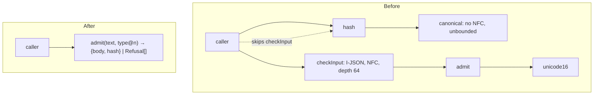
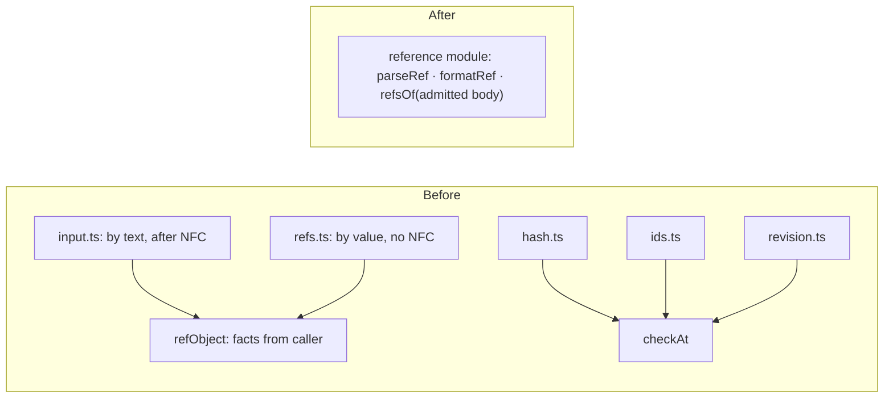

# Kernel architecture review — 2026-09-30

Status: **review, not norm.** Input for the first kernel Change (SL-T02). Candidates are not decisions until grilled.

Scope: `src/kernel/*` (11 modules, ~950 lines), read against [02-object-model](../02-object-model.md), [03-ledger](../03-ledger.md), [09-slices](../09-slices.md) SL-T02.
Vocabulary: module, interface, implementation, depth, deep / shallow, seam, adapter, leverage, locality (`codebase-design`).

## Candidates

| # | Candidate | Strength | Depends on |
|---|---|---|---|
| 1 | Deepen admission: one module from text to hashed body | Strong | — |
| 2 | One reference module, one semantics of `$ref` | Strong | 1 |
| 3 | Envelope module: revision and hash meet in one record | Worth exploring | 1 |
| 4 | Shrink the kernel interface to what design-next keeps | Strong | — |
| 5 | Typed refusal catalogue as part of the interface | Speculative | 1, 2 |

**Top recommendation: 1.** It removes the only hidden correctness hazard (a hash of a body that never passed I-JSON/NFC), gives S0's round-trip and no-op check (OM-H03) one interface to stand on, and is the prerequisite for 2 and 3.

---

## 1. Deepen admission: one module from text to hashed body

**Strength:** Strong · in-process
**Files:** `input.ts`, `admit.ts`, `unicode16.ts`, `canonical.ts`, `hash.ts`, `index.ts`

**Problem.** The I-JSON/NFC guarantee lives only in `checkInput`; `hash` and `canonical` accept any value built in code (no NFC, `-0`, unsafe integers, no `$enc` check — `canonical.ts:145` "strings are not normalised"). A correct hash depends on every caller composing `checkInput → hash`; no kernel function and no test composes them. Two walks over the same value domain have different limits (depth 64 in `input.ts:9`, unbounded in `canonical`). Unicode handling is split three ways (`unicode16` table, `admit` surrogates + unassigned + NFC, `canonical` surrogates only).

**Solution.** One admission module takes text plus a pinned type and returns the admitted body and its hash; parse, unicode, canonical form and hash become its implementation (internal seams stay, used by its own tests).



**Wins**
- locality: one place owns "admitted body"
- leverage: OM-H01…H03 behind one call
- two walks, two depth limits → one
- tests hit one interface
- `admit.ts`, `hash.ts` glue deleted

> `index.ts` is labelled "frozen kernel v1" (design v0.6, VI-04); design-next SL-T02 reopens it module by module.

---

## 2. One reference module, one semantics of `$ref`

**Strength:** Strong · in-process
**Files:** `ref.ts`, `refs.ts`, `input.ts:213-248`, and `checkAt` callers `hash.ts`, `ids.ts`, `revision.ts`

**Problem.** What counts as a `$ref` is decided in three modules with two semantics: `input.ts` judges by text after NFC; `refs.ts` judges by value without NFC; `ref.ts` `refObject` hands the decision back through its `facts` parameter. They disagree: `refsOf` refuses a Kelvin-sign ref that `checkInput` normalises and accepts (`vectors.ts:389`). The identifier grammar leaks through `checkAt` into four modules, each formatting its own path prefix.

**Solution.** Concentrate reference grammar, detection and extraction in one module that only sees admitted bodies (candidate 1). It is also the home for OM-R02 (pinned / floating policy per field) and OM-R03 (existence of pinned targets).



**Wins**
- locality: one verdict per ref
- removes a live disagreement (Kelvin sign)
- `refObject`'s `facts` parameter disappears
- OM-R02 / R03 land in one place

---

## 3. Envelope module: revision and hash meet in one record

**Strength:** Worth exploring · in-process
**Files:** `revision.ts`, `hash.ts`, `ids.ts`, `types.ts`

**Problem.** `revision()` and `hash()` are unconnected: a revision carries no hash, its body is not checked as JSON (`revision.ts:1-2`, `:59`), and nothing ties `type@n` to the unpinned type id the hash uses. `newId` is a regex plus concatenation.

**Solution.** One envelope module builds entity and event records whole (OM-E01…E04, OM-I01…I02), taking an admitted body from candidate 1.

```text
Before                                   After
revision()   header shape only           ┌ envelope module ─────────────────────────────┐
hash()       unpinned type, not in header │ entity(header, admitted)                     │
newId()      regex + concat               │   → {id, rev, type, hash, by, at, body}      │
   ✗ type@n ↔ typeId never connected      │ event(header, admitted)                      │
                                          │   → {id, type, by, at, body.of}              │
                                          └──────────────────────────────────────────────┘
```

**Wins**
- leverage: complete record per call
- no-op check (OM-H03) gets its hash
- `ids.ts` deleted

> Mostly new behaviour for S0; shape it with the S0 Change.

---

## 4. Shrink the kernel interface to what design-next keeps

**Strength:** Strong · in-process
**Files:** `hash.ts` (`valueId`), `ref.ts:10-11`, `:58`, `input.ts:214` (`$enc`), `ids.ts`, `types.ts`

**Problem.** The interface still carries the v0.6 value kind and naming that design-next dropped; every caller and test must learn surface no one will use.

| Exists, dropped by design-next | design-next |
|---|---|
| `valueId`, `#hex32`, reserved `#label:hex`; `id` accepts value ids | no value kind (OM-K02), hash only for equality (OM-I03) |
| `$enc` reserved | — |
| `newId` → `namespace/ULID` | event id = bare ULID, entity id = `namespace/slug` (OM-I01…I02) |
| header field `version` | `rev` (OM-E01) |
| `Hash` as bare hex | `sha256:…` |

**Solution.** Delete the value-kind surface and rename to the design-next envelope in the first kernel Change (SL-T02).

**Wins**
- interface shrinks; depth rises
- vectors lose dead cases
- ref grammar simplifies (helps 2)

---

## 5. Typed refusal catalogue as part of the interface

**Strength:** Speculative · in-process
**Files:** `types.ts:3`, every module returning `Result<T>`

**Problem.** Refusal codes are untyped strings, so error modes — part of each module's interface — are visible only in comments and vectors.

**Solution.** Close the code set per interface (`'syntax' | 'too-deep' | 'not-json' | …`) once 1–2 settle the module shape.

**Wins**
- interface states its error modes
- compiler catches unknown codes

---

## Appendix: facts gathered

**Matches design-next:** `hash = sha256(JCS({type, body}))` with unpinned type id (OM-H01); NFC on write + I-JSON (OM-H02); pinned `type@n` in `revision` (OM-E02); fixed hash vectors (OM-H05, `vectors.ts:281-295`); floating / pinned `Ref` shape (OM-R01).

**Missing for design-next:** entity vs event envelopes with `hash` in the entity header (OM-E01); event `of` (OM-E04); ref policy per field (OM-R02); existence of pinned targets (OM-R03); no-op on equal hash (OM-H03); body size limit (OM-H04); closed JSON Schema subset (OM-T06); meta-type and genesis (OM-T01, LG-G01); `extends`, `key`, `card`; the `store` port.

**Test surface:** `contract.test.ts` and `scenarios.test.ts` go through the `index.ts` interface; `environment.test.ts` imports `unicode16.ts` directly (skipped unless runtime Unicode is 16.0). Not tested directly: `admit`, `hasLoneSurrogate`, `checkAt`, `refObject`, `eachObject`, `segment`. Gaps: no test composes `checkInput → hash → revision`; no hash test on a non-NFC or `-0` body; no `revision` test with a non-JSON body. `refsOf` vectors are built through `checkInput` (`vectors.ts:51`).

**Structure test** (`test/architecture/structure.ts`, 688 lines, AST, policy in `policy.ts`): inside `src/kernel/**` — relative `.ts` imports only plus `createHash` from `node:crypto`; no `import()`, `require`, `import.meta`; free identifiers from a closed list; deterministic `Date` / `Math` only; reachability from `index.ts`; no import cycles; every test inside `describe`. It checks import seams and purity, not depth.
