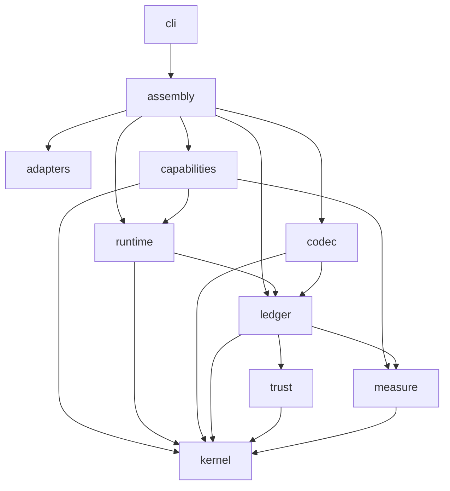
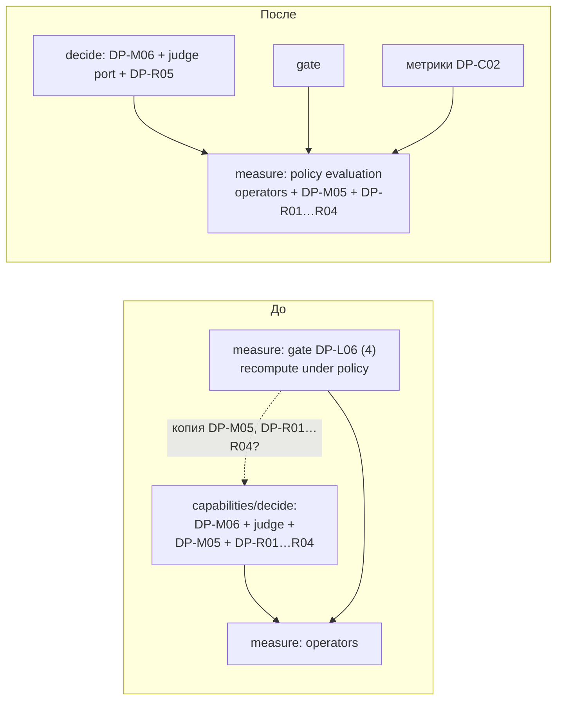
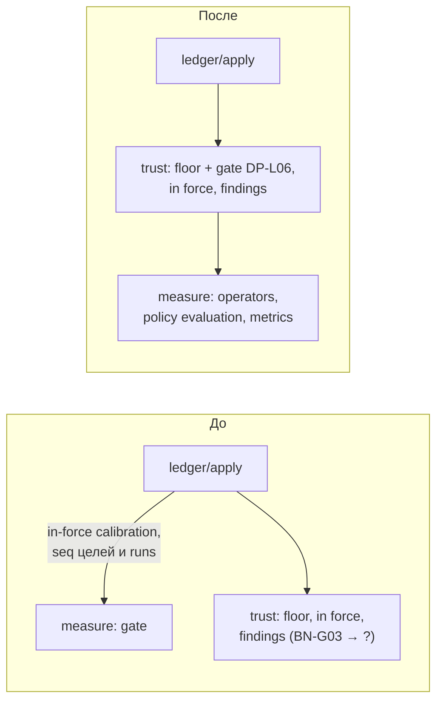
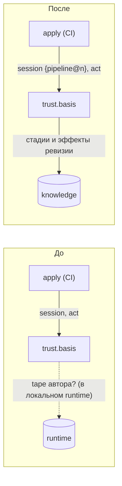
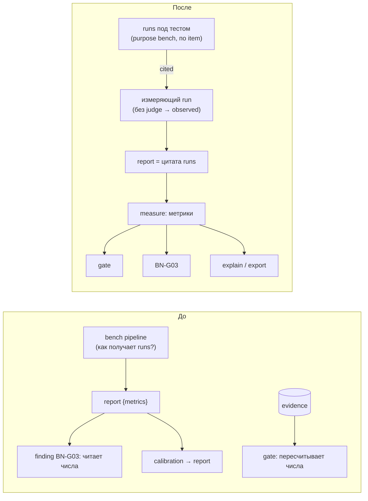

# design-next: возможности углубления (deepening review)

- **Дата:** 2026-10-01
- **Область:** `design-next/README.md`, `00-glossary.md` … `11-later.md` вместе с правками F1–F6 (разбор возвращённых идей v0.6). Папка `reviews/` не читалась. `design/`, `src/`, `openspec/` не читались.
- **Метод:** навык improve-codebase-architecture (explore → candidates; без grilling loop и без interface-предложений) со словарём codebase-design: module, interface, depth, seam, adapter, leverage, locality, deletion test, «the interface is the test surface», «one adapter = hypothetical seam, two = real». Depth понимается только как leverage. Second adapter засчитывается, только если по дизайну он реально подменяется.
- **Как читать:** объект ревью — архитектура, которую задаёт дизайн. Module — строка ST-M01 или модуль, который подразумевают правила; interface — всё, что вызывающий обязан знать (правила с ID); seam — порты (GL-02), kernel внутри apply (LG-A03), контракт capability (PL-C01, PL-C07). Каждая ссылка ниже сверена с текстом правила.
- **Решения:** кандидаты и находки разобраны grilling'ом — [2026-10-01-design-next-deepening-grilled](2026-10-01-design-next-deepening-grilled.md).

---

## 1. Карта модулей и seams, как их задаёт дизайн

Импорты (ST-M01):



Seams:

| Seam | Interface | Adapters | Реальный? |
|---|---|---|---|
| `store` (LG-S02) | ledger | JSONL, memory | да, два |
| `acts` (LG-A04) | ledger | `github`, `init`, `fixture`, `recorded` | да |
| `judge`, `llm`, `source`, `clock`, `ids` (PL-K01, PL-K02) | runtime, recording module | `service`, `recorded`, `fixture`; `service` для `judge` по срезам — только `judge-jev` (SL-S2), vendor-адаптер пока на бумаге | да, за счёт `recorded` (replay, PL-R02) и `fixture` (тесты, LG-R03) |
| kernel внутри apply (LG-A03, OM-L04) | internal seam of apply | одна реализация, периметр ST-K01 | internal seam, не порт; это нормально |
| стадия (PL-C01, PL-C07, PL-P03) | контракт capability: `input`/`output`/`params`, статусы, `reads`/`writes` | built-in; project capability (PL-C03) | built-in — да; project capability не названа ни в одном срезе S0–S4, а подмену capability в тестах дизайн не задаёт. Второй вид пока hypothetical, реален только контракт стадии внутри pipeline |
| read view (PL-K05) | interface `ledger` | один | нет, и дизайн это признаёт (NX-24) |

Глубокие места, которые дизайн уже сделал хорошо: apply как единственный путь записи (LG-A01) с rejection, привязанным к ID правила (LG-A02); один recording module на все записываемые порты (PL-K01); `decide()` как единственный канал к judge (DP-B13), проверяемый структурным тестом (ST-S01). Ниже — места, где понятие расползается по нескольким модулям или правилам либо где interface невозможно протестировать.

---

## 2. Кандидаты

### A1. Вычисление policy — одна чистая функция в `measure`, общая для `decide` и gate

**Правила/модули:** DP-M05, DP-R01…R04, раздел 01 «Policy operators», DP-L06 (4), DP-C01, DP-C02, DP-T01, ST-M01 (`measure`, `capabilities`).

**Проблема.** DP-C01 утверждает: «changing policy … needs none [no new calibration], because the gate recomputes the report under the policy of the revision (DP-L06)». Значит, gate в `measure` должен по записанным evaluations заново получить то, что `decide` получил во время run. Но в `measure` по ST-M01 лежат только *операторы*. Правила, которые превращают evaluations в DecisionResult, — `required` всегда выбраны и не оцениваются, budget тратится только на остальных, `insufficient` с причиной `budget` (DP-M05), сопоставление статусов `selected`/`none`/`ambiguous`/`insufficient` (DP-R01…R04), — по ST-M01 принадлежат `decide` в `capabilities`. `measure` не может импортировать `capabilities`. Значит, gate либо повторяет эту композицию (две дороги к одному ответу), либо её нарушает. Обещание DP-C01 держится только пока обе копии совпадают, и ни один тест этого не гарантирует. Та же композиция нужна для метрик калибровки: «precision in the "sure" band per answer value» (DP-C02) зависит от того, что выбрала policy.

**Решение.** Перенести в `measure` всю композицию: policy точки + evaluations + `required` + budget → status, reason, selected. `decide` остаётся тонкой обвязкой: проверка allowed set (DP-M06), вызов порта `judge`, `unavailable` (DP-R05), вызов функции `measure`, сборка `trace`. Gate и метрики bench вызывают ту же функцию на evaluations из evidence.

**Выгода.** Locality: всё поведение DP-M05 и DP-R01…R04 — в одном module. Leverage: функцию используют `decide`, gate (DP-L06 (4)), метрики калибровки (DP-C02); replay (DP-T01) получает её бесплатно. Тесты: табличные тесты на чистых данных через interface `measure`, без порта judge и без runtime. Обещание DP-C01 превращается в один тест: те же evaluations, две policy, результат gate совпадает с результатом `decide`. Тесты `decide` сводятся к проводке порта на `fixture`.

**Deletion test.** Если удалить композицию из `decide`, ничего не появится заново: `decide` вызывает `measure`. Если удалить её из `measure`, она снова появится в двух местах — в `decide` и в gate. Значит, композиция окупается и должна жить в одном module. Новой сущности нет: меняется только текст строк ST-M01.

**До / после**



**Сила рекомендации:** **Strong**. Конфликтов с NX/LT нет.

---

### A2. Gate — правило допуска в `trust`; `measure` — лист чистой математики

**Правила/модули:** DP-L06, BN-G02, BN-G03, BN-G04, TR-I01, TR-F06, TR-N02, LG-A03, ST-M01, LT-21.

**Проблема.** Gate (DP-L06) — код `measure`, который импортирует только `kernel`. Но шагу (4) нужна «a `calibration` in force» — это `inForce` (TR-I01), код `trust`. BN-G04 сравнивает `seq` целей с runs — это факты над записями ledger. Поэтому `ledger` (apply) обязан заранее посчитать in-force калибровку и порядок по `seq` и передать их в gate: caller (apply) обязан знать и готовить всё, что нужно gate, — in-force калибровку, порядок `seq`, разбор evidence. Leverage мал: на единицу interface caller получает лишь проверку чисел, остальное делает сам. Обратная зависимость тоже есть: projection findings лежит в `trust` (ST-M01), а среди её проверок есть BN-G03 (regression, TR-N02), которой нужны метрики `measure`. `trust → measure` запрещено, `measure → trust` тоже. Остаются два выхода. Первый — findings частично уходят в `ledger`, и тогда срабатывает триггер LT-21 («a projection owned by a module other than `trust`»). Второй — BN-G03 читает числа, сохранённые в report (см. A4). Кроме того, допуск status fact разрезан пополам: owner-act floor (TR-F06) — в `trust`, gate для `live` — в `measure`.

**Решение.** `trust` импортирует `measure`. Gate переезжает в `trust` как правило допуска `live` fact — рядом с owner-act floor. В `measure` остаются операторы, функция policy evaluation (A1), метрики BN-M01…M06, bootstrap: чистая численная математика, импорт только `kernel`. Направление зависимостей: `ledger → trust → measure → kernel`, без цикла. Finding BN-G03 считается в `trust` через метрики `measure`.

**Выгода.** Locality: на вопросы «почему этот `live` fact отклонён» и «что владельцу посмотреть» отвечает один module. Interface gate сжимается до «состояние ledger (tail + commit) и `live` intent → rejections». Тесты: gate проверяется через interface `trust` на memory-store fixture, `measure` — только числами. Триггер LT-21 не срабатывает, потому что findings целиком остаются в `trust`.

**Deletion test.** Если удалить gate из `measure`, исчезает и код подготовки входов в apply: сложность собирается в `trust`, а не размазывается. Новой сущности нет, добавляется одно ребро импорта.

**До / после**



**Сила рекомендации:** **Worth exploring**.
**Конфликты:** с NX нет. Решение пересматривает *размещение* gate в `measure`: по History файла 10-structure и правилам DP-L06, BN-G02 оно принято на финальном ревью (D1). Единственность gate и то, что он всегда пересчитывает, сохраняются. Альтернатива с тем же эффектом — gate в `ledger`, который уже импортирует оба module. Тогда, однако, правила доверия расходятся между `ledger` и `trust`.

---

### A3. Basis записи, созданной run, — по закреплённой ревизии pipeline, а не по его tape

**Правила/модули:** TR-B02 (строка 2 таблицы), TR-N03, BN-R02, CT-P01, CT-P03, PL-C05, LG-R02, LG-R04, LG-P05, ST-M01 (`trust`).

**Проблема.** Строка 2 таблицы TR-B02 задаёт basis так: «`machine`: a run whose tape holds an answer of the `judge` or `llm` port → `inferred`». Basis вычисляет apply (TR-B02, LG-A03), в том числе в CI (LG-P05), и видит только proposal и session event (CT-P03). Tape того run, который написал proposal, лежит в локальном `runtime`. Сослаться на самого себя как на evidence этот run не может: стадия `writes-proposal` выполняется *внутри* незавершённого run, а evidence — это целый `runtime` commit (LG-R02). Следовательно, строку 2 нельзя проверить там, где она вычисляется. К тому же `trust`, который импортирует только `kernel`, пришлось бы знать формат tape. С BN-R02 правило конфликтует напрямую: report — «basis `observed` (`machine`, purpose `bench`)». Однако bench run pipeline с `decide` содержит ответы judge, а строки читаются сверху вниз, и строка 2 срабатывает раньше. Тогда report и `calibration`, предложенные этим run, получают `inferred` и не могут быть in force (TR-I01 (1)). TR-N03 рассуждает так же («its run called the judge, so its basis is `inferred`»), противоречие явное.

**Решение.** Session event run называет свой `pipeline@n` (и `setup@n`) — в run record эти поля уже есть (PL-R01). Строку 2 переписать статически: «`machine`-сессия run, чья закреплённая ревизия pipeline содержит стадию `decide` или стадию с эффектом `calls-llm` (PL-C05)». Ревизия pipeline лежит в `knowledge`, поэтому apply проверяет это в CI без tape. Правило консервативно: run, у которого все ответы — memo hit, всё равно `inferred`.

**Выгода.** Basis считается только из `knowledge`, что согласуется с LG-R04: `runtime` не имеет веса. `trust` не знает формата tape. Тесты: таблица TR-B02 проверяется через interface `trust` одними блоками, без runtime-fixture. Неоднозначность «какой run» в TR-N03 исчезает.

**Deletion test.** Если удалить строку, зависящую от tape, заново ничего не появится, кроме одного поля в теле session event, которое уже есть в run record. Новой сущности нет.

**До / после**



**Сила рекомендации:** **Strong**. Конфликтов с NX/LT нет; NX-22 (re-run import в apply) не затрагивается. Кандидат связан с A4: статическая строка 2 делает report `observed` только в том случае, если измеряющий run сам не вызывает judge.

---

### A4. Seam bench: измеряющий run отделён от измеряемых; report цитирует, числа считает `measure`

**Правила/модули:** PL-E01, BN-R01…R03, BN-G03, DP-L06 (2), DP-C01, TR-F05 (`calibration`), TR-N02, LG-R02, PL-K05, PL-P05, NX-13, SL-S1.

**Проблема.**
(a) PL-E01: «bench» — это pipeline run. Pipeline не может запустить другой pipeline: составных capabilities нет (NX-13), петель нет (PL-P05), а стадии читают только `knowledge` (PL-K05). Как bench run получает runs измеряемого pipeline по каждому item, нигде не сказано. Если он выполняет их внутри себя, его tape содержит ответы judge, и по TR-B02 строка 2 report и `calibration` получают `inferred` (см. A3). Тогда калибровка judge-точки через bench никогда не будет in force, и SL-S3 недостижим. Seam нужен уже в SL-S1: «`solve` becomes `live` through the gate» требует report и evidence.
(b) Report хранит метрики (BN-R02), а gate всё равно пересчитывает их из evidence (DP-L06 (2), BN-R03). Сохранённые числа — производное, лежащее рядом с источником (evidence). По тексту их читают BN-G03 (finding «regression») и люди, а gate читает пересчитанные. Это две дороги к одному числу, и правила о расхождении нет.

**Решение.** Явно развести два вида runs. Измеряемые — обычные runs pipeline под тестом в сессии `purpose: bench`, по одному на item. Измеряющий run собирает и цитирует их (LG-R02); judge он не вызывает, поэтому его report — `observed`. Report становится цитатой: subject `ref@n`, `set@n`, процитированные runs. Числа считает `measure` (A1/A2) везде, где они нужны: gate, finding BN-G03, показ в `explain` или export. Как именно измеряющий run читает чужие runs (это не порт и не read view), решается отдельным вопросом; здесь interface не предлагается.

**Выгода.** Одна дорога к метрикам; report маленький; basis report не зависит от judge. Тесты: gate и BN-G03 используют общие evidence-fixture, а случай «сохранённое ≠ пересчитанное» исчезает и тестировать его не нужно. Locality: вопрос «как измеряется pipeline» — в одном module.

**Deletion test.** Если удалить сохранённые метрики из report, gate не изменится (он уже пересчитывает), а BN-G03 переедет на вычисление в `measure`/`trust` (A2): сложность собирается, а не дублируется. Новая сущность не добавляется; содержимое report сужается.

**До / после**



**Сила рекомендации:** **Strong** для (a) — это пробел на критическом пути S1–S3; **Worth exploring** для (b).
**Конфликты:** NX-21 сохраняется: `calibration` по-прежнему ссылается на report, а report — на evidence. NX-13 не пересматривается: смысл (a) как раз в том, что без составных capabilities дизайн обязан назвать связь между измеряющим и измеряемыми runs. NX-23 не затрагивается: проверяющий по-прежнему один, apply.

---

### A5. «Drives execution» — один предикат с наблюдаемым результатом

**Правила/модули:** DP-L01, DP-L02, DP-L03, PL-P06, PL-A01, PL-K04, TR-F05 (`live`), PL-C06, DP-B12, PL-R01, LN-O01, LT-15.

**Проблема.** Утверждение «что управляет исполнением» повторено в пяти местах, и эти места расходятся:
- DP-L01: точка управляет исполнением «iff the `live` revision of a pipeline … pins it. Every other revision runs only in `shadow` or on the bench»;
- PL-A01: «only a run under the `live` `setup` … may drive execution (DP-L03)» — второе условие, которого нет в DP-L01, так что «iff» в DP-L01 ложно;
- PL-K04: «whether a result drives execution is the `live` fact of a pipeline … Neither implies the other», где `setup` опущен, хотя по PL-A01 выбор `setup` влияет на ответ;
- DP-L03 повторяет DP-L01, PL-P06 повторяет ещё раз.

Кроме того, `lattice run --setup <не-live>` для `live` pipeline (PL-A01, PL-E02) не попадает ни в `shadow` (DP-L02), ни в bench, а DP-L01 говорит, что других вариантов нет. И ни одно правило не говорит, что «drive execution» означает *наблюдаемо*: что runtime делает иначе с результатом не-`live` run? Выход `solve` возвращается в любом случае, а для fallback пометка есть (PL-R01, LN-O01). DP-L03 нечем проверить через interface. Отсюда практическое следствие: ничто не запрещает `shadow`-ревизии, которая идёт рядом с `live` на том же входе (DP-L02), выполнить стадию `irreversible` второй раз. PL-C06 лишь попросит человека подтвердить дважды.

**Решение.** Одно правило с одним ID. Run авторитетен iff его `pipeline@n` и `setup@n` — ревизии, названные in-force `live` facts на knowledge commit, который run прочитал (PL-K05). Это чистая функция run record: вычисляется, не хранится. Наблюдаемое следствие задаётся в том же правиле: выход и outcome неавторитетного run помечены так же, как fallback (PL-R01), а стадия с эффектом `irreversible` в неавторитетном run отказывает. DP-L01, PL-P06, PL-A01 и PL-K04 ссылаются на это правило, DP-L03 удаляется.

**Выгода.** Locality: одно правило и одна функция вместо пяти формулировок. Тест через interface: fixture-pipeline под не-`live` `setup` → выход помечен, `irreversible` отказан; то же для `shadow`. Leverage: LT-15 (когда сработает в S3) опирается на уже определённый предикат.

**Deletion test.** Если удалить четыре повтора, заново ничего не появится; добавляются одно правило и одно наблюдаемое следствие. Новой хранимой сущности нет.

**До / после**

```text
До:   DP-L01 (pipeline live) ─┐
      DP-L03 (= DP-L01)       ├─ «drives execution» — три разных условия,
      PL-P06 (= DP-L01)       │   наблюдаемого результата нет
      PL-A01 (+ setup live)   │
      PL-K04 (без setup) ─────┘

После: authoritative(run) = live(pipeline@n) ∧ live(setup@n) @ knowledge commit
       → выход помечен; irreversible отказывает
       DP-L01, PL-P06, PL-A01, PL-K04 → ссылаются; DP-L03 удалён
```

**Сила рекомендации:** **Strong**. Конфликтов с NX нет; LT-15 не вносится раньше триггера, лишь получает опору.

---

### A6. Код judge-адаптера закреплён дважды: `judge@n` и `setup`; `setup` должен выбирать только режим

**Правила/модули:** PL-C09, DP-M02, PL-A01, PL-A03 (3), PL-K02, GL-07, OM-L02, DP-L06 (3), CT-A02, PL-R04, PL-K03, PL-A02.

**Проблема.** Код `service`-адаптера порта `judge` закреплён в двух местах. Первое — блок `judge@n` («the hash of the adapter code», PL-C09). Второе — `setup`: «which adapter serves each recorded port, pinned by revision» (PL-A01), причём у адаптеров есть собственные блоки (OM-L02, PL-A03 (3): «hashes of capabilities and adapters match their blocks»). GL-07 перечисляет оба. Что делать при расхождении блока адаптера в `setup` и хеша в `judge@n`, не сказано. (Сценарий двух `service`-адаптеров в одном run пока hypothetical — vendor-адаптера нет ни в одном срезе; двойное закрепление — дефект и без него.) Блоки адаптеров упоминаются в четырёх правилах, но ни одно их не определяет; в CT-A02 их нет среди owner acts. Для порта `llm` есть симметричный пробел: модель не закреплена нигде, хотя ключ memo содержит `model@version` (PL-K03), а PL-A02 требует держать в ledger всё, что меняет результат.

**Решение.** `setup` для каждого порта задаёт режим (`service` | `recorded` | `fixture`) и флаг memo; для порта без собственного конфигурирующего блока — ещё и блок `service`-адаптера. Для `judge` `service`-адаптер — тот, который закрепляет `judge@n` из запроса: блок `judge` *и есть* блок адаптера порта `judge`, закрепление одно. Для `llm` назвать одно место закрепления модели (например, статические `params` capability, PL-P02). Вариант «тот же std-тип, что и `judge`», — Speculative.

**Выгода.** Какой код judge работал, говорит одно поле запроса (`judge@n`). DP-L06 (3) и проверка запуска PL-A03 (3) сравнивают одно значение; ключ memo (DP-T03) уже содержит `judge@n`. Тесты: контрактный набор judge-адаптера (ST-T01) индексируется по `judge@n`, случай «setup и judge@n расходятся» исчезает.

**Deletion test.** Если удалить запись judge-адаптера из `setup`, заново ничего не появится: `judge@n` уже несёт эту информацию. Сущность не добавляется, одна удаляется.

**До / после**

```text
До:   setup.ports.judge = adapter-block X@k  (hash HX)
      point → judge@n  { model, adapter_hash H }      HX =? H — не определено
      GL-07: { …, judge@n(H), adapters(HX) }

После: setup.ports.judge = { mode: service|recorded|fixture, memo }
       point → judge@n = адаптер порта judge  { model, adapter_hash H }
       GL-07: { …, judge@n(H) }
```

**Сила рекомендации:** **Worth exploring**. Конфликтов с NX нет; NX-18 (ports в теле namespace) не затрагивается.

---

## 3. Мелкие текстовые находки

| ID | Проблема | Рекомендация |
|---|---|---|
| PL-P03 | «every field read was written by an earlier stage», но первая стадия в примере 06 читает `need`, который не пишет ни одна стадия; DP-M05: «no stage writes the budget», а budget лежит в need (LN-N01). | Сказать в PL-P03, что поля входа run считаются записанными до стадии 1 и ни одна стадия их не пишет. |
| CT-P04 / LG-A05 / LG-P05 | CT-P04: логины «verified by CI»; LG-A05: повторный apply в CI читает acts через `recorded` и «never call GitHub»; LG-P05 (1) не называет adapter порта `acts`. Неясно, проверяет ли CI acts вообще. | Назвать в LG-P05 (1) adapter `github` (допуск в CI) или в CT-P04 — место проверки. |
| PL-C05 | «The runtime gives it only the declared ports», но `clock` и `ids` — не эффекты; capability с `writes-proposal` нужны `id` и `at` событий (LG-P01). | Сказать, что `clock`, `ids` и read view получает каждая capability, или внести их в список. |
| ST-M01 | `capabilities` импортирует `kernel`, port interfaces `runtime`, `measure`, но не `ledger`; read view — interface `ledger` (PL-K05, NX-24), и он нужен LN-C01, LN-X01, LN-O04 (а также in force, TR-I01). | Добавить `capabilities → ledger` (только read view), как у `runtime` и `codec`; read view отдаёт in-force-запросы. |
| OM-T04 / OM-L02 | Списки std-типов не включают run record (событие, OM-K01), question event и ответ (PL-R03), listing fact (TR-S03), `example` (LG-B06), тип блоков адаптеров. Тип run record нужен gate (DP-L06) и evidence (LG-R02). | Перечислить их или написать «including»; явно ввести std-тип run record. |
| OM-T03 / OM-T04 / OM-I07 | У каждого типа ровно один родитель, но базовый тип std-типов поведения (pipeline, `setup`, `judge`, namespace, session, report, bench item) не назван. `supersedes` объявлен «in every base type», так что это важно. Базовый тип `rule` нигде не определён. | Назвать базовый тип каждого std-типа; определить `rule` или убрать его. |
| PL-A01 / PL-A03 / GL-07 / OM-L02 | «Блоки адаптеров» упоминаются, но не определены ни одним правилом; в CT-A02 их нет. | См. A6; минимум — одно правило-определение. |
| PL-R04 / PL-K03 / PL-A02 | Место закрепления модели `llm` не определено (в ключе memo есть `model@version`). | Назвать одно место (см. A6). |
| BN-G03 / DP-L06 | «the move to `live` requires an explicit owner decision on it [regression]» — не шаг gate и не связано с `dismissed` (TR-N04). | Шаг gate: открытый finding BN-G03 по subject без `dismissed` отклоняет `live`; либо сказать, что этим решением служит owner act на `live`. |
| DP-L06 / BN-S05 / SL-S3 | BN-S05: «`holdout` (the move to `live` is checked on it)»; SL-S3: «through the gate on `holdout`»; в шагах DP-L06 `holdout` нет. | Добавить в DP-L06 (2)/(4): evidence — runs по items из `holdout` этого `set@n`, с полами BN-G05. |
| BN-M05 / SL-K03 / SL-S1 | «Minimum size per answer value» не определён для метрик pipeline (`hit@k` у `solve`); SL-K03 и SL-S1 полагаются на то, что к ним он не относится. | Ограничить BN-M05 точками (DP-C02) или определить «answer value» для pipeline. |
| BN-G04 | «targets were in the ledger (by `seq`) before its runs» — runs лежат в другом ledger со своим `seq`. | Сравнивать с knowledge commit, который процитировал run (LG-S04, PL-K05). |
| BN-S01 / OM-R02 | Expected refs: pinned или floating? OM-R02 требует pinned там, где от них зависит калибровка; после правки блока pool содержит `id@n+1` — совпадает ли он с ожидаемым? | Сравнивать по `id`, хранить pinned; либо по `ref@n` с finding при новой ревизии ожидаемого блока (по образцу DP-C06). |
| LN-C03 / DP-C06 | «The tokenizer is a capability pinned by hash». Если это код, который импортирует `lens.candidates`, его уже покрывает транзитивный хеш (PL-C01) — второе закрепление того же кода. Если это отдельная стадия, это отдельный шаг pipeline, чего нет в примере 06. | Токенизатор — код `lens.candidates`, покрытый PL-C01; «is a capability» убрать. |
| DP-M03 / PL-P04 / пример 06 | `insufficient → fallback: lens.widen` обязан писать `selection` (PL-P04: те же поля), то есть отдаёт неоценённую выборку; «расширить и решить заново» невыразимо (PL-P05). DP-M03 при этом называет расширение заботой pipeline. | Сказать, что выборка fallback не проходит через judge и помечается (PL-R01), или поправить пример. |
| DP-R06 / PL-R01 / LN-N02 / DP-G02 | «input fingerprint» нигде не определён. | Одно правило: `sha256(JCS(input))` по образцу OM-H01; указатель в глоссарии. |
| DP-C02 | «sure band», «grey zone» не определены, хотя от них зависит калибровка (и A1). | Определить через policy точки (порог/margin) одним ID. |
| 00-glossary | Нет указателей: stage outcome и run outcome (PL-C07, PL-R01), effect (PL-C05), trust evidence (TR-V01), `tune`/`holdout` (BN-S05), `variants` (BN-S03), read view (PL-K05), fallback/escalate (PL-P04), kernel version и LATTICE version (OM-E01, LG-G01, LG-G02, LG-J05) — два понятия версии, связь между ними не задана. | Добавить строки-указатели; связь двух версий — одним ID. |
| DP-L03, PL-K02, 00-glossary | Повторы: DP-L03 повторяет DP-L01; последнее предложение PL-K02 повторяет LG-R02; строка глоссария «evidence (a set of whole run records published as files)» повторяет LG-R02 вопреки Purpose глоссария. | Удалить повторы, оставить ссылки (см. A5). |
| примеры 01, 06 | id без namespace (`pick-tool`, `judge.semantic@3`, `solve`, `lens.candidates@2`) против OM-I01/OM-I05; `"type": "std/pipeline"` без `@n` против OM-E02. Code blocks при нормализации станут блоками `example` дословно (LG-B06). | Исправить до нормализации LG-B04. |
| LN-X03 / SL-S2 | «until that point exists (S2)» — в критерии SL-S2 точки «sufficient?» нет, только `lens-rank`. | Назвать срез в 09 или сослаться на пункт LT. |

---

## 4. Top recommendation

**Первым брать A4 вместе с A3.** Это единственные кандидаты на критическом пути срезов. SL-S1 уже требует report и evidence («`solve` becomes `live` through the gate»), SL-S2 — `shadow` с judge, SL-S3 — калибровку in force. При текущем тексте строка 2 TR-B02 делает report и `calibration`, рождённые в bench run с judge, `inferred`, а такой факт по TR-I01 не может быть in force — путь S3 закрыт. Сам seam «bench run ↔ runs под тестом» не определён (PL-E01 при NX-13 и PL-K05). Оба исправления сужают дизайн и ничего не добавляют: строка basis становится статической, report — цитатой. Сразу за ними — A1: дешёвый перенос кода внутри ST-M01, который делает проверяемым обещание DP-C01 и даёт A4 единственное место расчёта метрик. A5 стоит внести тем же проходом, что и правки текста, потому что это прямое противоречие DP-L01, PL-A01 и PL-K04. A2 и A6 — после, на grilling.

### Сводка кандидатов

| ID | Одной строкой | Сила |
|---|---|---|
| A1 | Вычисление policy (операторы + DP-M05 + DP-R01…R04) — одна функция в `measure` для `decide` и gate | Strong |
| A2 | Gate — в `trust` (`trust → measure`), `measure` — лист математики; LT-21 не срабатывает | Worth exploring (пересматривает размещение D1) |
| A3 | Basis записи от run — по ревизии pipeline в `knowledge`, а не по tape | Strong |
| A4 | Seam bench: измеряющий run отделён от измеряемых; report — цитата, числа — `measure` | Strong (a) / Worth exploring (b) |
| A5 | «Drives execution» — один предикат (`live` pipeline ∧ `live` setup) с наблюдаемым результатом | Strong |
| A6 | Код judge-адаптера закреплён один раз — в `judge@n`; `setup` выбирает только режим | Worth exploring |
