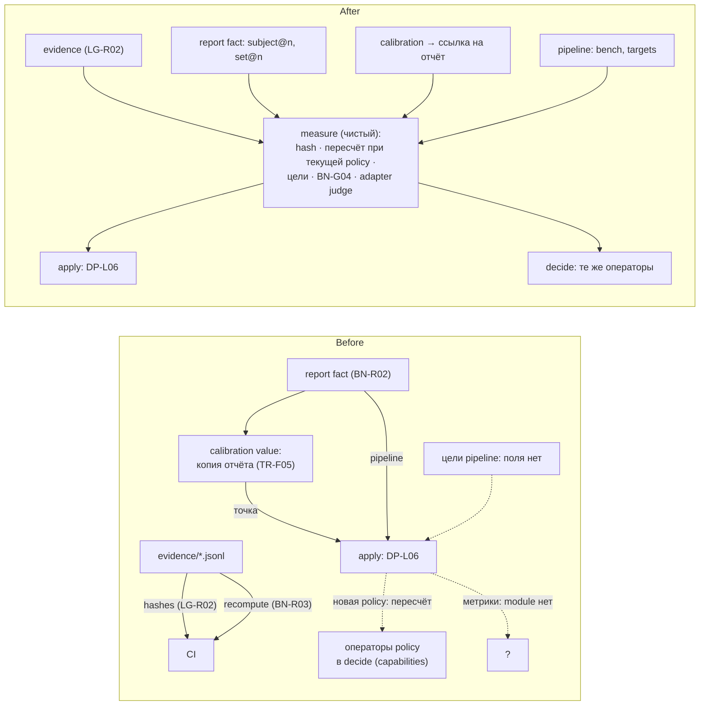
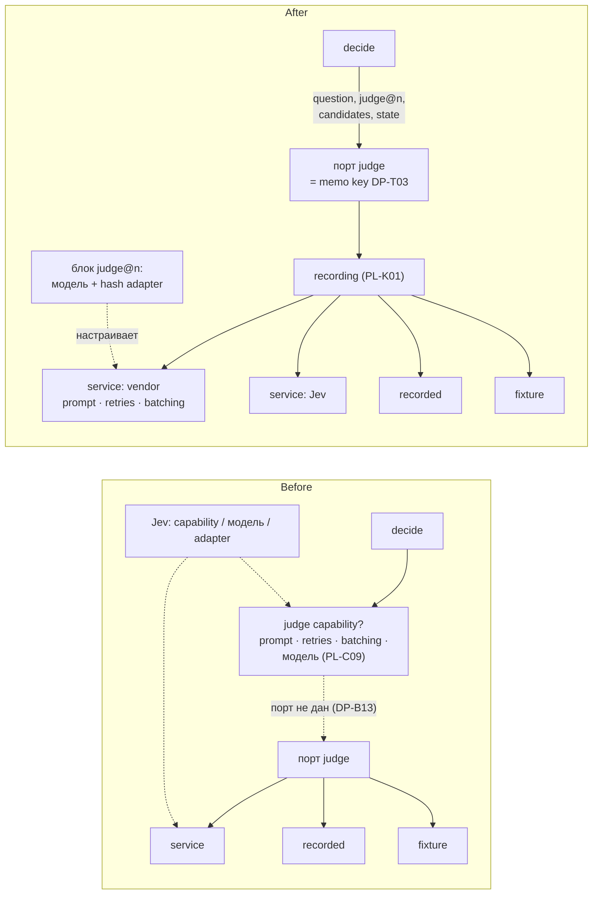
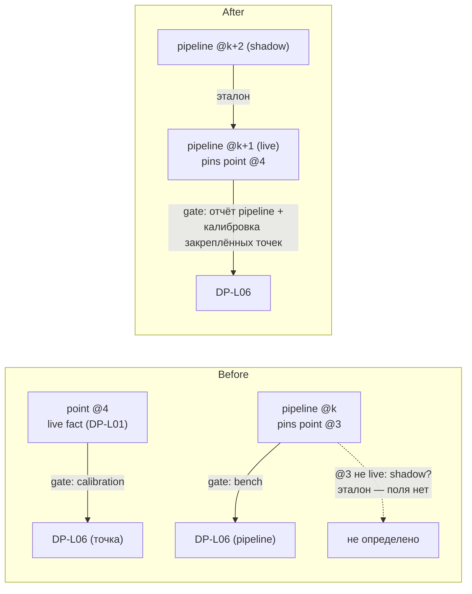
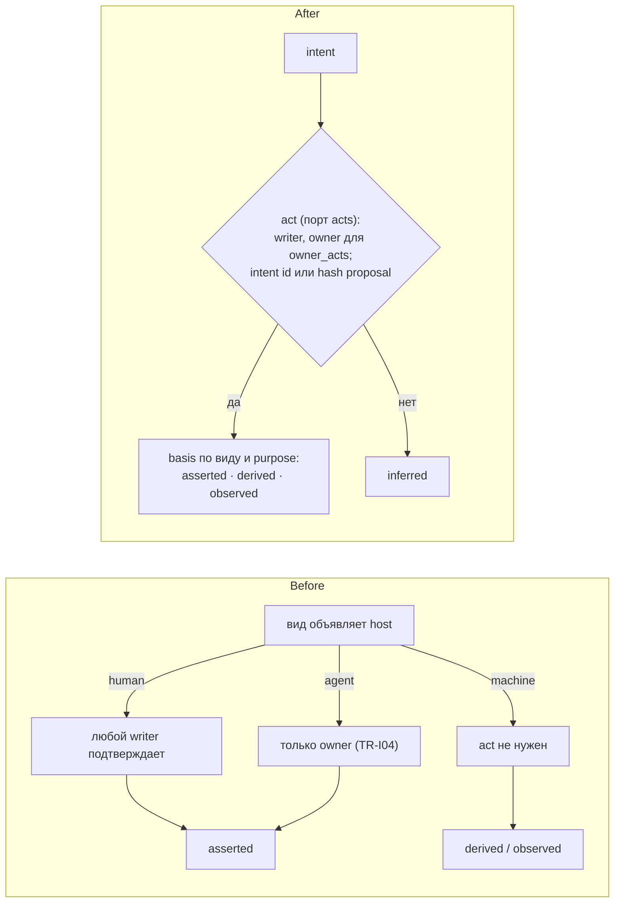

# LATTICE · design-next — финальный архитектурный разбор перед заморозкой

Дата: 2026-10-01 · Объект: `design-next/` — README, 00-glossary, 01–11 после правок аудита v0.6 (строка History «design v0.6 audit» в каждом файле).
Вход: [2026-10-01-unified-architecture](2026-10-01-unified-architecture.md) (U1–U6), [2026-10-01-design-v06-audit](2026-10-01-design-v06-audit.md) (G, T, L, X), [11-later](../11-later.md) (LT, NX). Решения из строк History и из NX не пересматриваются. Где пункт всё же их задевает, это прямо помечено: **переоткрывает …**.
Словарь: доменные термины взяты из 00-glossary и документов, архитектурные — из `codebase-design`: module, interface, implementation, depth, seam, adapter, leverage, locality.

Статус: **ревью, не норма; пункты становятся решениями только после grilling.**

## Итог в трёх строках

- Разовая правка на ~100 правил не сломала структуру «один вопрос — один путь», но оставила **три дыры, из-за которых не специфицировать S0**: детерминизм повторного apply (R03), bootstrap genesis/`std` (R04) и неполное отображение md → blocks (R12).
- Ядро trust противоречит само себе в двух местах: basis не может получиться `inferred` там, где дизайн этого требует (R01), и «in force» не определён для entity, хотя LENS и DP-C01 на него опираются (R02).
- Допуск `live` описан в четырёх правилах, ссылается на двух проверяющих (apply и CI) и нуждается в коде, которого матрица модулей ST-M01 не разрешает импортировать. Это главный кандидат углубления (D1).

## Сводная таблица

Строки R — правка текста, строки D — кандидаты углубления.

| # | Находка | Вид | Сила | IDs | Нужно к |
|---|---|---|---|---|---|
| [R01](#r01-basis-не-может-стать-inferred-у-machine-run) | Basis не может стать `inferred` у machine-run | противоречие | Strong | TR-B01, TR-B02, PL-R04, PL-C05, TR-N03, DP-C04, CT-P03 | до заморозки |
| [R02](#r02-in-force-не-определён-для-entity-accepts-и-in_force--два-механизма) | «In force» не определён для entity; «accepts» и `in_force` — два механизма | дыра | Strong | TR-I01, TR-B03, TR-I02, OM-T03, LN-O02, LN-O04, DP-C01, DP-L06, OM-H03, TR-F07 | S0 |
| [R03](#r03-повторный-apply-не-может-быть-байт-в-байт) | Повторный apply не может совпасть байт в байт | дыра | Strong | LG-P05, LG-C01, LG-C02, LG-C07, LG-C08, OM-I02, OM-E03, ST-S03 | S0 |
| [R04](#r04-bootstrap-тип-сессии-genesis-статус-core-и-std-содержимое-std) | Bootstrap: тип сессии genesis, статус `core`/`std`, содержимое `std` | дыра | Strong | LG-G01, LG-G02, LG-G04, LG-A07, OM-L01, OM-L02, OM-T04, OM-E02, OM-I02, CT-N01, CT-N02, CT-A02, PL-C03, PL-A01, PL-A03, TR-B02, SL-S0 | S0 |
| [R05](#r05-owner-act-для-статусных-fact-жёсткое-правило-или-default-политики) | Owner act для статусных fact — жёсткое правило или default политики | противоречие | Strong | TR-F06, CT-N03, CT-A02, BN-S02, PL-C03, TR-V09 | до заморозки |
| [R06](#r06-выбор-adapter-только-в-live-setup-против-replay-ci-и-s1) | Выбор adapter «только в `live` setup» против replay, CI и S1 | противоречие | Strong | PL-K02, PL-A01, PL-R02, LG-R03, SL-S1, BN-M06 | S1 |
| [R07](#r07-runtime-commit--один-run-а-verdict-и-ответ-на-escalate-куда) | «Runtime commit — один run», а verdict и ответ на escalate куда? | противоречие | Strong | LG-R05, LG-S03, PL-R03, TR-V09 | S2 |
| [R08](#r08-decision-как-event-против-decisionresult-только-в-run-record) | Decision как event против DecisionResult только в run record | противоречие | Strong | OM-K01, OM-E04, OM-R02, DP-R06, TR-F05, DP-B05, DP-C04, PL-R03 | до заморозки (текст), S3 (адрес) |
| [R09](#r09-lens-required-в-dp-n01-форма-допустимого-множества-и-общий-budget) | LENS: `required` в DP-N01, форма допустимого множества, общий budget | противоречие | Strong | DP-N01, 07 Purpose, LN-C02, LN-C06, DP-M05, DP-M06, LN-N01, LN-X01, LN-X03, SL-S1 | S1 |
| [R10](#r10-операторы-policy-вне-закрытого-набора) | Операторы policy вне закрытого набора | противоречие | Strong | DP-B03, DP-D01, DP-D02, 01 Stress test | до заморозки |
| [R11](#r11-матрица-st-m01-и-структурные-тесты-не-сходятся-с-03-и-06) | Матрица ST-M01 и структурные тесты не сходятся с 03 и 06 | противоречие | Strong | ST-M01, ST-S01, ST-S03, ST-T01, LG-B05, PL-K02, PL-K03, PL-K05, LG-R05, PL-A02, PL-A03, PL-C04, DP-B13, LT-21, LG-J01 | до заморозки |
| [R12](#r12-lg-b06-не-покрывает-корпус-который-должен-пройти-round-trip) | LG-B06 не покрывает корпус, который должен пройти round-trip | дыра | Strong | LG-B04, LG-B06, SL-S0, DP-R06, DP-N01, TR-B02, TR-F05, ST-M01 | S0 |
| [R13](#r13-калибровка-с-ключом-по-id-точки-и-сосуществующие-ревизии) | Калибровка с ключом по `id` точки при нескольких живых ревизиях | дыра | Worth exploring | DP-C01, DP-C06, TR-F05, DP-S02, DP-S03, LN-C03 | S3 |
| [R14](#r14-термины-в-двух-смыслах-и-вне-глоссария) | Термины в двух смыслах и вне глоссария | термин | Strong | GL-01, GL-07, PL-R01, ST-M01, CT-N03, PL-K02, PL-E02, LN-N03, LN-X03, TR-V09, DP-L02, BN-S01 и др. | до заморозки |
| [R15](#r15-пересказ-вместо-ссылки) | Пересказ вместо ссылки | повтор | Strong | DP-L06/BN-G04/BN-G02/PL-P06, LN-C05/TR-V10, PL-E02/SL-T06, LN-O01/PL-R01, DP-C05/BN-S04, DP-B10/LG-B02, 01 Authority/PL-K04, TR-F06/CT-A02 | до заморозки |
| [R16](#r16-число-прогонов-на-holdout-непроверяемо) | Число прогонов на `holdout` проверить нельзя | дыра | Worth exploring | BN-S05, LG-R04, CT-P04 | S3 |
| [R17](#r17-транзитивный-hash-capability-и-upgrade-ломают-live-pipelines) | Транзитивный hash capability и `upgrade` ломают `live` pipelines | дыра | Worth exploring | PL-C01, PL-C03, LG-G02, PL-P06, DP-L06, PL-R02 | первая смена кода built-in capability |
| [D1](#d1-gate-live--одна-дорога-от-evidence-к-допуску) | Gate `live` — одна дорога от evidence к допуску | кандидат углубления | Strong | DP-L06, DP-C01, PL-P01, PL-P06, BN-G01, BN-G02, BN-G04, BN-R02, BN-R03, TR-F05, LG-P05, LG-R02, ST-M01 | матрица — до заморозки; код — S3 |
| [D2](#d2-judge--одна-seam-вместо-трёх-ролей) | Judge — одна seam вместо трёх ролей | кандидат углубления | Strong | 01 Roles, DP-M02, DP-T03…T05, DP-B13, DP-L04, PL-C05, PL-C07, PL-C09, PL-K01, GL-02, SL-S2, ST-S01 | место в матрице — до заморозки; код — S2 |
| [D3](#d3-одна-ось-live--pipeline) | Одна ось `live` — pipeline | кандидат углубления | Worth exploring | DP-L01…L04, DP-L06, DP-S03, PL-P06, OM-R02, TR-F05, SL-S2 | S2 |
| [D4](#d4-подтверждение-авторства--один-путь-к-basis-уровня-knowledge) | Подтверждение авторства — один путь к basis уровня knowledge | кандидат углубления | Worth exploring | TR-B02, TR-I04, CT-P03, CT-A03…A05, CT-N03, LG-B07, BN-S04 | S0 |

Итого 21: противоречий 8, дыр 7, термин 1, повтор 1, кандидатов углубления 4. Сила: Strong — 16, Worth exploring — 5, Speculative — 0.

---

## Противоречия и дыры (правка текста)

### R01. Basis не может стать `inferred` у machine-run

**Strong** · противоречие · до заморозки

- TR-B01: `inferred` — «output of an agent, LLM or judge».
- TR-B02: basis вычисляется «from its session, by this table only». По таблице `machine` даёт только `derived` или `observed`.
- CT-P03: «`machine` sessions are those opened by LATTICE itself: service commands and runs».
- PL-C05 разрешает capability эффекты `calls-llm` и `writes-proposal`. PL-R04: «LLM output is generation with basis `inferred`». TR-N03: отчёт некалиброванной точки — «a hint (`inferred`)». DP-C04: verdict от judge — `inferred`.

**Почему ломается.** Run — это сессия `machine`. Поэтому proposal, которую написал run с LLM или judge внутри, по TR-B02 получит `derived`, а knowledge-типы `derived` принимают (TR-I02). Вывод LLM становится знанием в обход DP-B02 и PL-R04, а три правила о `inferred` (PL-R04, TR-N03, DP-C04) apply реализовать не может: basis считается «by this table only».

**Исправление.** В TR-B02 добавить строку перед остальными строками `machine` и оговорить, что строки проверяются сверху вниз:
> | `machine`, a run whose tape holds an answer of the `judge` or `llm` port (PL-K01) | any | `inferred` |

В PL-R04 фразу «LLM output is generation with basis `inferred`» заменить ссылкой: «its records have basis `inferred` (TR-B02)». В TR-N03 фраза «is a hint (`inferred`, TR-I02)» станет следствием этой строки.

### R02. «In force» не определён для entity; «accepts» и `in_force` — два механизма

**Strong** · дыра · S0

- TR-I01 определяет только `inForce(fact)`. Условие (3) «the latest event by `seq` for its key» к ревизии entity неприменимо.
- При этом у блоков «in force» есть: LN-O02 (у каждого элемента вывода «basis, in force»), LN-O04 («a fact not in force … is never given out» — речь о блоках, но сказано «fact»), OM-T03 («narrow the `in_force` bases» у типа блока).
- TR-B03: тип «declares which bases it accepts». TR-I02: «Knowledge-bearing types accept only `asserted`, `derived`, `observed`». Из этого не видно, отклоняет ли apply ordinary block, написанный агентом (`inferred`), или пишет его как недействующий. CT-A02 добавляет: «An ordinary block write needs no owner act».
- DP-C01 употребляет термин в третьем смысле: калибровка «is in force for a revision of the point only while that revision has the same `question`…». Это четвёртое условие сверх TR-I01, где сказано «Nothing else». DP-L06 опирается именно на этот смысл.
- OM-H03 считает no-op от «the latest revision», а TR-F07 — от «current value», то есть от последнего **действующего** (TR-F02). Если человек перепишет черновик агента тем же body, запись станет no-op: для entity запись пропадёт, для fact — нет.

**Почему ломается.** В S0 apply вычисляет basis и должен выбрать одно из двух: отклонить или записать недействующим. В S1 LENS должен решить, какую ревизию блока выдать. Сейчас обе вещи не определены. Для калибровки одним словом названы две разные проверки.

**Исправление** (форму нужно выбрать на grilling; ниже — рекомендуемая, по образцу TR-F02):
- TR-I01: «`inForce(record)` … (1) basis in the type's `in_force` list; (2) owner act …; (3) for a fact — the latest event by `seq` for its key; for an entity — the latest revision of its `id` among those that meet (1) and (2) (the **current revision**)».
- TR-B03: «A type declares its `in_force` bases (TR-I01). A basis outside that list never rejects a write; it keeps the record out of force». TR-I02: «accept only» → «list in `in_force` only».
- LN-O04: «a block whose `id` has a `retired` fact in force, or that has no current revision (TR-I01)».
- DP-C01: «in force for a revision» → «**applies to** a revision». DP-L06: «a `calibration` fact in force (TR-I01) that applies to that revision (DP-C01)».
- OM-H03: «…equals the hash of the current revision (TR-I01) is a no-op».

### R03. Повторный apply не может совпасть байт в байт

**Strong** · дыра · S0

- LG-P05 (2): commit в ветке «equals, byte for byte, the result of re-applying its intents to `base`».
- Недетерминированные поля: id event — ULID (OM-I02), `at` — из порта `clock` (OM-E03), `at` в заголовке commit (LG-C02). По ST-S03 apply чист и не может сам взять clock или ids. Откуда они берутся, не сказано нигде.
- LG-C07: «any permutation of intents gives the same result». LG-C01: «order inside a commit is `seq`». LG-C02: `proposal` — «the hash of its intents». Если `seq` внутри commit идёт по порядку intents, перестановка даёт другие байты и другой hash proposal, и идемпотентность LG-C08 промахивается.

**Почему ломается.** Без этого нельзя написать ни apply для S0, ни проверку CI (2): CI получит другие ULID и `at` и покраснеет на каждом PR.

**Исправление:**
- LG-P01, дописать: «An intent carries every value not computed from the tail: an event's `id` and `at`, every record's `by`. Apply assigns only `seq`, `rev` and `hash` (ST-S03)». LG-C02: `at` commit = `at` proposal (ставится, когда proposal пишется), либо убрать `at` из заголовка.
- LG-C07: «…gives the same result: the same outcome (commit, `no-op` or the same set of rejections) and the same bytes — records inside a commit are ordered canonically (entity `id`, fact key, event `id`), not by intent order». LG-C02: «`proposal` — the hash of its intents in that canonical order».

### R04. Bootstrap: тип сессии genesis, статус `core`/`std`, содержимое `std`

**Strong** · дыра · S0

- LG-G01: genesis записывает meta-type и «a genesis session that records itself». Сессия — это event, а его `type` — всегда `type@n` (OM-E02). В `core` лежит «only the meta-type» (OM-L01), а тип сессии появится только с `std` во втором commit. Сессии genesis нечем типизироваться. LG-A07 называет исключения «the self-typed meta-type, a session that has no earlier session event», но про тип сессии молчит.
- Hash genesis — константа (LG-G01), и `at` задан, а id сессии — ULID (OM-I02), случайный. Константу из этого не получить.
- CT-N01: namespace — «an entity with an owner and a policy». CT-N02 называет `core` и `std` namespaces, но owner и политики у них нет. CT-A02 ставит «an `upgrade` of `std`» в `owner_acts`, то есть в политику **проектного** namespace, хотя CT-N03 описывает политику своего namespace. Неизвестно и то, какой `id` у самой entity проектного namespace (commit 3, CT-N05): префикс `id` — это и есть namespace.
- OM-L02: `std` = «base types … and status fact types». При этом по тексту `std` нужны тип pipeline (`"type": "std/pipeline"` в примере 06), типы `setup`, namespace, сессии, `bench-item`, отчёта. Кроме того, нужны блоки built-in capabilities (PL-C03) и adapters: PL-A03 (3) сверяет их «hashes … match their blocks», а pinned-ссылка на несуществующий блок отклоняется (OM-R03). OM-T04 тоже не перечисляет pipeline, `setup`, namespace.
- LG-G04 пишет в commit 4 `setup@1` с fact `live`, но SL-S0 доказывает только «02, 03». Значит, S0 без 04 (namespace, CT-N05), 05 (`live`, TR-F05) и 06 (тип `setup`, блоки adapters) не собрать. У службы `upgrade` нет purpose в закрытом списке TR-B02.

**Исправление:**
- OM-L01: «`core` — the meta-type and the session event type, both created by kernel code at genesis». LG-G01: «the genesis session id is a constant of the kernel version, like its `at`».
- CT-N02: «`core` and `std` are reserved `id` prefixes, not namespace entities (CT-N01): no owner, no policy. A write into `std` is admitted only as an `upgrade` (LG-G02) under the project namespace's `owner_acts`». Отдельно определить `id` entity namespace (например, `<name>/namespace`, первая запись namespace) и назвать это исключение в LG-A07.
- OM-L02: «`std` — base types, status fact types, the types that 03–08 name (pipeline, `setup`, namespace, session, bench item, report) and the blocks of built-in capabilities and adapters (PL-C03)».
- TR-B02: purpose `upgrade` → `machine`, `derived` (или явно отнести upgrade к `init`).
- SL-S0 «Proves»: добавить LG-G01…G04, CT-N05, TR-B02, TR-F05 (`live`), PL-A01 (тип `setup`). Другой вариант — commit 4 пишется при первом `lattice run` в S1. Это **переоткрывает G07** («init пишет 1–4»); рекомендую первый вариант.

### R05. Owner act для статусных fact — жёсткое правило или default политики

**Strong** · противоречие · до заморозки

- TR-F06: `retired`, `alias`, `live`, `calibration`, `dismissed` «are written and revoked **only** by an owner act (CT-A02)».
- CT-A02 называет тот же список «**Default** `owner_acts`», то есть политика namespace может его изменить. CT-N03: namespace policy — «the only place that says which writes need an owner act».
- Так же читаются BN-S02 («A new revision of a set is an owner act (CT-A02)») и PL-C03: они ссылаются на default как на закон.
- Внутри TR-F06: verdict пишет «only … its own participant», а TR-V09 допускает verdict из `runtime`, который в proposal пишет другой автор (`via`).

**Почему ломается.** Непонятно, может ли политика убрать `live` из `owner_acts`. Если может, gate DP-L06 остаётся без человека, хотя BN-G02 требует: «a human decides». Требование задано в двух местах — ровно то, что устраняла U2.

**Исправление.** В CT-N03 ввести пол:
> «A floor no policy removes: the status facts of TR-F06, an `upgrade` of `std`, a change of namespace policy or ownership. `owner_acts` may only add to it».

TR-F06: «…are in the owner-act floor (CT-N03)». CT-A02 перечисляет только настраиваемые defaults сверх пола. TR-F06 про verdict: «…only by its own participant, directly or cited from `runtime` (TR-V09)».

### R06. Выбор adapter «только в `live` setup» против replay, CI и S1

**Strong** · противоречие · S1

- PL-K02: adapter «is chosen only in `setup` (PL-A01)». PL-A01: какой `setup` активен, «is decided by its `live` fact, never by a naming convention».
- PL-R02: replay — это «a run on the `recorded` adapters». LG-R03: CI «never calls a live judge» и работает на `fixture` и `recorded`. SL-S1: `solve` идёт на `fixture`. BN-M06: прогоны шума — «with memoization off».

**Почему ломается.** Если adapters выбирает только `live` setup, то replay, CI, bench без memo и разработка на `service` требуют каждый раз переписывать `live` setup через owner act. Одновременно они работать не могут.

**Исправление.** PL-A01, дописать:
> «Any `setup` revision may be named for a run (`lattice run --setup`); only a run under the `live` `setup` may drive execution (DP-L03). Replay ignores `setup`: every recorded port is served by `recorded` (PL-R02)».

PL-K02: «chosen by the run's `setup` (PL-A01), except in replay». Флаг memo для прогонов шума — поле `setup`.

### R07. «Runtime commit — один run», а verdict и ответ на escalate куда?

**Strong** · противоречие · S2

LG-R05: «A `runtime` commit is one run». Но LG-S03 кладёт в `runtime` ещё и «local verdicts». PL-R03: «The human's answer is a participant event», и этот event не принадлежит ни одному run. TR-V09 цитирует такие verdict в knowledge.

**Исправление.** LG-R05: «A `runtime` commit is one run (PL-R01) or one participant event outside a run (a local verdict, an answer to an escalation, PL-R03), with its session event».

### R08. Decision как event против DecisionResult только в run record

**Strong** · противоречие · до заморозки (текст), S3 (адрес)

- OM-K01 относит к events «facts, decisions, verdicts». OM-R02 требует pinned-ссылки у «decisions». Пример envelope в 02: `"of": { "decision": "01H…" }`.
- DP-R06: DecisionResult «is stored only inside its run record». Это решение U3, и отдельного event decision нет.
- Verdict на исход (DP-B05, DP-C04) ссылается на «subject `ref@n`» (TR-F05), а у решения внутри run нет ни `id`, ни `@n`. Продолжение после escalate ссылается на «the previous run» (PL-R03), а id у run тоже не определён.

**Исправление** (текст — до заморозки):
- OM-K01: «event (… facts, verdicts, sessions, runs)». OM-R02: «decisions» → «runs». Пример в 02: `"of": { "run": "01H…" }`.
- Адрес решения внутри run (например, `run-id` + номер stage) — новая форма ссылки для грамматики OM-I05. Это вопрос grilling к S3. Отдельного хранения DecisionResult **не** предлагаю: это второй дом рядом с DP-R06.

### R09. LENS: `required` в DP-N01, форма допустимого множества, общий budget

**Strong** · противоречие · S1

- DP-N01: «candidate source (BM25, plus blocks referenced by id as `required`)», диаграмма 07 Purpose: «(BM25 + required)». LN-C02 после аудита говорит обратное: id из need «are not `required`… `required` is declared only by a point».
- DP-M06 и пример Model: `"source": "tools.allowed@2"`, pinned-ссылка. LN-C06: допустимое множество `lens-rank` — «blocks within the need's `scope`», то есть правило над входом run, а не ссылка. Как записать это в поле `candidates.source`, не сказано.
- Budget: DP-M05 — «one run context field, taken from the need». Его тратят `decide` (оператор `budget`), расширение LN-X01 («within the budget») и вторая точка LN-X03. PL-P03 запрещает двух writers одного поля, так что как передаётся остаток — неизвестно. SL-S1 («Solve without judge») включает расширение, но в S1 ещё нет точки «sufficient?» из LN-X03.

**Исправление:**
- DP-N01: «candidate source (BM25 plus blocks named by id in the need, LN-C02) → `decide(score)` → `top-k` + `budget`; `required` only as the point declares it (DP-M05)». Диаграмма 07: «(BM25 + ids from the need)».
- DP-M06: «`candidates.source` is a pinned reference to the allowed set, or `scope`: the need's scope (LN-N03)».
- DP-M05, дописать: «Budget is spent once, on the final output. A stage that consumes it computes the remainder from the fields it reads; no stage writes the budget». LN-X03: «until the point "sufficient?" exists (S2), expansion stops at the remainder».

### R10. Операторы policy вне закрытого набора

**Strong** · противоречие · до заморозки

Закрытый набор: `threshold`, `top-k`, `margin`, `budget`, `any`, `all` (DP-B03, DP-D02). Но DP-D01 говорит «complexity levels → model via a table in policy», а stress test использует `permission` (tool), «table level → model» (model), «report» (scenario coverage) и «priority from a table in policy» (ticket routing).

**Исправление.** Либо добавить в набор `table` («maps the selected value to an output value from a table in the point's policy»), либо в DP-D01 заменить «via a table in policy» на «a following stage maps the level». Рекомендую `table`: он нужен трём кейсам и не рассуждает. В stress test заменить `permission` на ссылку на допустимое множество (DP-M06; «Judge never grants», DP-B01), а `report` — на «— (shadow, DP-S03)».

### R11. Матрица ST-M01 и структурные тесты не сходятся с 03 и 06

**Strong** · противоречие · до заморозки

| Место | Сейчас | Что говорит текст | Правка |
|---|---|---|---|
| `codec` → | `kernel` | импорт даёт «md → proposal» (LG-B05), а формат proposal задан в 03; экспорт читает последние ревизии и compositions — это projections `ledger` | `kernel`, `ledger` (формат proposal, read view) |
| `runtime` → `ledger` | «(read view, PL-K05)» | runtime ещё и пишет runtime commit (LG-R05) и ищет memo в прошлых лентах (PL-K03) | «read view; append of a `runtime` commit; tape lookup» |
| ST-S03, чистота | вне `adapters` и `cli` | `assembly` читает конфигурацию и `$env` (PL-A02, PL-A03); PL-C04 запрещает `process.env` вне adapters | исключить `assembly` из ST-S03 или читать `$env` через adapter; PL-C04 и ST-S03 привести к одной формулировке |
| ST-S01 | направление, циклы, adapters, SDK | DP-B13: «a structure test forbids any other import» порта `judge`, а матрица даёт `capabilities` все «runtime port interfaces» | в ST-S01 добавить: «only `decide` imports the `judge` port (DP-B13)» |
| PL-K02, ST-T01 | «Every port has three adapters» | у `store` (LG-S02) и `acts` (LG-A04) свои adapters; ST-T01 не упоминает `acts` | PL-K01/K02: «every **recorded** port (judge, llm, source, clock, ids)»; в ST-T01 добавить `acts` |
| LT-21 | триггер «more than three projections» | LG-J01 уже перечисляет пять: referrers, latest revision, uniqueness, in-force, findings | переписать триггер (например, «a projection owned by a module other than `policy`»). Брать LT-21 сейчас не нужно |
| gate `live` | нет дома | DP-L06 требует от apply операторов policy и метрик bench | см. [D1](#d1-gate-live--одна-дорога-от-evidence-к-допуску) |

`ledger` → `policy` нужен и правилен: apply вычисляет basis (TR-B02) и проверяет writers (CT-N03), а projections in-force и findings строятся в `ledger` (LG-J01). Порты `store` и `acts` стоят в `ledger` верно: у обоих по два и больше adapters, seam настоящий. Кто импортирует `codec`: только `assembly` и `cli`; CI вызывает его через `cli` (LG-P05 (3)).

### R12. LG-B06 не покрывает корпус, который должен пройти round-trip

**Strong** · дыра · S0

Критерий SL-S0 — байт-в-байт на нормализованном md (LG-B04). В корпусе есть формы, для которых в LG-B06 нет строки:
- абзац, который начинается с ID: «DP-R06. A DecisionResult…», «DP-N01. LENS is…»;
- правило, за которым идёт таблица без ID и которая является его частью: TR-B02 (таблица basis), TR-F05 (типы статусных fact), ST-M01 (матрица), LG-B06 (сама таблица отображения); отдельно — таблицы без ID и без правила: 01 Roles, Stress test, 00 «Terms defined by rules»;
- блоки кода не на JSON (` ```text ` в 01 и 07) и «JSON», который не парсится: пример envelope в 02 с `// entity revision` и `{ … }`;
- диапазоны ID в тексте: «DP-C01…C05», «OM-A01…A03». Правило «an ID mentioned in text → a floating reference» диапазоны не описывает, а экспорт должен восстановить `…` байт в байт;
- ссылки на раздел или документ: «01 Model», «(04, 05)»; маркированные списки README; гранулярность прозы без ID (абзац или раздел).

**Исправление.** Дополнить LG-B06 строками для каждой формы или записать в LG-B04: «normalization rewrites every other form into a form of LG-B06». Минимум:
- «a paragraph starting with an ID → the block of that ID»;
- «a table without IDs right after a rule ending with ":" → a field of that rule's block»;
- «a fenced block of any language → `example` with its text as a string»;
- «an ID range → one reference per ID; export restores the range»;
- «one prose paragraph → one block».

### R13. Калибровка с ключом по `id` точки и сосуществующие ревизии

**Worth exploring** · дыра · S3

- TR-F05: key у `calibration` — «decision point `id`». Значит, на точку приходится одна калибровка. Но ревизии сосуществуют: одна `live`, другие в `shadow` или на bench (DP-L01).
- Калибровка новой ревизии (новый `judge@n`) заменяет по key калибровку `live`-ревизии. После этого `live`-ревизия по DP-C01 некалибрована. Если DP-S02 и DP-S03 («an uncalibrated `binary` point … never drives execution») проверяются при валидации pipeline, живой pipeline становится невалидным. Когда они проверяются, в дизайне не сказано.
- DP-C06: «the tokenizer capability of the candidate source». Но source по DP-M06 — объявление допустимого множества, а не stage. Tokenizer закрепляет pipeline (LN-C03), и его смену уже закрывает gate pipeline (PL-P06).

**Исправление** (выбрать на grilling):
- (a) Key `calibration` = `(point id, hash of question, judge@n, set@n)`. Тогда «applies to» (R02) — это совпадение key, и калибровки ревизий сосуществуют. Рекомендую этот вариант.
- (b) «A `calibration` for a revision other than the `live` one is written only in the same commit as its `live` fact».
- В DP-C06 оставить только card: tokenizer покрыт PL-P06 через LN-C03. Сказать, где проверяются DP-S02 и DP-S03: при допуске `live` (DP-L06) или при валидации pipeline.

### R14. Термины в двух смыслах и вне глоссария

**Strong** · термин · до заморозки

| Термин | Смыслы | Где | Правка |
|---|---|---|---|
| policy | (1) policy точки — операторы (01); (2) политика namespace (CT-N03); (3) module `policy` (ST-M01), «catalog or trust policy» (LG-A03) | 01, 04, 10, 03 | module переименовать (например, `trust`); в 00-glossary: «policy (of a point) — DP-B03», «namespace policy — CT-N03» |
| service | (1) adapter (PL-K02, GL-03); (2) service commands (PL-E02, LG-B07, LG-G02, CT-P03); (3) «service blocks» (LN-N03) | 06, 03, 04, 07 | переименование `live` → `service` (G18) создало новую коллизию; команды назвать, например, «write commands», в LN-N03 — «`std` blocks» |
| import | (1) md → blocks через codec, одноразово в S0 (LG-B05, LG-B07); (2) импорт внешнего источника — pipeline (CT-M02, TR-S01…S03, PL-E01); (3) import кода (ST-S01) | 03, 04, 05, 06, 10 | PL-E01 «In S0 import is a service command» склеивает (1) и (2); после S0 md — только экспорт (LG-B02). Назвать (1) «md import», в PL-E02 добавить его в список команд (сейчас там только `init`, `apply`, `verify`, `export`, `upgrade`) |
| via | (1) метка расширения `via: <ref>` (LN-X03, LN-O01); (2) исходный участник процитированного verdict (TR-V09) | 07, 05 | в TR-V09 другое имя поля (например, `origin`) |
| reference | (1) ссылка на entity (OM-R01); (2) эталон в `shadow` (DP-L02); (3) эталонный ответ bench (BN-S01) | 02, 01, 08 | DP-L02: «**baseline**» или «**referee**»; BN-S01: «expected answer» (так уже сказано в BN-S06) |
| block | GL-01: только знание и compositions — «behaviour, not content»; а PL-C01 «entity block», PL-A01 «`setup` is a block», 01 Model «ordinary block type», DP-B10 «LATTICE blocks are the source of truth» | 00, 01, 06 | GL-01: «block — any entity; **content block** — a knowledge-bearing type or a composition (what LENS selects)» |
| evidence | файлы-отрезки ленты (LG-R02, PL-K02); доказательства доверия в выводе (TR-V01, LN-O02); URL act в commit (LG-A05); вывод judge (DP-B02) | 03, 05, 06, 07, 01 | в 00-glossary: evidence = отрезок ленты (LG-R02); остальное — «trust evidence» и «act record» |
| source | candidate source (DP-M06); порт `source` и source adapter (GL-02, CT-M02); ссылка `source` на черновик (TR-I04) | 01, 04, 05 | в TR-I04 — «`draft`» |
| execution tuple | GL-07: «code hashes of capabilities, `judge@n` with its pinned model, adapters»; PL-R01: «code hashes of capabilities, `judge@n`, models» — adapters нет | 00, 06 | PL-R01 ссылается на GL-07, а не пересказывает |

Нет в 00-glossary: record, run record, report, evidence, store, segment, tail, genesis, upgrade, referrers (OM-R05), policy.

### R15. Пересказ вместо ссылки

**Strong** · повтор · до заморозки

| Одно утверждение | Где сказано | Оставить | Остальные — ссылкой |
|---|---|---|---|
| gate `live` и «цели до прогонов» | DP-L06, BN-G04, BN-G02, PL-P06 | DP-L06 (gate), BN-G04 (цели до прогонов) | PL-P06, BN-G02; DP-L06 ссылается на BN-G04, не пересказывая его |
| полезность — не verdict | TR-V10, LN-C05 | TR-V10 | LN-C05 |
| CLI-команда ручной приёмки у каждого slice | PL-E02, SL-T06 | SL-T06 | PL-E02 |
| fallback помечен в выводе | PL-R01, LN-O01 (друг на друга) | PL-R01 | LN-O01 |
| escalations — только в `tune` | DP-C05, BN-S04 | BN-S04 | DP-C05 |
| md — только экспорт после S0 | DP-B10, LG-B02 | LG-B02 | DP-B10 (отмечено ещё в U-ревью, осталось) |
| две оси: adapter и `live` | 01 Authority (преамбула), PL-K04 | PL-K04 | преамбула 01 |
| список статусных fact для owner | TR-F06, CT-A02 | CT-N03 (пол, R05) | TR-F06, CT-A02 |
| смена judge — новая ревизия | DP-L04, PL-C09 (друг на друга) | PL-C09 (ревизия `judge@n`), DP-L04 (ревизия точки) | см. [D2](#d2-judge--одна-seam-вместо-трёх-ролей) |
| состав execution tuple | GL-07, PL-R01 | GL-07 | PL-R01 (см. R14) |

### R16. Число прогонов на `holdout` проверить нельзя

**Worth exploring** · дыра · S3

BN-S05: «The number of runs on the `holdout` of each `set@n` is recorded». Но прогоны bench локальны (BN-R01), `runtime` не проверяется (CT-P04), и в knowledge попадают только процитированные сегменты (LG-R04). Автор может прогнать holdout много раз и процитировать один. Защита от подгонки, ради которой записано G22, не работает.

**Исправление.** Сказать честно, как с PII в LG-A06: «In v1 the holdout run count is local and unverified (CT-P04); the owner is responsible». Проверяемый вариант (holdout только в CI на recorded-ответах, как BN-R03) завести в 11-later с триггером «first `live` point (S3)».

### R17. Транзитивный hash capability и `upgrade` ломают `live` pipelines

**Worth exploring** · дыра · первая смена кода built-in capability

PL-C01: hash capability покрывает «every file of `src/` it imports transitively», и при расхождении «the runtime refuses to run it». `decide` импортирует интерфейсы портов `runtime`, а через них — `kernel` (ST-M01). Значит, любая правка `kernel` или `runtime` меняет hash `decide`. Новая ревизия built-in capability приходит через `upgrade` (LG-G02), но pipelines проекта закрепляют старую ревизию (OM-R02). Они перестают запускаться, пока owner не напишет новые ревизии pipelines и не пройдёт gate (DP-L06, PL-P06). Ни LG-G02, ни 09 этого не описывают.

**Исправление.** Минимально, без переоткрытия T22: в LG-G02 записать, что `upgrade`, который меняет hash built-in capability, несёт в том же PR новые ревизии pipelines, закрепивших её, вместе с их отчётами. Альтернатива **переоткрывает T22**: hash не включает модули ниже seam stage (`kernel`, интерфейсы портов), их покрывает версия LATTICE в execution tuple. Рекомендую минимальный вариант и измерить его цену на первом upgrade.

---

## Кандидаты углубления

### D1. Gate `live` — одна дорога от evidence к допуску

**Strong** · in-process · матрица — до заморозки, код — S3

**Files / IDs**
- `01-decision-pattern.md`: DP-L06, DP-C01, DP-S02
- `06-pipeline.md`: PL-P01, PL-P06
- `08-bench.md`: BN-G01, BN-G02, BN-G04, BN-R02, BN-R03, BN-M01…M06
- `05-trust.md`: TR-F05 (`calibration`)
- `03-ledger.md`: LG-A01, LG-A03, LG-P05, LG-R02
- `10-structure.md`: ST-M01

**Problem**
- Допуск `live` описан в четырёх правилах (DP-L06, PL-P06, BN-G02, BN-G04), а проверяющих два. Apply: DP-L06, BN-G02. CI: BN-R03 («CI recomputes the metrics»), LG-R02 («CI verifies their hashes»). При этом LG-P05: CI «holds no checks of its own», LG-A01: каждая hard check — часть apply.
- DP-L06 велит apply пересчитать отчёт при новой policy. Для этого нужны операторы policy (01; живут в `decide`, module `capabilities`) и метрики (08; module в матрице нет). Apply лежит в `ledger`, который по ST-M01 импортирует только `kernel` и `policy`. Кода, который правило требует от apply, в разрешённых импортах нет.
- У отчёта два дома: fact отчёта (BN-R02) и его копия в value `calibration` (TR-F05). Точка проверяется по копии, pipeline — по fact. Это две дороги к одному вопросу.
- Целям pipeline негде жить: PL-P01 знает только stages, а BN-G01 («a pipeline has targets per metric») и BN-G04 («targets were in the ledger before its runs») требуют поле.
- Gate не спрашивает, откуда в отчёте ответы judge. Отчёт на `fixture` проходит цели так же, как на `service`, хотя execution tuple (GL-07) это записывает.
- Deletion test: уберём «пересчёт при смене policy» как особый случай и будем пересчитывать отчёт из evidence **всегда**. Сложность не вырастет, а исчезнут и особый случай DP-L06, и второй проверяющий (CI по BN-R03).

**Solution**
- Один чистый module оценки (рабочее имя `measure`): закрытый набор операторов policy (01), метрики (BN-M01…M06) и проверка «отчёт проходит цели» вместе с BN-G04. Он импортирует только `kernel`, а его импортируют `ledger` (apply) и `capabilities` (`decide` берёт операторы отсюда).
- При допуске `live` apply всегда делает одно и то же: сверяет hash evidence (LG-R02), пересчитывает метрики из evidence при policy текущей ревизии без вызовов judge, проверяет цели и BN-G04, проверяет, что ответы judge в evidence пришли от `service`-adapter закреплённого `judge@n` (GL-07). CI остаётся «apply + codec» (LG-P05). BN-R03 и вторая половина LG-R02 становятся ссылками на apply.
- Один тип fact отчёта (BN-R02) о `subject@n` на `set@n`. Value `calibration` ссылается на отчёт, а не копирует его. Цели и bench set pipeline — поля блока pipeline (как `bench` у точки).
- Правило живёт в DP-L06, остальные — ссылки (R15).
- Это не NX-17: module лежит не в kernel, и его проверки — закрытый набор с rule ID, а не реестр.



**Benefits**
- Locality: «почему `live` отклонён» объясняет один module с rule ID (LG-A02), не четыре правила и не CI-скрипт.
- Leverage: `decide` в run и пересчёт в gate используют одни операторы и не могут разойтись.
- Тест: фикстура ledger + evidence → принять или отклонить. Interface gate — это test surface. Отдельных проверок в CI нет.
- Матрица ST-M01 становится честной: у каждого кода, которого требует текст, есть разрешённый дом.

**Для grilling:** имя module; стоит ли пересчёт «всегда» (при ~150 пунктах SL-K03 он дешёвый); поля целей pipeline.

---

### D2. Judge — одна seam вместо трёх ролей

**Strong** · ports & adapters · место в матрице — до заморозки, код — S2

**Files / IDs**
- `01-decision-pattern.md`: Roles, DP-M02, DP-T03, DP-T04, DP-T05, DP-B13, DP-L04, DP-R05
- `06-pipeline.md`: PL-C01, PL-C05, PL-C07, PL-C09, PL-K01…K03, PL-A01, PL-A03
- `00-glossary.md`: GL-02, GL-03 · `09-slices.md`: SL-S2 · `10-structure.md`: ST-M01, ST-S01, ST-T01

**Problem**
- «Judge» — это три вещи сразу: роль шаблона (01 Roles, «`judge` capability (Jev, LLM)»), блок capability `judge@n` с моделью и prompt (PL-C09, DP-M02) и порт (GL-02, DP-B13, PL-K01). Jev тоже в трёх ролях: capability (Roles), «the version of Jev» как модель (PL-C09), `judge-jev` adapter (SL-S2).
- «Judge capability» не выполняет контракт capability: по PL-C07 каждая capability возвращает stage outcome, а judge — не stage. По PL-C05 и DP-B13 порт `judge` получает только `decide`, значит capability, которая держит prompt (PL-C09) и retries/batching (DP-T04, DP-T05), сама вызвать порт не может. В ST-M01 ей нет места: в `capabilities` она не может импортировать SDK вендора (ST-S01), а в `adapters` она уже не capability.
- Уровень записи не определён. Memo key DP-T03 `(question, judge@n, candidate set, state)` совпадает с interface порта над prompt. Но где стоит recording — над prompt или под ним, — нигде не сказано. От этого зависит, нужен ли replay код prompt.
- DP-L04 смешивает две ревизии: «a new revision of the point (`judge@n+1`)». PL-C09 ссылается на DP-L04, говоря о ревизии judge.
- ST-S01 не проверяет DP-B13, хотя DP-B13 обещает «a structure test».

**Solution**
- `judge` — это порт. Его interface — ровно memo key DP-T03: (question, `judge@n`, кандидаты с cards, `state`) → оценки, покрывающие ровно множество кандидатов (DP-R05). Recording (PL-K01) стоит на этом interface.
- `judge@n` — блок, который настраивает `service`-adapter порта: точная модель (PL-C09) и hash кода adapter. В этом коде prompt, retries, backoff, batching (DP-T04, DP-T05) и сверка модели из ответа. Это не stage capability. Ссылка точки на `judge@n` (DP-M02) остаётся как есть; `setup` выбирает вид источника: `service`, `recorded` или `fixture` (PL-A01).
- Vendor LLM и Jev — два `service`-adapter одного порта. Два adapter — значит, seam настоящий.
- DP-L04: «changing the judge — a new `judge@n` (PL-C09) — reaches execution only through a new revision of the point that pins it». В ST-S01 добавить DP-B13.



**Benefits**
- Locality: всё о том, как спросить модель, лежит в одном adapter, а `decide` знает только порт.
- Leverage: memo, replay, fixture и contract-тест точного покрытия (ST-T01) работают на одном interface.
- Тест: `decide` тестируется с `fixture`, `service`-adapter — contract-тестом. Replay не нуждается в коде prompt.
- Матрица: SDK вендора остаётся в `adapters`, правило DP-B13 проверяется структурным тестом.

Второго механизма нет: из трёх ролей остаётся одна seam и её adapters.

---

### D3. Одна ось `live` — pipeline

**Worth exploring** · in-process · S2 · **переоткрывает U1** («одна лестница для точки, pipeline, capability и `setup`») **и DP-L01**

**Files / IDs**
- `01-decision-pattern.md`: DP-L01…L04, DP-L06, DP-S03
- `06-pipeline.md`: PL-P01, PL-P06, PL-K04
- `05-trust.md`: TR-F05 (`live`) · `02-object-model.md`: OM-R02 · `07-lens.md`: LN-C03 · `09-slices.md`: SL-S2, SL-S3

**Problem**
- Точка исполняется только как stage `decide` внутри pipeline (01 Model, PL-E01). Pipeline закрепляет ревизию точки (`"point": "lens-rank@3"`; OM-R02 требует pinned). Fact `live` точки тоже называет ревизию (DP-L01). На вопрос «какая ревизия точки управляет исполнением» отвечают два fact. Если они расходятся (живой pipeline закрепляет @3, а `live` точки — @4), то по DP-L01 @3 «runs only in shadow», но заменить её решение в stage нечем. Что происходит, дизайн не говорит.
- DP-L02 требует для `shadow` эталон и говорит, что без него «pipeline validation rejects it». Но ни у точки, ни у pipeline нет поля для эталона.
- Одна смена judge требует новой ревизии точки, `calibration`, `live` точки, новой ревизии pipeline, отчёта pipeline и `live` pipeline: два gate и три owner act на одно изменение.
- Deletion test: убираем `live` у точки. На вопрос «какая ревизия управляет» отвечает pin живого pipeline, а проверка калибровки переходит в gate pipeline (D1). Сложность нигде не появляется, а состояние рассогласования исчезает.

**Solution**
- `live` остаётся у pipeline и `setup`. Ревизия точки управляет исполнением тогда и только тогда, когда её закрепляет `live`-ревизия pipeline.
- DP-L06 для pipeline: у каждой закреплённой ревизии точки есть калибровка, которая к ней применима и проходит её цели (DP-C01), плюс отчёт самого pipeline.
- `Shadow` — это не-`live` ревизия pipeline, которая работает рядом с `live` на том же входе. Эталон — `live` pipeline, это и есть «existing rule» из DP-L02, так что поле не нужно. Человеческое решение и bench set остаются эталонами для bench. SL-S2 так и сформулирован: `lens-rank` в `shadow` против baseline S1, то есть против живого pipeline S1.
- DP-S03 становится следствием: pipeline с некалиброванной `binary`-точкой gate не пройдёт.



**Benefits**
- Locality: «что сейчас исполняется» — один fact на pipeline.
- Leverage: один gate (D1) вместо двух; эталон `shadow` получает определение без нового поля.
- Тест: фикстура ledger с pins pipelines → какая ревизия управляет; состояния «pin ≠ live» больше нет.

**Если отклонить**, нужна минимальная связка, и она показывает, что оси две только на бумаге: apply отклоняет `live` pipeline, если закреплённая ревизия точки не `live`, и отклоняет перенос `live` точки, пока живой pipeline закрепляет другую ревизию. В stage `decide` появляется поле `reference`.

---

### D4. Подтверждение авторства — один путь к basis уровня knowledge

**Worth exploring** · ports & adapters (`acts`) · S0 · **частично переоткрывает G10** (таблицу TR-B02)

**Files / IDs**
- `05-trust.md`: TR-B01, TR-B02, TR-I02, TR-I04
- `04-catalog.md`: CT-N03, CT-N05, CT-P03, CT-A01, CT-A03, CT-A04, CT-A05
- `03-ledger.md`: LG-A04, LG-B07 · `08-bench.md`: BN-S04, BN-R02 · `09-slices.md`: SL-K03

**Problem**
- Вид сессии объявляет host (CT-P03), и дизайн сам говорит, что этому верить нельзя. Но объявленный вид всё равно выбирает, **кто** может дать `asserted`. Объявлен `human` → подтверждает любой логин из `writers` (CT-A05). Объявлен `agent` → только owner (TR-I04, последняя строка TR-B02). Требование owner из TR-I04 и BN-S04 обходится объявлением `human`, а объявляет его host агента.
- `machine` объявляется так же и не требует никакого act: `machine` + `import` → `derived`, basis уровня knowledge (TR-I02). Агент, запустивший импорт LATTICE над собственным текстом, получает `derived` без участия человека (LG-B07; CT-P03: «opened by LATTICE itself»).
- Гранулярность act расходится. CT-A03 и CT-A05 называют intent id; CT-A04 — «acted on that proposal»; CT-A05 — «a login listed in `writers`», хотя `writers` задаются «by participant or by kind» (CT-N03). CT-N05 утверждает, что init — «not an exception to CT-A03», а CT-A03 определяет act как комментарий в PR.
- TR-I04: «a `source` reference to the draft (the hint or the agent's intent)». Но intent — не запись, и сослаться на него нельзя (OM-R03); заголовок закрыт (OM-E01), и где лежит `source`, не сказано.
- В TR-B02 пять строк, и последняя кладёт act в колонку «Participant kind».

**Solution**
- Одно правило: запись в knowledge получает basis выше `inferred` только для intent, который назван act (форма CT-A03; `init`-adapter при init). Act может дать логин, которому разрешено авторство (`writers`), а для `owner_acts` — owner. Act называет intent id **или hash proposal** (LG-C02): иначе импорт сотен блоков не подтвердить.
- Какой именно basis, решают вид и purpose: `human` или `agent` → `asserted`; `machine` с `check`/`bench` → `observed`; `machine` с `init`/`work`/`import` → `derived`. Без act — `inferred` (для типов знания — недействующая запись, R02). Вместе с R01 таблица TR-B02 сводится к purpose и одной строке про ленту с `judge`/`llm`.
- Объявленный вид перестаёт быть вопросом безопасности: он выбирает вид basis, но не даёт права его получить. TR-I04 становится следствием. `source` к intent не нужен: act в commit (LG-A05) и `by` уже показывают черновик. `source` остаётся только для пути hint → knowledge.
- CT-A03 формулируется через порт: «in a PR, an act is … (the `github` adapter, LG-A04)».



**Benefits**
- Locality: вопрос «подтверждено ли» решает один порт `acts`, а таблица basis становится таблицей purpose.
- Закрывается лазейка `machine` без нового механизма: не нужен повторный вывод `derived` в CI.
- Тест: `fixture`-acts × виды × purpose → basis. Interface — это test surface.
- Цена: импорт S0 требует одного комментария maintainer с hash proposal.

---

## Что сознательно не предлагаю

| Идея | Почему нет |
|---|---|
| Удалить статусный fact `calibration` и держать только `live` + отчёт | DP-S02 и DP-S03 требуют принятой owner калибровки ещё до `live` (порог в `shadow`). Хватает D1: калибровка ссылается на отчёт |
| Проверять `derived` повторным выполнением импорта в apply | Затягивает codec и source adapter в `ledger`; D4 решает то же через `acts` |
| Взять LT-21 (подключаемые projections) сейчас | `ledger` → `policy` правилен для S0; достаточно поправить триггер (R11) |
| Отдельный job CI для метрик bench | Второй проверяющий рядом с apply; противоречит LG-A01 и LG-P05 (см. D1) |
| Вынести read view (PL-K05) в отдельный module матрицы | Это interface `ledger` с одним adapter — seam гипотетическая |
| Хранить DecisionResult отдельным event, чтобы на него ссылался verdict | Второй дом рядом с DP-R06 и U3; адрес внутри run (R08) дешевле |
| Открыть реестр findings (TR-N02) для проектных проверок | Решено в аудите v0.6 («Оставить закрытым»); трения не видно |
| Суммировать basis или вводить веса ради D4 | NX-01; D4 не меняет TR-B03 |

## Top recommendation

**Перед заморозкой — правка текста, которая задаёт форму S0: R03, R04, R02, R12.** S0 превращает 02–03 в код и md в blocks. После S0 md — только экспорт (LG-B02), и каждая такая правка становится proposal с owner act, а форма записи — версией kernel (OM-E01, OM-L04). Сейчас это правка бумаги. Там же, одним проходом и дёшево: R01, R05, R10, R11, R14, R15 и текстовая половина R08.

**Из кандидатов первым — D1.** Он меняет матрицу ST-M01, а она по самому ST-M01 — «the starting point for the first kernel Change». Ещё он задаёт форму fact отчёта в `std` (R04). D2 — вторым: его вклад в матрицу (где живут prompt и SDK) нужен до заморозки, а код — только в S2. D4 нужно решить до S0, потому что apply вычисляет basis с первого commit. Если отложить, минимум — R01 и строка про `machine` в CT-P03.

**Может подождать:** R06 и R09 (S1); R07, R17 и D3 (S2, до первого `shadow`); R13, R16 и адрес решения из R08 (S3).
