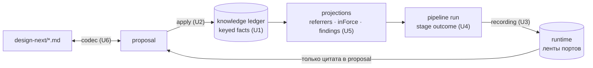
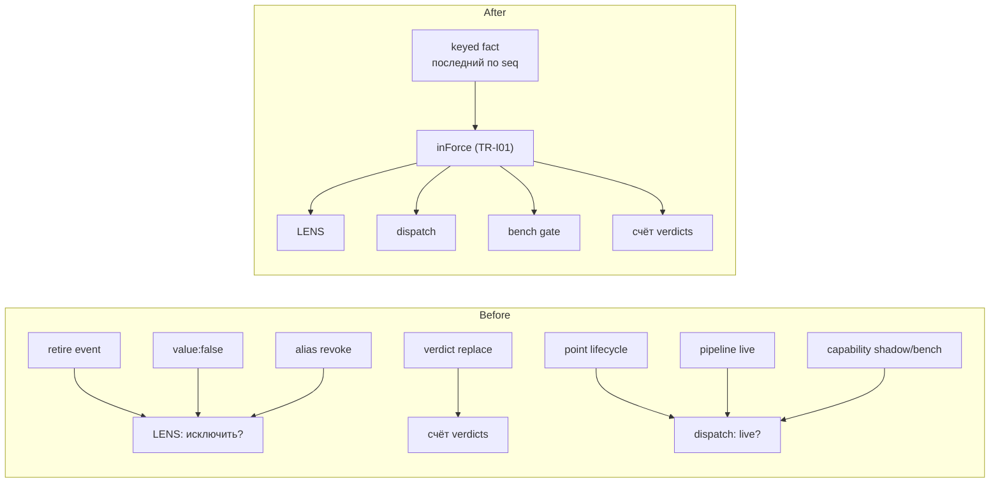
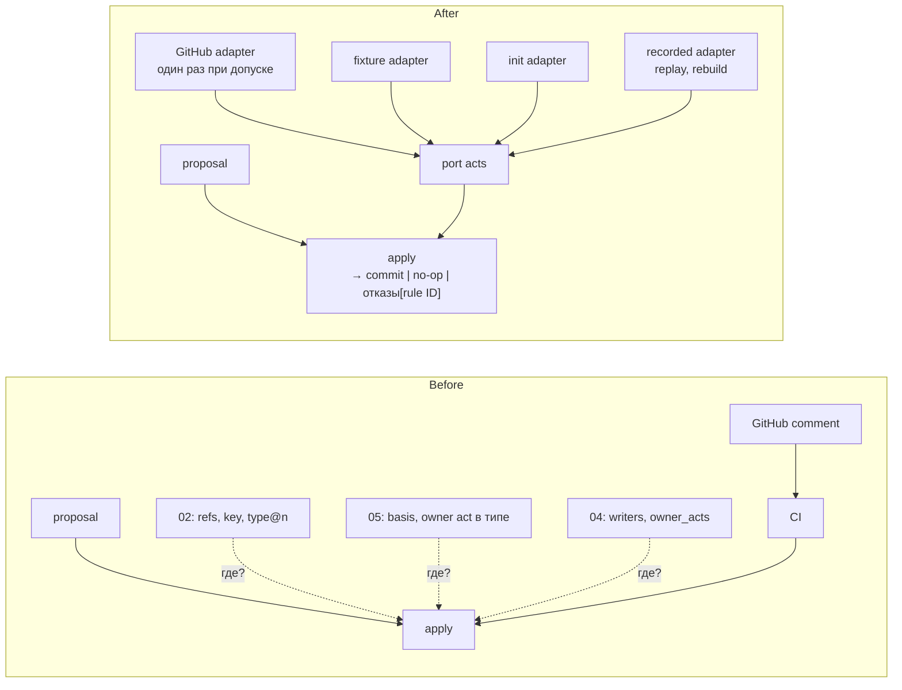
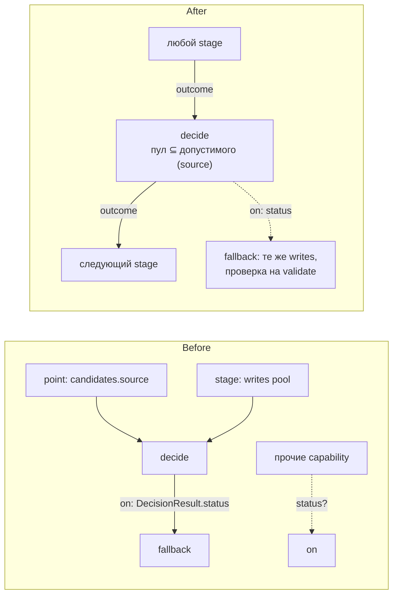
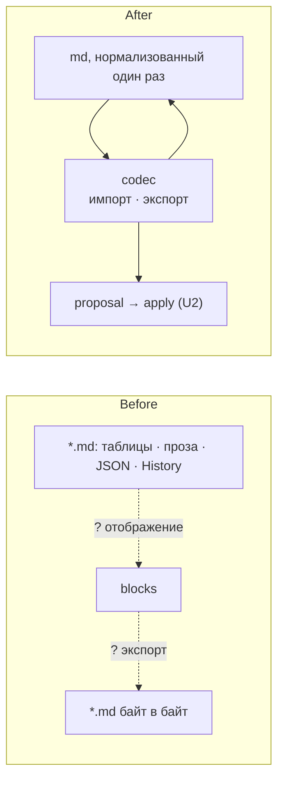

# LATTICE · design-next — унифицированная архитектура (повторный разбор)

Дата: 2026-10-01 · Объект: `design-next/` (README, 01–09). Это только дизайн: реализованный код (`src/kernel`) и ревью `2026-09-30-kernel-architecture.md` не рассматриваются.
Предыдущий вход: [archive/architecture-review-20260930](archive/architecture-review-20260930.md). Его диагнозы учтены, вредные решения отрезаны (см. [раздел ниже](#что-отрезано-из-предыдущего-ревью)).
`GLOSSARY.md` и ADR нет. Доменные термины взяты из самих документов, архитектурные — из словаря `codebase-design`: module, interface, implementation, depth, seam, adapter, leverage, locality.

Статус: **ревью, не норма.** Кандидаты становятся решениями только после grilling.

## Цель: один вопрос — один путь

Сейчас на многие вопросы дизайн отвечает двумя–пятью механизмами. Целевая картина: одна форма записи и три пути через неё.



| Вопрос | Сейчас (механизмов) | Единственный путь |
|---|---|---|
| Можно ли это записать? | 4 документа, часть «в CI» | **apply** (U2) |
| Действует ли X? | 5 способов снять, 3 лестницы `live` | **keyed fact + `inForce`** (U1) |
| Откуда ответ порта? | replay, memo, режим `recorded` | **recording** (U3) |
| Что делает pipeline дальше? | `on` только для DecisionResult | **stage outcome** (U4) |
| Что ждёт внимания owner? | 7 правил, определения нет | **findings projection** (U5) |
| Как md становится блоками и обратно? | не описано | **codec** (U6) |
| Как runtime влияет на knowledge? | CT-A04, LG-R02, BN-R02 | **только цитата в proposal** (сквозное правило) |

## Кандидаты

| # | Кандидат | Сила | Зависимость | Нужен к |
|---|---|---|---|---|
| [U1](#u1-keyed-fact--один-способ-сказать-заменить-и-снять) | Keyed fact — один способ сказать, заменить и снять | **Strong** | in-process | S0 (форма 02 застывает в коде) |
| [U2](#u2-apply--единственный-путь-записи) | Apply — единственный путь записи | **Strong** | ports & adapters (`acts`) | S0 |
| [U3](#u3-recording--одна-лента-ответов-портов) | Recording — одна лента ответов портов | **Strong** | ports & adapters | S2 |
| [U4](#u4-stage-outcome--один-dispatch-для-всех-capability) | Stage outcome — один dispatch для всех capability | Worth exploring | in-process | S1–S2 |
| [U5](#u5-findings--одна-projection-для-всего-что-ждёт-owner) | Findings — одна projection для всего, что ждёт owner | Worth exploring | in-process | S1+ |
| [U6](#u6-codec-md--blocks--один-module-формата) | Codec md ↔ blocks — один module формата | **Strong** | in-process | S0 (критерий готовности) |

---

## U1. Keyed fact — один способ сказать, заменить и снять

**Strong** · in-process

**Files**
- `02-object-model.md`: OM-K03, OM-D02, OM-R04
- `05-trust.md`: TR-F01…F03, TR-I01, TR-V02, TR-V04
- `01-decision-pattern.md`: DP-L01…L04, DP-C03
- `06-pipeline.md`: PL-P06, PL-C03
- `07-lens.md`: LN-C03, LN-C04
- `04-catalog.md`: CT-A02

**Problem**
- Снять утверждение можно пятью способами: событие `retire` (OM-K03), «отмена поздним событием» (OM-K03), fact с `value: false` (TR-F02), «поздний verdict заменяет ранний» (TR-V02), отзыв alias (OM-D02).
- Лестниц `live` три: точка `draft → fixture → shadow → calibrated → live` (DP-L01…L04), pipeline (PL-P06), capability или tokenizer — «проверяется bench и shadow» (LN-C03, PL-C03). Где хранится текущий режим, не сказано нигде.
- `value: false` как отмена сталкивается с настоящим булевым значением `false`.
- Каждый потребитель — исключение в LENS (LN-C04), dispatch (DP-L03), bench gate (BN-G02) — должен знать каждый механизм.
- Deletion test: если убрать `retire` как отдельный вид события, сложность не появится у вызывающих — это обычный fact с key. Значит, это не отдельный механизм, а лишняя копия.

**Solution**
- Каждое утверждение о статусе — fact с key (TR-F01), и действует последний по `seq` (TR-F02). Покрываются:
  - retired — key `(id, retired)`;
  - alias — key `(пара, alias)`;
  - live — key `(id, live)`, значение — номер ревизии. Одна лестница для точки, pipeline, capability и `setup`. `live` принадлежит `id`, а значение называет ревизию, поэтому DP-L04 («смена judge — новая ревизия») работает без изменений. Это закрывает открытый вопрос предыдущего ревью;
  - калибровка принята — key `(point@n, calibration)`, значение — ссылка на отчёт (BN-R02);
  - verdict — key `(participant, subject@n)`. Тогда TR-V02 — просто следствие TR-F02, а не отдельное правило.
- Отмена — явный признак отзыва в body, а не `false`.
- Линия жизни точки сокращается до `draft → shadow → live`: «calibrated» — это fact, а не шаг; `fixture`/`recorded` уходят в U3.
- `inForce` остаётся ровно TR-I01: basis, owner act, последний по key. Никаких aspect, весов и runtime.

**Что намеренно не входит** (отличие от универсального `inForce` предыдущего ревью)
- Вес verdict из runtime (CT-A04) — это переход между stores, а не вопрос «действует ли». Он идёт единым путём «цитата в proposal».
- Набор типов статусных fact закрыт и лежит в `std`; растёт только с версией LATTICE. Правило «новый статус — новый тип fact, заведи сам» не вводится: это был бы движок правил (DP-B09).

**Before / After**



**Benefits**
- Locality: вопрос «действует ли X» решает одна функция над ledger.
- Leverage: четыре потребителя, одна implementation.
- Тест: ledger-fixture → ожидаемые статусы. Interface — это test surface.
- Уходят отдельные правила: TR-V02 как самостоятельный механизм, особый вид `retire`, «calibrated» как шаг.

**Для grilling:** правило «отозвать можно только fact того же key» против «любой участник может переписать» (TR-F03 уже поднимает finding «overridden» — оставить).

---

## U2. Apply — единственный путь записи

**Strong** · ports & adapters

**Files**
- `02-object-model.md`: OM-H03, OM-R02, OM-R03, OM-T02, OM-T05, OM-T06, OM-C01, OM-D01, OM-L04
- `03-ledger.md`: LG-C01…C05, LG-P02…P05, LG-J03
- `04-catalog.md`: CT-N03, CT-N05, CT-A01…A03, CT-P02…P04
- `05-trust.md`: TR-B02, TR-I01(2), TR-I02, TR-I04
- `08-bench.md`: BN-R02, BN-S04 · `09-slices.md`: SL-K03

**Problem** (диагноз предыдущего ревью плюс новое)
- Правила отклонения proposal собираются из 02, 03, 04 и 05; часть проверок живёт «в CI».
- Требование owner act задано в трёх местах: политика namespace (CT-N03), «тип требует» (TR-I01 п. 2), жёсткие правила (DP-B12, PL-C06). При этом OM-T02 прямо говорит, что права в тип не входят.
- Basis назначается противоречиво: CT-P02 даёт `machine → derived`, а BN-R02 делает отчёт машины `observed`. TR-B02 учитывает `purpose`, которого нет в CT-P02.
- Черновик агента, одобренный человеком: SL-K03 и BN-S04 говорят «становится `asserted`», TR-I04 — «basis никогда не меняется, человек пишет новый блок», CT-P03 — «сессия агента → `inferred`».
- CT-N05 (создание namespace без комментария) — исключение из CT-A03, и init вообще не PR (LG-P03).

**Solution**
- Apply — единственный module, который превращает proposal в commit. Каждая hard check на запись (DP-B11) — его implementation. Отказ называет ID правила: каталог кодов отказа — это ID из дизайна.
- Внутри apply у трёх вещей по одному дому:
  - **требование owner act** — только `owner_acts` namespace (CT-N03); тип его не несёт; TR-I01 п. 2 ссылается на CT-N03;
  - **basis** — одна таблица `(participant kind, purpose, owner act) → basis`, её вычисляет apply. Owner act над черновиком агента — это авторство человека: результат `asserted` со ссылкой на черновик. Так TR-I04, BN-S04 и SL-K03 сходятся в одно правило;
  - **identity и owner acts** — через порт `acts` с тремя adapter: GitHub (CI), fixture (тесты), init (CT-N05: owner из конфигурации). Три adapter — seam настоящий, и CT-N05 перестаёт быть исключением.
- Kernel (OM-L04: envelope, hash, meta-type, схема, ссылки) — внутренний seam apply. Политики каталога и trust живут над ним, поэтому их смена не требует новой версии kernel.

**Что намеренно не входит**
- Apply не проверяет GitHub повторно. Acts проверяются один раз, при допуске; в commit записываются URL комментария и результат. Повторный apply в CI (LG-P05 п. 2), открытие store (LG-C04) и rebuild (LG-J02) читают acts из commit через recorded adapter (U3) и в сеть не ходят. Иначе удалённый комментарий или переименованный логин сделает историю непроверяемой.
- Подтверждение `irreversible` (DP-B12, PL-C06) — это runtime, а не apply.

**Before / After**



**Benefits**
- Interface apply — это test surface для всех правил записи из 02–05.
- CI и тесты идут одним путём; CI только вызывает apply и сравнивает байты.
- Basis и требование owner act перестают противоречить друг другу, потому что у каждого один источник.
- Для S0 форма module готова.

---

## U3. Recording — одна лента ответов портов

**Strong** · ports & adapters

**Files**
- `01-decision-pattern.md`: DP-M02, DP-T01…T05, DP-L01…L03, DecisionResult `trace`
- `06-pipeline.md`: PL-C04, PL-A01, PL-R01, PL-R02, PL-R04
- `03-ledger.md`: LG-S03, LG-C01, LG-C02, LG-C04, LG-R01…R03
- `08-bench.md`: BN-R03

**Problem**
- Одно и то же хранилище ответов описано трижды: replay (DP-T01), memoization (DP-T03), режим `recorded` (LG-R03).
- `fixture`/`recorded` одновременно реализация judge (DP-M02, `trace.judge_impl`), шаг линии жизни (DP-L01) и выбор adapter (PL-A01). «Откуда ответ» и «решает ли результат» стоят на одной оси.
- Clock, ids и source не записываются, хотя PL-R02 требует «recorded port answers».
- Решение записано дважды: в `DecisionResult.trace` и в run event (PL-R01). LG-S03 отдельно перечисляет «decisions».
- Runtime противоречит сам себе: сегменты истекают (LG-R01), а цепочка проверяется при открытии (LG-C04). Кроме того, заголовок commit требует `proposal` (LG-C02), которого в runtime нет.

**Solution**
- Один module recording на seam каждого порта: judge, llm, source, clock, ids. Adapter: live, recorded, fixture.
- Run record — лента ответов портов и исходов stage. Replay — прогон на recorded adapter. Evidence (LG-R02) — отрезок ленты. `DecisionResult` живёт только внутри run record.
- Две оси вместо одной линии:
  - **откуда ответ** — adapter в `setup` (PL-A01), и только там;
  - **решает ли результат** — fact `live` из U1, и только он.
- Runtime store (рекомендация для grilling): цепочка — внутри сегмента; истекает сегмент целиком; хэш головы каждого сегмента хранится в маленьком индексе, чтобы LG-C04 проверял то, что осталось. Commit в runtime — это run, без поля `proposal`.

**Что намеренно не входит**
- Memo — только для портов, которые его объявили (judge, llm). Clock, ids и source пишутся для replay, но не мемоизируются: memo времени вернёт старое время, memo source спрячет изменения источника.
- Повторы, backoff и batching остаются внутри capability порта (DP-T04, DP-T05).

**Before / After**

```text
Before                                          After
judge  : replay · memo · recorded mode          judge  llm  source  clock  ids
llm    : «та же дисциплина» (PL-R04)              │     │     │       │     │
clock  : —                                    ┌───▼─────▼─────▼───────▼─────▼───┐
ids    : —                                    │ recording: лента на run          │
source : —                                    │ replay = recorded adapter        │
lifecycle: draft→fixture→shadow→calibrated→live│ memo = поиск по ленте (judge, llm)│
decision: trace + run event + «decisions»     │ evidence = отрезок ленты          │
                                              └──┬──────────────┬──────────────┬─┘
                                               live         recorded        fixture

                                              ось «откуда ответ» — setup (PL-A01)
                                              ось «решает ли»    — fact live (U1)
```

**Benefits**
- Locality: правила replay в одном module.
- Leverage: одна implementation на пять портов.
- Тест replay — прогон на recorded adapter; дыры clock/ids закрываются.
- Линия жизни точки короче, решение записано один раз.

---

## U4. Stage outcome — один dispatch для всех capability

**Worth exploring** · in-process

**Files**
- `01-decision-pattern.md`: Model (`candidates.source`), DP-M03, DP-M05, DP-B04, DP-B13, операторы policy
- `06-pipeline.md`: PL-C05, PL-P02…P05, PL-R01, PL-R03
- `07-lens.md`: LN-N01, LN-C01, LN-C02, LN-B01

**Problem**
- `on: {status}` (PL-P04) определён только для статусов DecisionResult. Что возвращают прочие capability, не сказано; outcome run (PL-R01) и `escalated` (PL-R03) не определены.
- Candidates приходят двумя путями: `candidates.source` в точке и поле `pool` из предыдущего stage (пример `solve`).
- `required` описан трижды: DP-M05, DP-B04 вместе с оператором `required ⊆ selected`, LN-C02.
- `budget` живёт в четырёх местах: DP-M05 (поля в точке нет), оператор `budget`, `need.budget` (LN-N01), параметр-коэффициент (LN-B01).
- DP-B13 разрешает импорт порта judge только `decide`, а PL-C05 даёт эффект `calls-judge` любой capability.

**Solution**
- Каждая capability возвращает stage outcome: статус и записанные поля. DecisionResult — его частный случай. Outcome run — outcome последнего stage или действие dispatch (`refuse`, `escalate`).
- Candidates: конкретный пул приходит из поля контекста (source — обычный предыдущий stage), **но** точка сохраняет `candidates.source` как объявление допустимого множества. `decide` проверяет, что пул ⊆ допустимого; иначе отказ.
- `required` — одно правило DP-M05; оператор `required ⊆ selected` и вторая половина DP-B04 удаляются как избыточные.
- `budget` — одно поле контекста run, пришедшее из need; оператор `budget` читает его. Коэффициент символы → токены остаётся параметром stage.
- Эффект `calls-judge` разрешён только `decide` (PL-C05 приводится к DP-B13).
- Форму interface stage outcome не предлагаю: это вопрос grilling.

**Что намеренно не входит**
- `candidates.source` из точки не удаляется. На нём держатся DP-B04 и DP-B01: точка объявляет, что вообще можно рассматривать, а автор pipeline не может подсунуть произвольный пул.

**Before / After**



**Benefits**
- Один dispatch для всех stage; fallback проверяется на validate (PL-P03).
- Candidate source тестируется как любой stage.
- `required` и `budget` получают по одному дому.

---

## U5. Findings — одна projection для всего, что ждёт owner

**Worth exploring** · in-process

**Files**
- `02-object-model.md`: OM-R04
- `05-trust.md`: TR-F03, TR-S02, TR-V06
- `08-bench.md`: BN-G03
- `01-decision-pattern.md`: DP-S03, DP-L02
- `03-ledger.md`: LG-J01, LG-R02

**Problem**
- Семь правил «поднимают finding», но ни один документ не говорит, что это такое, где живёт, кто видит и как закрывается. Deletion test: module нет, и сложность уже размазана по правилам-источникам.

**Solution**
- Findings — projection над knowledge ledger, как referrers (LG-J01). Каждое правило — зарегистрированная проверка со своим ID.
- Finding закрывается owner act (fact «dismissed» — U1) или исчезает вместе с причиной.
- Сигналы из runtime — расхождение в shadow (DP-L02), отчёт некалиброванной binary-точки (DP-S03) — становятся findings только после цитаты в knowledge через proposal. Это тот же единственный путь runtime → knowledge.
- Расхождение в shadow имеет basis `observed`: сравнивает код, а не judge.

**Что намеренно не входит**
- Второго хранилища для findings нет.
- Judge не пишет findings в knowledge напрямую.

**Before / After**

```text
Before                                    After
OM-R04  ref to retired    ─┐              ┌────────────────────────────────┐
TR-F03  overridden        ─┤              │ findings = projection (LG-J01) │
TR-S02  missing in source ─┤              │  проверка на каждый rule ID    │
TR-V06  vote threshold    ─┼─▶ ?          │  runtime — только через цитату │
BN-G03  regression        ─┤              └───────────────┬────────────────┘
DP-S03  binary report     ─┤                              ▼
DP-L02  shadow disagree   ─┘                owner → fix | retire | dismissed (U1)
```

**Benefits**
- Locality: всё, что ждёт owner, собрано в одном месте.
- Rebuild даёт те же findings (LG-J02); тест — ledger → ожидаемый список.

---

## U6. Codec md ↔ blocks — один module формата

**Strong** · in-process (в предыдущем ревью — Speculative; повышено, потому что без него S0 не специфицируется)

**Files**
- `README.md` (Conventions), `01-decision-pattern.md`: DP-B10
- `02-object-model.md`: OM-I01, OM-C01, OM-R02
- `03-ledger.md`: LG-B01…B03, LG-P05 п. 3
- `06-pipeline.md`: PL-E01 · `09-slices.md`: SL-S0, SL-T01

**Problem**
- Критерий готовности S0 — байт-в-байт round-trip md ↔ blocks, но отображение не описано:
  - текст без ID: Purpose, таблица Roles, JSON-примеры, History, «Depends on», ссылки README;
  - многоколоночные таблицы (DP R, DP X, SL-S) и тип блока для каждой строки с ID;
  - превращение `DP-B01` в `namespace/slug` (OM-I01);
  - ссылка ли «(DP-C04)» внутри текста;
  - NFC, переводы строк, экранирование в таблицах.
- Импорт от сессии агента получит basis `inferred`, который типы знания отвергают (TR-I02, CT-P03).
- PL-E01 делает импорт pipeline run, а S0 доказывает только 02 и 03 — runtime из 06 в S0 нет.
- Не сказано, входит ли `reviews/` в корпус.

**Solution** — один codec module: импорт md в proposal, экспорт блоков в md, property «экспорт(импорт(md)) = md». Всё знание формата внутри него. Рекомендации для grilling:
- Перед S0 — один проход нормализации md под формат codec. Критерий S0 — round-trip на нормализованном md, а не на написанном руками.
- History и «Depends on» — не блоки: историю хранит ledger, зависимости показывают referrers. При нормализации они уходят из md.
- Строка таблицы с ID → блок типа, заданного разделом (`rule`, boundary, discipline — типы `std`); ID → `lattice/<id>`.
- «(DP-C04)» в тексте → floating-ссылка (OM-R02: навигация).
- Прозаический текст (Purpose) получает свой ID — прямое следствие «one statement — one ID».
- Импорт — сессия `machine`, basis `derived` (CT-M02).
- В S0 импорт — служебная команда рядом с apply; PL-E01 действует с S1.
- `reviews/` в корпус не входит.

**Before / After**



**Benefits**
- Round-trip — один property test.
- Формат знает один module; LG-B03 проверяется кодом, а не глазами.
- S0 получает проверяемый критерий готовности.

---

## Что отрезано из предыдущего ревью

| Решение предыдущего ревью | Почему вредно | Что взамен |
|---|---|---|
| Универсальный `inForce(subject, aspect)` для всего, включая вес verdict | Смешивает жизненный цикл, связи и переход runtime → knowledge; «новый статус — новый тип fact» ведёт к движку правил (DP-B09, TR-I01 «nothing else») | U1: закрытый набор keyed facts, TR-I01 без изменений, CT-A04 отдельно |
| Убрать `candidates.source` из decision point | Ломает допустимое множество (DP-B04, DP-B01): пул может прийти откуда угодно | U4: source — объявление допустимого, пул ⊆ допустимого |
| Проверка GitHub внутри apply при каждом применении | Replay, rebuild и открытие store зависят от сети и от того, что комментарий ещё жив | U2: один раз при допуске, evidence в commit, recorded adapter |
| Memo для всех портов | Memo clock и source возвращает устаревшее | U3: memo только для объявивших портов (judge, llm) |
| Apply как один module со всем внутри, включая kernel | Смена политики каталога потребует версии kernel (OM-L04) | U2: kernel — внутренний seam apply |
| Finding от judge = hint с basis `inferred` | Расхождение в shadow фиксирует код | U5: `observed`, в knowledge только через цитату |

## Сквозные противоречия (не кандидаты — правка текста)

| IDs | Противоречие | Рекомендация |
|---|---|---|
| DP-B01 ↔ DecisionResult | judge «может escalate», но эскалация — ветка dispatcher | Убрать «escalate» из DP-B01: judge только сужает и помечает |
| DP-S03 ↔ Stress test «PR boundary» | некалиброванная binary-точка с `any` управляет исполнением | PR boundary — в `shadow`/report до калибровки |
| CT-M01 ↔ LG-S04 | «нет ссылок между stores», но runtime ссылается на knowledge | Store проекта = пара knowledge + runtime; CT-M01 говорит о проектах |
| PL-E02 ↔ init, apply, verify, export | «нет логики вне pipelines» | Назвать исключение: путь записи (U2) и codec (U6); всё, что читает и решает, — pipeline |
| OM-A03 ↔ DP-M04, составной кандидат | «card — единственный текст, который читает judge» | Card — единственный текст **блока**; `state` — вход run |
| OM-D01 ↔ TR-F01 | `key` в двух смыслах | Переименовать ключ уникальности типа (например, `unique`) |
| TR-I02 ↔ OM-T04 | типы `hint`/`candidate` отсутствуют среди базовых | Добавить базовый тип `hint` в `std` |

**Гигиена «one statement — one ID»:** пересказ вместо ссылки — CT-A04≡TR-V07, DP-C02≡BN-M01, DP-C03≈BN-G02, DP-C05≈BN-S02, DP-B10≈LG-B02, LG-R03≈BN-R03, DP-T01≈PL-R02. Оставить одну формулировку, вторая — ссылка.

## Top recommendation

**[U1. Keyed fact](#u1-keyed-fact--один-способ-сказать-заменить-и-снять).**
- U1 меняет форму записи в 02 и 05, а S0 превращает 02 в код. После S0 смена видов записей — это новая версия kernel (OM-E01, OM-L04); сейчас это правка бумаги.
- U1 уменьшает всё остальное: apply (U2) проверяет меньше механизмов, findings (U5) и LENS читают один `inForce`, recording (U3) избавляется от шага `calibrated`.

Дальше: U2 и U6 вместе задают форму S0; U3 — до S2; U4 и U5 — по пути.
