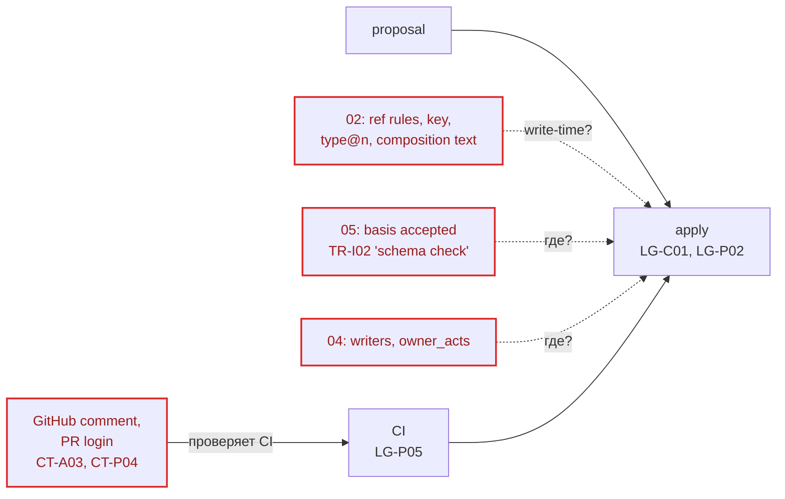
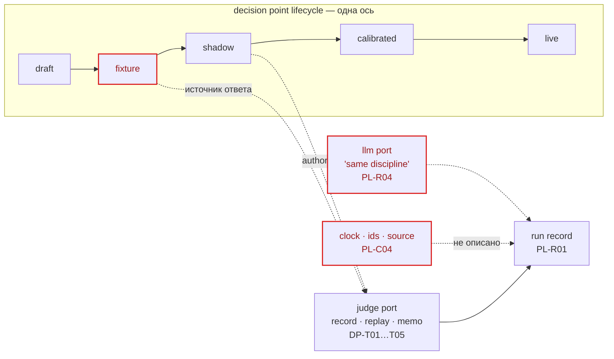
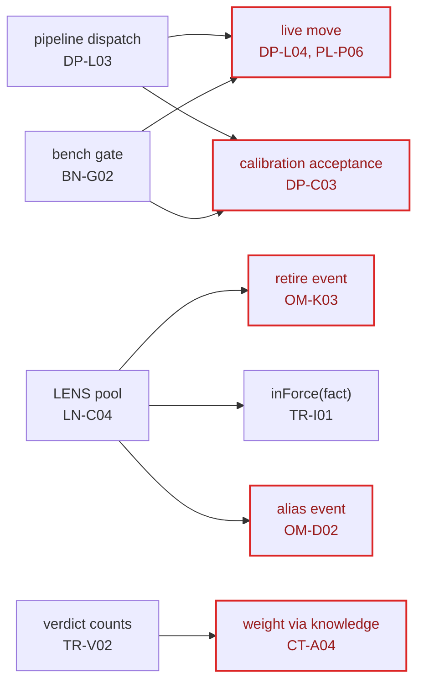
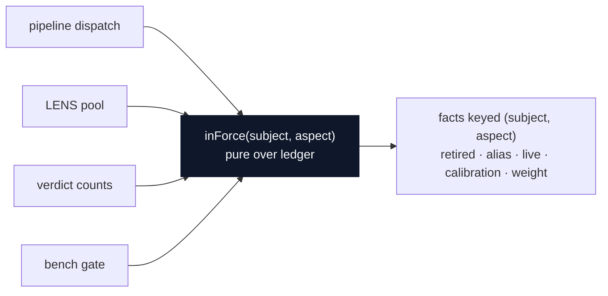
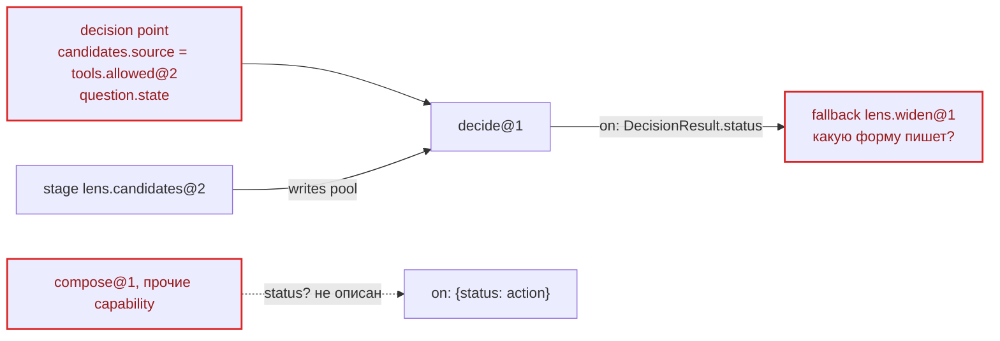
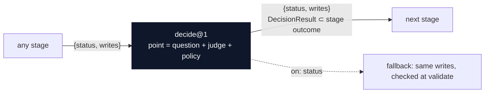
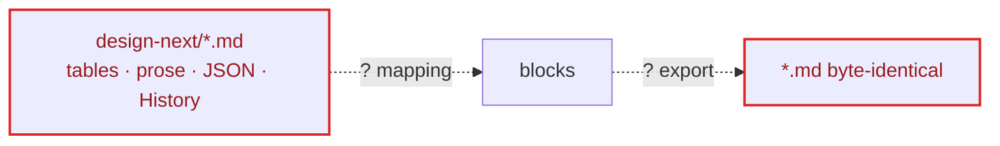

# LATTICE · design-next — архитектурный разбор

Дата: 2026-09-30 · Объект: `design-next/` (9 документов + README, только дизайн, кода нет).
`GLOSSARY.md` и ADR нет. Доменные термины (block, ledger, proposal, intent, commit, projection, decision point, DecisionResult, judge, policy, capability, pipeline, stage, run, port, owner act, fact, basis, in force, verdict, finding, bench set, LENS, need) взяты из самих документов. Архитектурные термины (module, interface, implementation, depth, seam, adapter, leverage, locality) взяты из словаря `codebase-design`.

Git-истории нет, а все документы прошли grilling в один день. Поэтому вес кандидата определяется тем, как близко он к первым slices (S0–S2 в `09-slices`).

| # | Кандидат | Сила | Зависимость |
|---|---|---|---|
| [A](#a-apply-владеет-каждой-hard-check) | Apply владеет каждой hard check | **Strong** | ports & adapters (`acts`) |
| [B](#b-recording-module-одна-запись-для-всех-port) | Recording module: одна запись для всех port | **Strong** | ports & adapters |
| [C](#c-in-force--один-ответ-на-считается-ли-это) | «In force» — один ответ на «считается ли это?» | Worth exploring | in-process |
| [D](#d-finding-без-дома) | Finding без дома | Worth exploring | in-process |
| [E](#e-один-исход-stage-для-всех-capability) | Один исход stage для всех capability | Worth exploring | in-process |
| [F](#f-markdown-codec-для-s0) | Markdown codec для S0 | Speculative | in-process |

---

## A. Apply владеет каждой hard check

**Strong** · ports & adapters

**Files**
- `02-object-model.md`: OM-H03, OM-R02, OM-R03, OM-T05, OM-T06, OM-C01, OM-D01
- `03-ledger.md`: LG-C01…C05, LG-P02…P05, LG-J03
- `04-catalog.md`: CT-N03, CT-A01…A03, CT-P03, CT-P04
- `05-trust.md`: TR-I02

**Before**: правила отклонения proposal разбросаны по четырём документам. Часть проверок живёт «в CI», вне apply.



**After**: один deep module. Interface маленький, все проверки уходят в implementation, а identity и owner acts приходят через port.

```text
┌──────────────────────────────────────────────────────────────┐
│ apply(proposal, tail) → commit | no-op | rejections[rule-id] │  ← interface
╞══════════════════════════════════════════════════════════════╡
│  envelope + hash + no-op            OM-H01…H03, LG-C05       │
│  expected revision, seq             LG-P02, LG-C03           │
│  type@n, closed schema subset       OM-T05, OM-T06           │  ← implementation
│  pinned/floating per field          OM-R02, OM-R03           │
│  composition has no free text       OM-C01                   │
│  uniqueness key                     OM-D01                   │
│  basis accepted by type             TR-I02                   │
│  writers, owner_acts                CT-N03, CT-A01…A02       │
│  hash chain + commit header         LG-C01…C04               │
└───────────────────────────┬──────────────────────────────────┘
                            │ port `acts` (identity + owner acts)
              ┌─────────────┴─────────────┐
        GitHub adapter (CI)        fixture adapter (tests)
```

- **Problem**: чтобы узнать, когда proposal отклоняется, надо собрать правила из 02, 03, 04 и 05. Owner act и identity проверяет «CI» (CT-A03, CT-P04), то есть снаружи apply. Поэтому apply в тестах и apply в CI проверяют разное.
- **Solution**: один Apply module `apply(proposal, tail) → commit | no-op | rejections[rule-id]`. Каждая hard check (DP-B11) — его implementation. Owner acts и identity приходят через port `acts`. CI (LG-P05) только вызывает apply и сравнивает байты.
- **Wins**
  - interface — это test surface для правил из 02–05
  - rejection называет rule ID
  - у `acts` два adapter, значит seam настоящий
  - CI и тесты идут одним путём
  - locality: write-правила собраны в одном месте
  - S0 получает готовую форму module

---

## B. Recording module: одна запись для всех port

**Strong** · ports & adapters

**Files**
- `01-decision-pattern.md`: DP-T01…T05, DP-L01…L03
- `06-pipeline.md`: PL-C04, PL-R01, PL-R02, PL-R04
- `03-ledger.md`: LG-R01…R03
- `08-bench.md`: BN-R03

**Before**: record, replay и memo подробно описаны только для judge. Для llm написано «та же дисциплина», а clock, ids и source не описаны совсем. Режимы «откуда ответ» и «решает ли результат» стоят на одной линии.



**After**: каждый port проходит через один module. Источник ответа и authority разнесены по двум осям.

```text
   judge     llm     source    clock     ids              ← ports
     │        │        │         │        │
┌────▼────────▼────────▼─────────▼────────▼────┐
│  call(port, request) → answer                │  ← interface
╞══════════════════════════════════════════════╡
│  tape per run · memo key · input fingerprint │
│  expiry (LG-R01) · cite segment (LG-R02)     │  ← implementation
│  retries/batching stay in port capability    │
└──────┬──────────────┬───────────────┬────────┘
   live adapter   recorded adapter  fixture adapter

   answer source ╲ authority │ shadow │ calibrated │ live
   ──────────────────────────┼────────┼────────────┼─────
   fixture                   │   ✓    │            │
   recorded                  │   ✓    │     ✓      │
   live                      │   ✓    │     ✓      │  ✓
```

- **Problem**: record, replay и memoization расписаны для judge port (DP-T01…T05). Для llm стоит «та же дисциплина» (PL-R04). Про clock, ids и source ничего не сказано, хотя PL-R02 требует «recorded port answers». Кроме того, `fixture`/`recorded` (откуда берётся ответ) и `shadow`/`live` (решает ли результат) смешаны в одной линии жизни (DP-L01).
- **Solution**: один Recording module на seam каждого port, с adapters live / recorded / fixture. Run record — это лента ответов всех port. Memo — поиск по ленте. Evidence (LG-R02) — отрезок ленты. У decision point в линии жизни остаётся только authority: shadow → calibrated → live.
- **Wins**
  - locality: правила replay в одном module
  - leverage: одна implementation на пять port
  - три adapter — seam настоящий
  - clock и ids перестают быть дырой replay
  - тест replay — прогон на recorded adapter
  - lifecycle точки сжимается до трёх шагов

---

## C. «In force» — один ответ на «считается ли это?»

**Worth exploring** · in-process

**Files**
- `05-trust.md`: TR-I01…I04, TR-V02…V07
- `04-catalog.md`: CT-A02, CT-A04
- `01-decision-pattern.md`: DP-L03, DP-L04, DP-C03
- `06-pipeline.md`: PL-P06
- `02-object-model.md`: OM-K03, OM-D02, OM-R04
- `07-lens.md`: LN-C04

**Before**: у каждого потребителя свой механизм.



**After**:



- **Problem**: на вопрос «действует ли X» отвечают шесть разных механизмов: inForce для fact, событие retire, событие alias, перевод point или pipeline в live, принятие calibration, вес verdict через цитату в knowledge. Каждый потребитель (dispatch в pipeline, LENS, bench gate, счёт verdicts) должен знать свой механизм.
- **Solution**: каждое изменение статуса оформляется как fact с key `(subject, aspect)`. Тип fact говорит, нужен ли owner act (он уже есть в TR-I01, пункт 2). Тогда `inForce` — один pure module над ledger, и все потребители спрашивают только его.
- **Wins**
  - leverage: один вопрос, четыре потребителя
  - locality: правила «считается» в одном месте
  - pure: тест на ledger-fixture
  - новый статус — это новый тип fact, а не новый механизм
- **Открытый вопрос для grilling**: DP-L04 делает смену judge новой ревизией точки. Совместимо ли `live` как fact с этой семантикой ревизий?

---

## D. Finding без дома

**Worth exploring** · in-process

**Files**
- `02-object-model.md`: OM-R04
- `05-trust.md`: TR-F03, TR-S02, TR-V06
- `08-bench.md`: BN-G03
- `01-decision-pattern.md`: DP-S03, DP-L02
- `03-ledger.md`: LG-R02

**Before**: семь правил «поднимают finding», но принимать их некому.

```text
  OM-R04  ref to retired      ─ ─ ─┐
  TR-F03  overridden          ─ ─ ─┤
  TR-S02  missing in source   ─ ─ ─┤
  TR-V06  vote threshold      ─ ─ ─┼─ ─ ─▶  ?   (type? store? owner? закрытие?)
  BN-G03  regression          ─ ─ ─┤
  DP-S03  uncalibrated binary ─ ─ ─┤
  DP-L02  shadow disagreement ─ ─ ─┘
```

**After**:

```text
┌──────────────────────────────────────────┐
│ findings(ledger) → [{rule, subject, …}]  │  ← interface
╞══════════════════════════════════════════╡
│  check OM-R04 · check TR-F03 · TR-S02    │
│  check TR-V06 · check BN-G03             │  ← implementation (projection, LG-J01)
│  DP-S03 / DP-L02 → hint fact, inferred   │
└────────────────────┬─────────────────────┘
                     ▼
                   owner  → fix | retire | dismiss (owner act)
```

- **Problem**: минимум семь правил «поднимают finding», но ни один документ не говорит, что такое finding, в каком store он живёт, кто его видит и как он закрывается. Deletion test: module нет, и сложность уже размазана по вызывающим.
- **Solution**: findings — это projection над ledger, как referrers (LG-J01). Каждое правило — зарегистрированная проверка со своим ID. Finding от judge (DP-S03, расхождения в shadow) — это hint fact с basis `inferred`. Finding закрывается owner act или сам исчезает вместе с причиной.
- **Wins**
  - locality: все проверки для owner в одном месте
  - rebuild даёт те же findings (LG-J02)
  - тест: ledger → ожидаемый список findings
  - не нужно второе хранилище

---

## E. Один исход stage для всех capability

**Worth exploring** · in-process

**Files**
- `01-decision-pattern.md`: Model (`candidates.source`, `question.state`), DP-M03, DP-M04
- `06-pipeline.md`: PL-P02…P05
- `07-lens.md`: LN-C01, LN-C02, LN-X03

**Before**: decide получает candidates двумя путями, а `on` описан только для статусов DecisionResult.



**After**:



- **Problem**: decide получает candidates двумя путями: через `candidates.source` в самой point и через поле `pool` из предыдущего stage (пример `solve`). `on: {status}` описан только для статусов DecisionResult, а что возвращают прочие capability, не сказано. Fallback `lens.widen` должен знать форму вывода decide.
- **Solution**: каждая capability возвращает один stage outcome `{status, writes}`, и DecisionResult — его частный случай. Candidates приходят только из поля контекста: source — это обычный предыдущий stage. Decision point = question + judge + policy.
- **Wins**
  - interface decision point сужается
  - один dispatch для всех stage
  - fallback проверяется на validate (PL-P03)
  - candidate source тестируется как любой stage
- **Альтернатива для grilling**: оставить source в point и убрать stage `lens.candidates`. Выбор определяет, где живёт seam.

---

## F. Markdown codec для S0

**Speculative** · in-process

**Files**
- `README.md` (Conventions)
- `03-ledger.md`: LG-B01…B03, LG-P05(3)
- `02-object-model.md`: OM-C01
- `09-slices.md`: SL-S0
- `01-decision-pattern.md`: DP-B10

**Before**:



**After**:

```text
┌───────────────────────────────────────────────┐
│ import(md) → proposal                         │
│ export(blocks) → md                           │  ← interface
│ property: export(import(md)) == md            │
╞═══════════════════════════════════════════════╡
│ table row → rule block; ID column → id        │
│ section → composition (refs + headings only)  │  ← implementation
│ Purpose / JSON examples / History → ? types   │
└───────────────────────────────────────────────┘
```

- **Problem**: байт-в-байт round-trip md ↔ blocks — это критерий готовности S0, но отображение не описано. Неясно, какая таблица становится каким типом и куда идут «Purpose», JSON-примеры, таблицы Stress test и History. При этом OM-C01 запрещает свободный текст в composition.
- **Solution**: один codec module с `import`/`export` и свойством round-trip. Всё знание формата живёт внутри него, а документы пишутся под него.
- **Wins**
  - round-trip — один property test
  - формат знает один module
  - LG-B03 проверяется кодом, а не глазами

---

## Top recommendation

**[A. Apply владеет каждой hard check](#a-apply-владеет-каждой-hard-check).** Первый slice S0 проверяет именно object model, ledger и proposals. Поэтому форма Apply определяет первый Change, а правила из 02–05 получают один test surface раньше, чем код разнесёт их по разным местам. Второй на очереди — **B (Recording)**: он нужен к S2, где появляются `fixture`/`recorded` и `shadow`.
