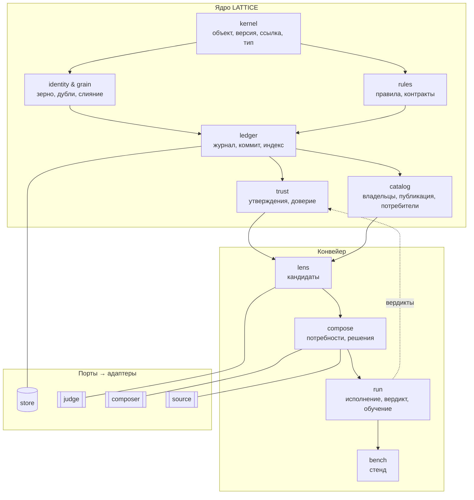

# 04. Архитектура — домены, зависимости, раскладка кода

## Карта доменов



**Правило зависимостей:** стрелка — «зависит от». Ядро не зависит от конвейера; конвейер не зависит от адаптеров
(только от портов); адаптеры зависят от портов. Проверяется тестом структуры (импорты между каталогами).

## Слои и что где живёт

| Слой | Что | Язык описания |
|---|---|---|
| **ядро (код)** | kernel, ledger, rules (примитивы), trust (вычисление), catalog (права, перезерновка), интерпретатор конвейера | TypeScript |
| **библиотека `std` (данные)** | типы, правила, политика доверия по умолчанию, стадии-способности, конвейер `solve`, шаблоны карточек, промпты стадий | JSON в пакете |
| **реализации стадий (код)** | builtin-функции стадий, на которые ссылаются `impl` | TypeScript |
| **адаптеры (код)** | store-jsonl, judge-jev, composer-claude, composer-caller, source-warrant, CLI | TypeScript |
| **проект (данные)** | пространство имён, типы проекта, объекты, конфигурация | JSON в `.lattice/` и `lattice.config.json` |

## Раскладка репозитория (TypeScript / Node, ESM)

```text
LATTICE/
  package.json                  node >= 22, ESM, без тяжёлых фреймворков
  src/
    kernel/                     revision.ts, canonical.ts, hash.ts, ref.ts, ids.ts, genesis.ts
    identity/                   grain.ts, ensure.ts, regrain.ts, alias.ts, resolve.ts
    ledger/                     commit.ts, index.ts, rebuild.ts, query.ts
    rules/                      validate.ts, primitives/*.ts, lint.ts, contract.ts
    trust/                      assert.ts, compute.ts, policy.ts, explain.ts
    catalog/                    namespace.ts, owner.ts, publish.ts, consumers.ts, migrate.ts
    lens/                       stages/{normalize,route,id-lookup,lexicon,pool,bm25,judge,fuse,trust,threshold,cut}.ts, card.ts
    compose/                    stages/{frame,recall,recheck,select,self-search,check}.ts, materialize.ts
    run/                        interpreter.ts, registry.ts, deliver.ts, verdict.ts, learn.ts, replay.ts
    bench/                      plan.ts, metrics.ts, bootstrap.ts, report.ts
    ports/                      store.ts, judge.ts, composer.ts, source.ts, exec.ts, clock.ts
    adapters/
      store-jsonl/  judge-jev/  composer-claude/  composer-caller/  source-warrant/
    cli/                        main.ts, commands/*.ts
  std/                          *.json — библиотека (типы, правила, стадии, конвейер, промпты)
  test/                         node:test; структура, ядро, срезы S1–S9, фикстуры
  design/                       этот каталог
```

## Конфигурация проекта

```json
{ "$schema": "lattice://config/1",
  "namespace": "warrant",
  "data": ".lattice",
  "imports": ["core", "std"],
  "pipeline": "std/pipeline.solve@1",
  "adapters": {
    "store": { "use": "store-jsonl" },
    "judge": { "use": "judge-jev", "model": "…" },
    "composer": { "use": "composer-claude", "model": "…" },
    "source": { "use": "source-warrant", "root": "D:/project/WARRANT" }
  } }
```

## Принципы кода

- Стадии и функции ядра — чистые; побочные эффекты — только в адаптерах и в `ledger.commit`.
- Одна структура `Revision` на всё; «класс на тип» не заводится — тип — данные.
- Ревизии из журнала заморожены (`Object.freeze`); меняется только индекс.
- Номинальные строки: `Id`, `Ref`, `Hash` — branded types.
- Детерминизм: `clock` и `ids` — порты; в тестах — фиксированные; пересборка и воспроизведение — побайтно.
- Тесты: `node:test`; каждый срез ([05](05-slices.md)) — свой набор тестов конец-в-конец на фикстурах.
- Всё машинное — канонический JSON; второго формата нет.

## Решения

| ID | Решение | Почему |
|---|---|---|
| AR-01 | Гексагональная архитектура: ядро → порты ← адаптеры | заменяемость технологий, тестируемость |
| AR-02 | Код ядра мал; поведение — данные `std` | самоописание, версии без релиза кода |
| AR-03 | TypeScript / Node ESM, `node:test`, без фреймворков | как WARRANT; просто |
| AR-04 | Правило зависимостей проверяется тестом структуры | архитектура не расползается |
| AR-05 | Срезы — единица реализации и приёмки | каждый шаг даёт работающий результат |

## Вопросы для grilling

1. **Один пакет или монорепо** (`@lattice/core`, `@lattice/adapters-*`)? Рекомендация: один пакет с каталогами до
   второго потребителя; разделение — когда адаптеры понадобятся отдельно.
2. **`std` в JSON-файлах репозитория или генерируется кодом?** Рекомендация: JSON-файлы (данные под ревью), тест —
   что они проходят правила ядра.
