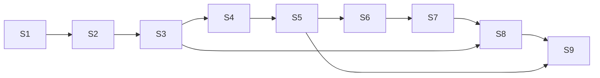

# 05. Вертикальные срезы — порядок реализации

Срез — сценарий конец-в-конец, который проходит через несколько доменов и проверяется тестом. Каждый следующий
опирается на предыдущие. Первый запуск ([01](01-first-run.md)) требует S1–S8; S9 — эффект самоописания.

| # | Срез | Домены | Готово, когда (тест) |
|---|---|---|---|
| **S1** | **Запись объекта** | kernel, ledger, rules | `init` пишет генезис; сущность v1 → v2; то же тело — no-op; значение пишется дважды — один `#id`; нарушение `hard` отклоняет весь коммит; `rebuild --check` побайтно совпадает |
| **S2** | **Типы и зерно** | catalog, identity, rules | тип с `grain`; дубль отклонён (`duplicate_of`); `ensure` возвращает существующую; правка тела в чужой ключ отклонена; сужение зерна без плана отклонено, с планом — версия типа + алиасы одним коммитом; `split` возвращает сущность; ссылки через алиас разрешаются |
| **S3** | **Факты и доверие** | trust, catalog | членство true/false по ключу; утверждения разных сессий дают `observed`; «+» и «−» дают `contested`; «−» владельца отзывает; не-владелец не пишет ревизию, но пишет факт; допуск разрешает агенту создавать `std/need` |
| **S4** | **Импорт проекта** | adapters (source-warrant), catalog | пространство `warrant`, типы проекта, нормы (`derived` / `inferred`), домены `lifecycle`, `cli-core`, словарь; `lint` без находок `hard`; повторный импорт без изменений — ноль новых строк |
| **S5** | **Поиск кандидатов** | lens, adapters (judge) | запрос → кандидаты с баллами и причинами; ID в тексте — прямое попадание; пустышка → `no-match`; событие оценки с snapshot'ом пула; повтор — из кэша judge без вызова |
| **S6** | **Решение потребности** | compose, run | задача → потребности → выбор 1…7 с цитатами → `check` → решение + членства + snapshot → пакет; ссылка вне кандидатов отклонена; промах → self-search → `via: self-search`; нет блока → `gap` |
| **S7** | **Повтор** | compose, trust | та же потребность другими словами → `recall` → выдача без LENS; `stale` после правки нормы → `recheck` → новый snapshot; `contested` → заново через LENS |
| **S8** | **Вердикт и обучение** | run, trust, bench | вердикты меняют доверие по правилам (п. 6 [22](domains/22-run.md)); `incomplete` + `add` чинит решение; удаление после 3 сессий `unused`; раскачка → `contested`; self-search → кандидат в ловушку |
| **S9** | **Самоописание** | run, bench, catalog | конвейер читается из LATTICE; новая версия конвейера (`fuse: rrf`) проходит или не проходит регрессию; закреплённый конвейер + кэши → `replay` побайтно совпадает |

## Зависимости срезов

## Что срез обязан оставить после себя

- тесты на фикстурах (маленький синтетический проект, без сети: judge и composer — фиктивные адаптеры с
  фиксированными ответами);
- команду CLI, которой срез можно показать руками;
- запись в журнале решений (ID из доменов), если при реализации что-то уточнилось.

## Фиктивные адаптеры для тестов

| Порт | Фиктивный адаптер |
|---|---|
| `judge` | баллы по пересечению слов + таблица переопределений из фикстуры |
| `composer` | ответы из фикстуры по `(kind, hash входа)` |
| `source` | каталог с 10–20 маленькими «нормами» |
| `clock`, `ids` | фиксированное время и счётчик ULID |

Живые адаптеры (`judge-jev`, `composer-claude`, `source-warrant`) подключаются только в первом запуске и в ручных
проверках.
