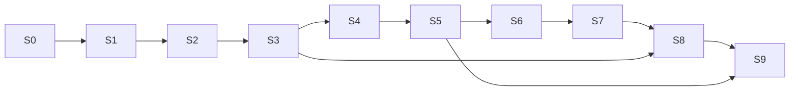

# 05. Вертикальные срезы — порядок реализации

Срез (T171) — сценарий конец-в-конец, который проходит через несколько доменов и проверяется тестом. Каждый следующий
опирается на предыдущие. S0 — скелет: тонкий настоящий код всех слоёв; S1–S9 наполняют его. Первый запуск
([01](01-first-run.md)) требует S0–S8; S9 — эффект самоописания.

| # | Срез | Домены | Готово, когда (тест) |
|---|---|---|---|
| **S0** | **Скелет** | все слои, адаптеры (фиктивные), CLI | тест структуры проходит ([04](04-architecture.md) §3); каждый фиктивный адаптер проходит контрактный набор своего порта; проводка `config/2`: неизвестный ключ, литерал секрета, нет переменной окружения, нет привязки у адаптера из `setup.ports` — отказ до первого вызова с путём поля; `lattice init` + `lattice solve "<задача>"` на пустом проекте → пакет, где каждая потребность — `gap absent`; вызов записан одним коммитом |
| **S1** | **Запись объекта** | kernel, ledger, rules, хост | `init` пишет генезис из кода; хэш генезиса — константа версии ядра, `open()` его сверяет; сущность v1 → v2; то же тело — no-op по `(type@n, hash)`, под `type@n+1` — новая ревизия; значение пишется дважды — один `#id`, тот же `#id` с другим полным хэшем — отказ; нарушение `hard` отклоняет весь коммит; хвост без маркера `core/commit` уходит в `recovered/`; `rebuild --check` побайтно совпадает; фиктивный секрет в окружении — `grep` по `.lattice/` пуст; пишущая команда без `--as` / `LATTICE_ACTOR` — отказ |
| **S2** | **Типы и зерно** | catalog, identity, rules | `init` копирует `std` замкнутым пакетом, копия совпадает с оригиналом по `id`, версии и хэшу; тип с `grain`; дубль отклонён нарушением `{rule: grain-unique, with, diff}`; `ensure` возвращает существующую; правка тела в чужой ключ отклонена; любое изменение зерна без плана отклонено, с планом — версия типа + алиасы одним коммитом; `split` возвращает сущность; ссылки через алиас разрешаются; `extends` — только с сужением, цикл отклонён; версия с невыполненными `examples` не публикуется; ревизию пишет только владелец пространства или допущенный |
| **S3** | **Факты и доверие** | trust, catalog | членство true/false по ключу; утверждения разных групп независимости дают `observed`, сессии одной группы — нет; «+» и «−» дают `contested`; «−» владельца отзывает; управляющий факт пишет только допущенный `writers` типа; правка чужого объекта `refs: follow` — только `core/proposal`; допуск разрешает агенту создавать `std/need`; участник вне реестра — `agent`; пересборка даёт то же доверие |
| **S4** | **Импорт проекта** | adapters (`source-warrant`, `source-files`), catalog | пространство `warrant`, участники адаптера в реестре; типы проекта; нормы — ревизии из извлечённых полей (`derived`, `summary` — первый абзац), `summary` units — факт `warrant/summary` вне карточки; домены `lifecycle`, `cli-core`, словарь; алиасы — кандидаты `std/alias-candidate`, индекс их не видит; расхождения — `std/load-finding`; `lint` без нарушений `hard`; повторный импорт без изменений — ноль новых строк; второй проект через `source-files` — без правки ядра (E7) |
| **S5** | **Поиск кандидатов** | lens, run, adapters (judge) | запрос → кандидаты с баллами и причинами; ID в тексте — прямое попадание, порогом не отбрасывается; пустышка → `no-match` (у `threshold` есть `calibrated_for`); модель берётся из ревизии `std/setup`, правка проводки её не меняет; модель порта ≠ `setup@n`, `calibrated_for` ≠ `describe()`, код ≠ `impl.pins` — отказ на старте; оплаченная оценка — событие `std/measurement` со ссылкой на пул; повтор — из кэша judge без вызова |
| **S6** | **Решение потребности** | compose, run | задача → потребности (`frame`) → выбор 1…7 с цитатами из карточек → `check` → решение + членства + snapshot → пакет с шапкой `deliver.header`; вызов — один коммит с кортежем исполнения; ссылка вне кандидатов и `found` отклонена; у `form: set` нет связей; промах → self-search → `found_by: self-search`; нет блока → `gap`, у `coverage` — место в источнике; `composer-caller`: `pending` → `lattice answer` → перезапуск с тем же id, ответ проходит схему |
| **S7** | **Повтор** | compose, trust | та же потребность другими словами → `recall` → выдача без LENS; judge без `calibrated_for` «ту же потребность» не выносит; `stale` после правки нормы → `recheck` → новый snapshot; `contested` → заново через LENS |
| **S8** | **Вердикт и обучение** | run, trust, bench | вердикты меняют доверие по правилам ([22](domains/22-run.md) §6), один вердикт на пару; `incomplete` + `add` чинит решение; член удаляется при `unused` в 3 из 5 последних выдач по группам; раскачка → `contested`; self-search → кандидат в ловушку; пара без `bench-run pass` — пакет помечен, факт обучения `from: verdict` отклонён коммитом, с `pass` — принят; сессии `bench` не питают доверие, подсказки и обучение; `simulate` — только в копии кампании; E3: симуляторы одного агента — одна группа, `observed` не достигается |
| **S9** | **Самоописание** | run, bench, catalog | конвейер читается из LATTICE (`std/setup` → `pipeline@n`); новая ревизия `std/setup` с конвейером `fuse: rrf` проходит или не проходит регрессионный план (`base`, тот же `setup@n`); сравнимы только прогоны с равным кортежем, `Meta` ≠ `setup@n` → `invalid`; эталон `test` не дописывается; закреплённый кортеж + кэши → `replay` побайтно совпадает, без записи и живых вызовов; другая версия адаптера или источника — явное расхождение `code` / `source` |

## Зависимости срезов

## Инварианты доменов → срез

Текст инварианта — у домена (раздел «Инварианты»); здесь — срез, чей набор тестов проверяет его первым. Наборы
прежних срезов гоняются в каждом следующем.

| Срез | Инварианты (домен: номера) |
|---|---|
| S0 | [30](domains/30-adapters.md): 1, 2, 4 · [22](domains/22-run.md): 1 |
| S1 | [10](domains/10-kernel.md): 1–6, 8, 9, 11 · [12](domains/12-ledger.md): 1–6 · [13](domains/13-rules.md): 1 · [30](domains/30-adapters.md): 3, 6 |
| S2 | [10](domains/10-kernel.md): 7 · [11](domains/11-identity-grain.md): 1–4 · [13](domains/13-rules.md): 2–4 · [15](domains/15-catalog.md): 1–4 |
| S3 | [10](domains/10-kernel.md): 10 · [14](domains/14-trust.md): 1–5 · [15](domains/15-catalog.md): 5 |
| S4 | [11](domains/11-identity-grain.md): 5 · загрузка — [30](domains/30-adapters.md) AD-11, AD-12 |
| S5 | [20](domains/20-lens.md): 1–5 · [22](domains/22-run.md): 2 · [13](domains/13-rules.md): 5 |
| S6 | [21](domains/21-compose.md): 1–5, 7, 8 · [22](domains/22-run.md): 3, 4 · [13](domains/13-rules.md): 6 · [30](domains/30-adapters.md): 5, 7 |
| S7 | [21](domains/21-compose.md): 6 |
| S8 | [14](domains/14-trust.md): 6 · [20](domains/20-lens.md): 6 · [22](domains/22-run.md): 5–7 · [23](domains/23-bench.md): 1–4 |
| S9 | [22](domains/22-run.md): 8 · [23](domains/23-bench.md): 5, 6 |

## Что срез обязан оставить после себя

- тесты из столбца «Готово, когда» и инвариантов своей строки — написаны до реализации; исполнитель среза критерии не
  меняет (уточнение — решением в домене);
- тесты на фикстурах: маленький синтетический проект, без сети — фиктивные адаптеры ([30](domains/30-adapters.md) §1);
- команду CLI, которой срез показывается владельцу проекта руками (приёмка);
- зелёные тест структуры и наборы всех прежних срезов;
- запись в журнале решений (ID из доменов), если при реализации что-то уточнилось.

Живые адаптеры (`judge-jev`, `composer-claude`, `source-warrant`) проходят те же контрактные наборы, а сценарии — только
в первом запуске и в ручных проверках.

## Решения

| ID | Решение | Почему |
|---|---|---|
| SL-01 | Первый срез — скелет S0: все слои тонким настоящим кодом, фиктивные адаптеры через корень сборки, тест структуры, сквозной `solve` с коммитом | ошибки стыков порт ↔ рантайм ↔ коммит видны с начала, а не в S6. v0.4 · 30-adapters/И-13 · И-17 · D13 Q3 |
| SL-02 | «Готово, когда» — спецификация приёмки: тесты до реализации, исполнитель критерии не меняет, приёмка — показ CLI владельцу | критерий, который правит исполнитель, ничего не проверяет. v0.4 · 30-adapters/И-14 |
| SL-03 | Инвариант домена входит в срез номером, текст — у домена; первым его проверяет срез из таблицы | у понятия один владелец; видно, что ни один инвариант не остался без теста. v0.4 · D13 Q6 · N-22…N-64 |
| SL-04 | Генезис v1 полон к первой записи реальных данных (первый запуск); до того смена генезиса — новая константа и пересчёт фикстур; в S1 — тест «хэш генезиса = константа версии» | до первого журнала проекта данных нет; требование полноты к S1 заставило бы S1 проектировать поля S3 и S8. v0.4 · N-18 · D13 Q4 · T-10 |
