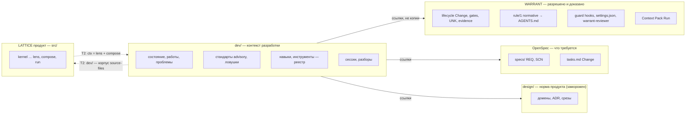
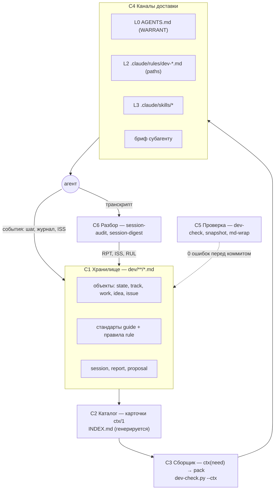
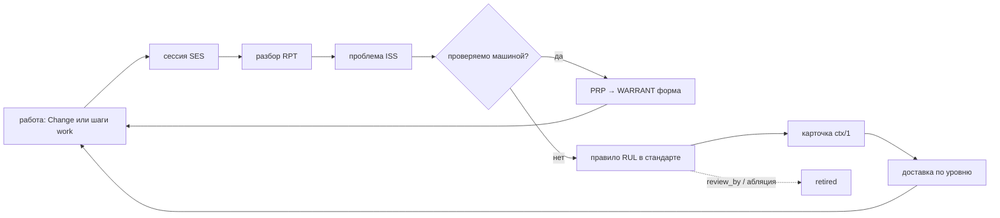
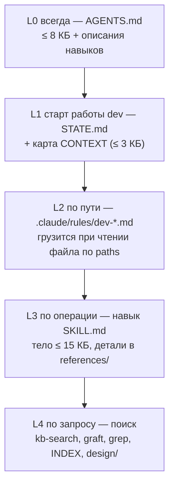
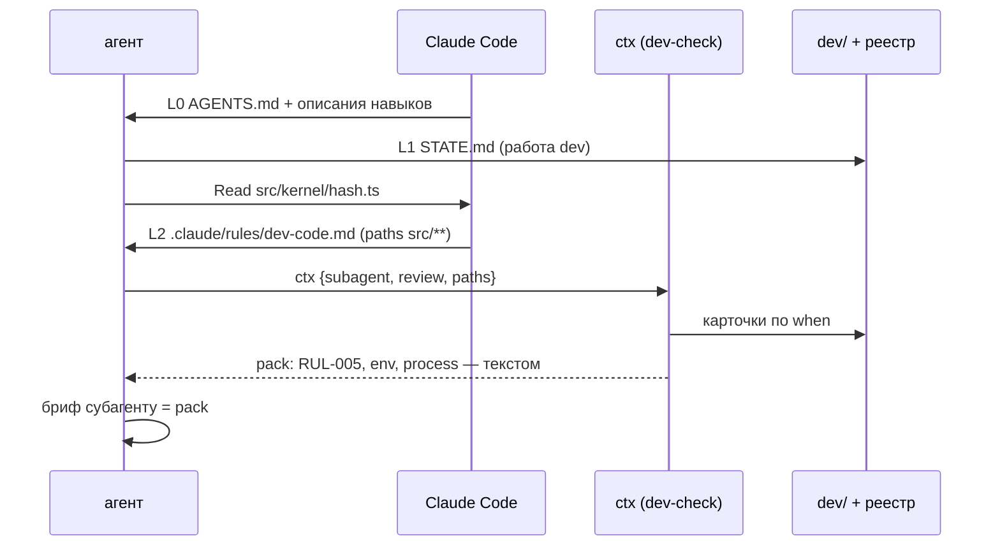
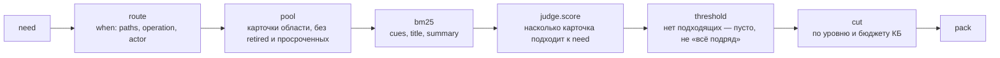
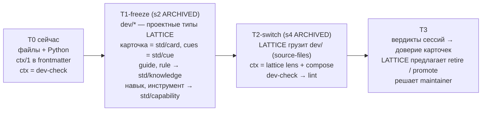

# dev — подсистема контекста разработки (черновик v0)

Как агент разработки LATTICE получает ровно тот контекст, который нужен для шага: что лежит в dev/, как оно раскрывается по уровням через один контракт `ctx/1`, где граница с WARRANT, OpenSpec и design/, и как подсистема переходит на сам LATTICE (lattice2lattice).

Статус: черновик для доработки; норма dev/ пока — [README](README.md). Открытые вопросы — раздел «Вопросы», решения по ним — комментарием maintainer'а в PR.

## 1. Что это

**dev — цепочка поставок контекста разработки** (`kb/PAT-101`): хранит то, что агенту нужно знать о работе и чего нет в WARRANT, OpenSpec и design/ (состояние, ловушки, стандарты, навыки, инструменты, разборы сессий), и доставляет это по уровням — от «всегда» до «по запросу», чтобы агент читал мало и не пропускал ограничение, которое решает изменение (`kb/TERM-070`).

Три обязанности, и больше ничего:

| # | Обязанность | Вопрос | Сейчас |
|---|---|---|---|
| D1 | **Хранить** | что мы знаем о разработке: где мы, что мешает, какие правила, что показали сессии | объекты dev/ (файл — объект) |
| D2 | **Доставлять** | что агенту прочитать для этого шага — и чего не читать | `AGENTS.md`, протокол старта руками, `--brief` для субагентов; L2 по пути не работает |
| D3 | **Учиться** | какие правила и навыки помогают, какие устарели | `session-audit` → `RPT` → `ISS` → `RUL`; абляции нет |

Имя: оставить `dev/` — короткое, на него ссылаются правило WARRANT `session-start` (policy-путь) и весь проект; «подсистема контекста разработки» — описание, не новое имя (вопрос Q-1).

## 2. Границы



| Вопрос | Владелец | dev/ хранит |
|---|---|---|
| можно ли, доказано ли, этап Change | WARRANT | ссылку `lattice/<Change>` |
| норма процесса, обязательная всем (`normative`) | WARRANT `rule/1` → `AGENTS.md` | стандарт с текстом и `source`; доставка — WARRANT |
| требования, задачи Change | OpenSpec | ссылку |
| устройство продукта | design/ | ссылку; выжимка в стандарте `code` |
| состояние вне Change, ловушки, advisory-стандарты, навыки, разборы | **dev/** | сам объект |
| смысл, связи, доверие, обучение (после T2) | LATTICE | dev/ — источник, LATTICE — проекция |

**Правило границы (новое):** dev/ генерирует только в свои каналы (`.claude/rules/dev-*`, `.claude/skills/<группа>-*` проекта) и никогда — в файлы WARRANT (`AGENTS.md`, `.claude/settings.json`, `.claude/agents/warrant-*`, `.warrant/**`). Что должно держаться принуждением — форма в WARRANT (PRP), а не текст в dev/ (`kb/PAT-102`: граница — машинной проверкой).

## 3. Компоненты и поток данных



| # | Компонент | Что делает | Вход → выход | Реализация сейчас |
|---|---|---|---|---|
| C1 | Хранилище | объекты dev/ — файл = объект, frontmatter = поля, первый абзац = суть | правка агента → файл + снимок `arhived/` | `dev/**`, `snapshot.py` |
| C2 | Каталог | карточка каждой единицы контекста: id, суть, когда нужна, размер | объекты, навыки, инструменты → `INDEX.md` | `dev-check --index` (только dev/) |
| C3 | Сборщик | по потребности (кто, операция, пути) выбирает единицы и уровень | `need` → `pack` | частично: `--start`, `--brief` |
| C4 | Каналы | кладут pack туда, где агент его увидит | pack → файл, который читает Claude Code | вручную; L2 не работает |
| C5 | Проверка | форма, ссылки, версии, размеры, сроки | dev/** → ошибки | `dev-check`, `snapshot --check`, `md-wrap` |
| C6 | Разбор | что сессия прочла, где ошиблась, какое правило помогло | транскрипт → `SES`, `RPT`, `ISS` | `session-audit`, `session-digest.py` |

Цикл (обучение — D3):



## 4. Постепенное раскрытие — уровни

Правило: единица опускается на уровень ниже, если без неё уровнем выше агент работает не хуже; проверка — абляция (`kb/PAT-102`) и метрика разбора (раздел 8).



| Уровень | Когда | Механизм Claude Code | Что | Бюджет | Владелец канала |
|---|---|---|---|---|---|
| **L0** | каждая сессия | `AGENTS.md` читается сам (≥ 2.1.277, если нет `CLAUDE.md`); `name`+`description` всех навыков | правила WARRANT `paths: **`: процесс, акты maintainer'а, старт | ≤ 8 КБ; описание навыка ≤ 250 знаков | WARRANT (`warrant sync`) |
| **L1** | работа касается разработки (основная сессия) | правило `session-start` в L0 велит прочесть | `STATE.md` (фокус, ловушки, switch) + `CONTEXT.md` (карта «вопрос → где») | ≤ 10 КБ | dev/ |
| **L2** | агент читает файл в области | `.claude/rules/*.md` с `paths:` — подгружается при чтении подходящего файла; вложенный `AGENTS.md` папки — при заходе в неё | стандарт темы: `code` для `src/**`, `tests` для `test/**`, `docs` для `dev/**` … | ≤ 5 КБ на тему | dev/ (генерирует `dev-check --sync`) |
| **L3** | операция или класс задачи | навык: описание всегда, тело — при вызове; `paths` навыка сужает; `context: fork` — в субагенте | процедура: старт, новый объект, разбор, grilling, поиск в kb | тело ≤ 15 КБ | dev/ (проектные), пользователь (глобальные) |
| **L4** | вопрос, которого нет выше | инструмент по запросу агента | `kb-search`, graft (код), `grep`, `INDEX.md`, design/, `warrant status` | без бюджета, только поиском | — |

**L2 — «агент в папке видит файл»** (твоя мысль) в Claude Code уже есть двумя способами:

| Способ | Как | За | Против |
|---|---|---|---|
| **A. `.claude/rules/dev-<тема>.md` с `paths:`** (рекомендую) | `dev-check --sync` генерирует из `dev/rules/<тема>.md`: `paths` — из поля стандарта, текст — правила + «навыки и инструменты этой области» | одно место, glob по всему репо, папки чистые; поля стандарта уже есть | генерируемый файл — дубль текста (как `AGENTS.md` у WARRANT) |
| B. `AGENTS.md` в папке | файл-карточка папки: что здесь, какой стандарт, какой навык | видно человеку в папке | размазано по дереву; работает, только пока нет `CLAUDE.md` |

## 5. Контракт `ctx/1` — одна форма для всего контекста

Любая единица контекста — стандарт, правило, навык, инструмент, агент, документ — объявляет себя **карточкой** одной формы; сборщик и каналы знают только её. Это порт в смысле `design/adr/0024-port-contract-at-consumer.md`: реализацию сборщика (сейчас Python, после T2 — LATTICE) можно заменить, каналы не меняются.

**Карточка** (поля frontmatter единицы; у навыка — рядом с `name`/`description`, Claude Code лишние поля не читает):

```yaml
id: code                      # локальный id; пространство dev подразумевается
type: dev/guide@1             # закреплённый тип
version: 3                    # 1 + число снимков в arhived/
title: Архитектура кода       # карточка: title
# summary — первый абзац под заголовком (RUL-036), не дублируется
cues: [слой, импорт, адаптер] # фразы, по которым единица находится (std/cue)
when:                         # когда доставлять
  paths: ["src/**"]
  operations: [implement]     # specify · review · implement · archive · dev · audit · research
  actors: [agent, subagent]
layer: L2                     # L0 … L4
owner: human:Homasters-max
source: [design/04-architecture.md]   # происхождение (kb/PAT-101)
status: active                # candidate · active · retired
review_by: 2026-10-12         # свежесть
```

**Потребность и пакет:**

```text
need = { actor: main|subagent|human, operation, paths[], question?, budget_kb? }
pack = [ { ref, layer, why, size_kb, text | pointer } ]   упорядочено: L0 → L4, внутри — по силе совпадения
```

| Операция контракта | Что | Кто вызывает |
|---|---|---|
| `card(unit)` | карточка единицы | каталог (C2) |
| `ctx(need)` | пакет: что прочесть и почему, в пределах бюджета | агент, навык, бриф субагента |
| `sync()` | разложить карточки по каналам Claude Code (L2 rules, проверка описаний L3) | `dev-check --sync` перед коммитом |
| `check()` | форма карточек, бюджеты уровней, просроченные `review_by`, дубли `cues` | `dev-check` |



Простота: одна форма карточки, одна команда `ctx`, один генерируемый каталог; `--start` и `--brief` становятся частными случаями `ctx` (`need.operation = start` и `need.actor = subagent`).

### 5.1 Отбор и роль judge

`ctx` отбирает карточки теми же стадиями, что `lens` продукта (`design/domains/20-lens.md`), поэтому на T2 он заменяется конвейером LATTICE без смены контракта:



**Judge** — порт семантической оценки в выданном пуле: `score` (подходит ли карточка), `verify` (та же ли единица — дубли `cues`, пересечение навыков), `choose` (какая из). Граница — `design/domains/20-lens.md#LN-17`: judge решает релевантность, **не истинность** правила и **не пользу** — пользу решает вердикт разбора сессии (D3). Judge не пишет в dev/ и не выбирает уровень: уровень задан карточкой.

| Где judge в процессе | Кто сейчас (T0) | T2 |
|---|---|---|
| L0 → L3: агент выбирает навык по описанию | сама модель Claude Code — неявный `judge.choose` по карточкам (`description`); поэтому описание — карточка с бюджетом | то же, описание генерируется из карточки |
| L2: правило по пути | не нужен — `route` детерминирован (`paths`) | то же |
| `ctx` для субагента и L4 | `route` + `bm25`; judge — по флагу (`--judge`, адаптер Jev, как `kb-search`) | `lattice solve`: judge-jev, фикстура в тестах |
| `dev-check --skills`: дубли и пересечения | `judge.verify` пар карточек с близкими `cues` — кандидаты, решает человек | `std/alias-candidate` |
| разбор сессии: помог ли pack | **не judge** — аналитик `dev-audit` даёт вердикт | `std/verdict` → доверие карточки |

Оценки judge — события с тройкой `{adapter, model, prompt_hash}` (как `std/measurement`): на T0 — строка в выводе `ctx --json`, чтобы разбор видел, почему карточка попала в pack; порог «нет ответа» без калибровки не отказывает (`design/domains/20-lens.md#LN-07`).

## 6. Шаблон объекта — как в LATTICE

Файл dev/ уже близок к ревизии ядра (`design/domains/10-kernel.md#1. Одна форма записи — ревизия`); шаблон закрепляет соответствие, чтобы T1 был переименованием типов, а не переделкой.

| Ядро LATTICE | Файл dev/ | Правило |
|---|---|---|
| заголовок `id` | `id` frontmatter | не меняется; переименование — `aliases` (`core/alias`) |
| заголовок `type` | `type: dev/<тип>@N` | закреплённый |
| заголовок `version` | `version` | 1 + снимки `arhived/` = ревизии |
| заголовок `at`, `by` | не пишутся | вычисляются: `at` — дата коммита, `by` — `SES-…` из журнала |
| `body` | остальные поля frontmatter + разделы тела | разделы — по типу (README «Файл») |
| вид: сущность / событие | work, issue, rule… — сущность; session, report — **событие** (не правится) | как `mutable` типа |
| факт с ролями `of` | поля-связи `from`, `track`, `found`, `source`, `links`, `refs` | связь хранится один раз — у зависимого |
| блок `std/knowledge` | guide, rule, issue, idea | карточка `ctx/1` |
| блок `std/capability` | навык, инструмент, агент | карточка + `impl` (путь) |
| `std/card` {title, summary, cues} | `title` + первый абзац + `cues` | генерирует `INDEX.md` |
| `std/cue` | `cues` | фразы поиска и срабатывания |
| `std/need` | `need` вызова `ctx` | — |

Общий шаблон (все типы; поля типа — по README «Поля»):

```markdown
---
id: <id>
type: dev/<тип>@1
version: 1
title: <одна фраза>
aliases: []
cues: []
when: {paths: [], operations: [], actors: []}
layer: <L1…L4>
owner: human:<login>
source: []
status: active
review_by: <ГГГГ-ММ-ДД>
<поля типа>
---

# <id> — <title>

<одна фраза-суть: summary карточки>

## <разделы типа>
```

## 7. Аудит

### 7.1 dev/

| Путь | Что | Решение | Почему / компонент |
|---|---|---|---|
| `README.md` (23 КБ) | концепция + справочник + протокол | **разделить:** концепция → этот файл; справочник (типы, поля, ссылки) → README ≤ 10 КБ; протокол старта → навык `dev-start` | L1 читает весь README — дорого; протокол руками не выполняется (ISS-022) · C1 |
| `STATE.md` (6 КБ) | фокус, switch, ловушки, журнал | оставить; журнал старше N строк уходит в снимок (история — в `arhived/`) | L1; журнал растёт с каждым событием · C1 |
| `INDEX.md` (39 КБ) | каталог dev/ | оставить генерируемым, расширить до всех карточек `ctx/1` (навыки, инструменты, агенты) + колонки `layer`, `size`; уровень L4 — не читать целиком | C2 |
| `CONTEXT.md` | — | **новый**, ≤ 3 КБ: карта «вопрос → где» и каталоги репо (ответ на вопрос о структуре) | L1 · C2 |
| `ideas/` | вход | оставить | начало цепочки · C1 |
| `tracks/`, `work/` | линии и работы | оставить | фокус · C1 |
| `issues/` (30) | проблемы, ловушки | оставить | D3 · C1 |
| `rules/` (9 стандартов) | стандарты `dev/guide@1` с правилами | оставить; переименовать в `guides/`? (Q-4); источник для L2 | C1 → C4 |
| `sessions/`, `reports/` | реестр и разборы | оставить | D3 · C6 |
| `proposals/` | PRP в другие проекты | оставить; путается с `design/proposals/` (PF) — переименовать в `upstream/`? (Q-4) | C1 |
| `templates/` (10) | шаблоны | переписать под общий шаблон (раздел 6) | C1 |
| `arhived/` (62) | снимки = ревизии | оставить | C5; T1 — ревизии объектов |

### 7.2 Вне dev/, но в подсистеме

| Путь | Что | Решение |
|---|---|---|
| `CLAUDE.md` (`@AGENTS.md`) | вход Claude Code | **удалить после исправления WARRANT**: Claude Code ≥ 2.1.277 читает `AGENTS.md` сам, если нет `CLAUDE.md` (установлено 2.1.283), но строку `@AGENTS.md` держит `warrant sync` (`claudeMdTarget`) — удалённый файл вернётся при следующем sync. Исправление — в WARRANT (PRP-003, п. 11 плана), затем удаление |
| `~/.claude/CLAUDE.md` | блок graphify | удалить вместе с graphify (глобально, решение пользователя) |
| `scripts/dev/*.py` | C3, C5, C6 | оставить; `dev-check` получает `--ctx`, `--sync` |
| `scripts/dev/__pycache__/*.pyc` | мусор в git | удалить из git, `__pycache__/` — в `.gitignore` |
| `~/.claude/tools/md-wrap` | проверка md, вызов по абсолютному пути | в реестр с версией; вендорить в `scripts/tools/md-wrap` или пакет devDependency (Q-5) |
| `.claude/skills/session-audit` | навык проекта | оставить → `dev-audit` (префикс) |
| `.claude/agents/warrant-reviewer.md` | агент WARRANT | не трогать (генерирует `warrant sync`) |
| `.claude/rules/` | — | **новый** канал L2, генерирует `dev-check --sync` |

### 7.3 Навыки и инструменты

Сверка 2026-09-28: WARRANT 0.8.1 (`D:\project\SRA`) в проект ставит только агент `warrant-reviewer`, `AGENTS.md`, строку `CLAUDE.md` и guard в `settings.json`; навыков не поставляет (`warrant/ADR-0039`). Навыки разработки WARRANT лежат в `SRA/.claude/skills` и в LATTICE не переносились. graft — не часть `warrant`, а отдельный пакет `@nanonets/graft` 0.19.0 (установлен глобально); WARRANT оборачивает его в `scripts/dev/cs.js` и навык `code-search`.

**Каналы WARRANT, с которыми dev/ не должен пересекаться:**

| Канал | Что доставляет | Когда |
|---|---|---|
| `AGENTS.md` | `rule/1` с `paths: ["**"]` | всегда (L0) |
| guard `PostToolUse` → `additionalContext` | `rule/1` с `paths`, совпавшими с правленым файлом, раз за Run | только в активном Run |
| Context Pack `warrant run start` | правила по write_scope, артефакты Change с хэшами | начало Run |

Поэтому: **normative** правило по пути — `rule/1` в `.warrant/local/rules/` (policy-путь, акт maintainer'а), его доставит guard; **advisory** стандарт — `.claude/rules/dev-*` (канал dev/). Одно правило — в одном канале. У `rule/1` нет `when` по операции — это PRP-001 P-1.

**Реестр:**

| Навык / агент / инструмент | Группа | Где | Происхождение | Уровень | Решение |
|---|---|---|---|---|---|
| `warrant-reviewer` | warrant | `.claude/agents/` | генерирует `warrant sync` | L3 | не трогать |
| `session-audit` | dev | `.claude/skills/` | LATTICE | L3 | → `dev-audit` |
| `kb-search`, `kb-research` | kb | `~/.claude/skills` → `D:\kb` | kb | L4 | оставить; в LATTICE нет `.kb-search.json` — добавить |
| `arch-integrate` | design | `~/.claude/skills` → `D:\kb` | kb | L3 | → `design-integrate`; описание 780 знаков — сжать |
| `domain-modeling` | design | `~/.claude/skills` | сторонний | L3 | → `design-domain`; проверить (PAT-101: сторонний — недоверен) |
| `grilling` | think | `~/.claude/skills` (28 строк) | сторонний; в SRA — другая версия (41 строка) | L3 | одна версия → `think-grill` |
| `grill-me`, `grill-with-docs` | think | `~/.claude/skills` | сторонний | L3 | удалить — дубли `grilling` |
| `graphify` | graph | `~/.claude/skills` + `graphify.exe` | сторонний | L4 | удалить: в LATTICE не используется; описание и блок в `~/.claude/CLAUDE.md` — постоянная цена L0 |
| graft (`@nanonets/graft` 0.19.0) | code | глобальный npm | сторонний, версия закреплена в SRA | L4 | **подключить** (Q-10): перенести `cs.js` + навык `code-search` |
| md-wrap | dev | `~/.claude/tools` | свой | L4 | в реестр с версией (Q-5) |
| `dev-check`, `snapshot`, `session-digest` | dev | `scripts/dev/` | LATTICE | L4 | оставить; `dev-check` += `--ctx`, `--sync` |

**Есть в SRA, нет в LATTICE:**

| Навык SRA | Что | Для LATTICE |
|---|---|---|
| `change-spec-pr`, `change-impl-pr`, `change-archive-pr`, `change-coordinate` | три PR Change по шагам | закрыли бы ISS-009; норма — WARRANT → upstream (Q-9) |
| `code-search` + `cs.js` | поиск по коду через graft | перенести (Q-10) |
| `review-impl` + агент `reviewer` | review реализации | **нужен**: сейчас review только spec; перенести, адаптировав к LATTICE |
| `git-start`, `git-land` | ветка от `main`, посадка PR | перенести как `git-*` — частая операция, правила `git` |
| `repo-hygiene` | чистка репо | перенести: закрыл бы `__pycache__` в git |
| `handoff`, `decision`, `group-done`, `group-stats` | процесс разработки SRA (ADR-0032) | не переносить: у LATTICE свой dev/ |
| `openspec-*` (4) | навыки OpenSpec | не переносить: OpenSpec ведёт `warrant` |
| `architecture-audit`, `software-architect`, `cli-contract` | аудит архитектуры по графу кода, CLI WARRANT | `architecture-audit` — после graft; остальные нет |

**Не хватает (новые):**

| Навык / инструмент | Зачем | Закрывает |
|---|---|---|
| `dev-start` | блок «▶️ Старт» из `dev-check --start` первым сообщением | ISS-022 |
| `dev-new <тип>` | объект из шаблона со следующим свободным id (main + ветки) | ручная нумерация, заглушки |
| `dev-ctx` | бриф субагенту = `ctx(actor: subagent)` | ISS-023 |
| `warrant status --compact` | короткий статус без разбора JSON | ISS-021 → upstream P-9 |

### 7.4 Стандарт навыка

- **Группа — префикс имени** (`dev-`, `design-`, `kb-`, `think-`, `git-`, `code-`, `warrant-`): Claude Code ищет навык в `skills/<имя>/SKILL.md`; вложенность папок групп не подтверждена документацией, SRA уже группирует префиксами (`change-`, `git-`, `openspec-`).
- **Где:** проектный (знает LATTICE) — `.claude/skills` в git; общий для проектов — `~/.claude/skills` или его источник (`D:\kb`).
- **Карточка `ctx/1`** — поля frontmatter рядом с `name`, `description`: `owner`, `source`, `layer`, `when`, `status`, `review_by`; `allowed-tools` — минимальные права (`kb/PAT-101`).
- **Бюджет:** `description` ≤ 250 знаков (L0 — у каждой сессии); тело ≤ 15 КБ, детали — в `references/` (L4 навыка).
- **Тест:** 1–2 фразы, на которые навык срабатывает, и одна — на которую нет; проверка `dev-check --skills`: длина, размер, `review_by`, пересечение `cues`.

## 8. Матрицы

### 8.1 Роли — кто что делает

| Роль | Кто | Пишет | Не делает |
|---|---|---|---|
| maintainer | человек `roles.maintainer` | решения в PR, merge, waiver, policy-пути, `normative` правила | — |
| основная сессия | агент Claude Code | dev/ (вне Run), артефакты Change (в Run), код, коммиты в свою ветку | акты maintainer'а |
| reviewer | субагент `warrant-reviewer` | envelope → `warrant run submit` | правка файлов |
| аналитик | субагент `session-audit` | `RPT` черновиком в scratchpad | правка вне отчёта |
| исследователь | субагент Explore / kb-research | ответ основной сессии | запись в репо |
| judge | порт оценки: модель Claude Code (выбор навыка), Jev (`ctx --judge`, `kb-search`) | оценки `score`/`verify`/`choose` в выводе `ctx` | запись в dev/, решение о пользе и истинности |
| вердикт | аналитик `dev-audit` по транскрипту | помог ли pack — в `RPT` | отбор карточек |
| WARRANT CLI / CI | `warrant`, job `warrant` | record, evidence, `AGENTS.md`, `settings.json`, вердикт | dev/ |
| скрипты dev | `dev-check`, `snapshot`, `session-digest` | `INDEX.md`, снимки, `.claude/rules/dev-*` | вне dev/ и своих каналов |

### 8.2 Роль × уровень контекста

| Роль | L0 | L1 | L2 | L3 | L4 |
|---|---|---|---|---|---|
| основная сессия | сам | STATE + CONTEXT | сам по paths | по операции | по запросу |
| reviewer | сам | — | — | Context Pack Run (WARRANT) + бриф `ctx` | — |
| аналитик | сам | — | — | навык `dev-audit` + бриф `ctx` | транскрипт |
| исследователь | сам | — | сам по paths | — | kb, graft |

Субагент L1–L2 сам не получает (ISS-023) — поэтому бриф `ctx(actor: subagent)` обязателен в промпте.

### 8.3 Операция × навык × инструмент

| Операция | Навык (L3) | Инструменты (L4) | Уровни |
|---|---|---|---|
| старт сессии | `dev-start` (новый) | `dev-check --start`, `warrant status` | L0, L1 |
| specify | — (процесс в L0) | `openspec validate`, `warrant classify`, `kb-search` | L0, L2 `docs` |
| review | `warrant-reviewer` (агент) | `warrant run submit` | Context Pack |
| implement | — | graft (код), `node --test` | L2 `code`, `tests`, `quality` |
| archive | — | `warrant ci fetch`, `warrant archive` | L0 |
| работа dev/ | `dev-new`, `dev-start` (новые) | `snapshot`, `dev-check`, `md-wrap` | L1, L2 `docs` |
| разбор сессий | `dev-audit` | `session-digest` | — |
| проектирование | `design-integrate`, `design-domain`, `think-grill` | `kb-search`, `kb-research` | L4 |

## 9. lattice2lattice в подсистеме



| Фаза | Хранилище | Сборщик `ctx` | Каналы | Обучение | Граница |
|---|---|---|---|---|---|
| T0 | dev/**/*.md | `dev-check --ctx` | Claude Code (L0 WARRANT, L2 `.claude/rules`, L3 навыки), бриф | руками: `RPT` → `RUL` | dev/ не пишет в файлы WARRANT |
| T1 | то же, формат заморожен | то же | то же | то же | типы dev/ = типы проекта LATTICE |
| T2 | dev/ — источник, LATTICE — проекция | `lattice solve` (need → cards → pack) | **те же** — контракт `ctx/1` не меняется | вердикты `RPT` → `std/verdict` | LATTICE читает dev/ и WARRANT, не пишет в них |
| T3 | то же | то же | то же | доверие карточек, предложения retire/promote | решение — maintainer |

Смысл контракта: на T2 меняется только реализация `ctx` — каналы, карточки и файлы остаются; поэтому `ctx/1` задаётся сейчас, а не на T2.

## 10. Метрики

| Метрика | Что показывает | Источник |
|---|---|---|
| прочитано до первой правки, КБ | цена поиска контекста (`kb/TERM-070`) | `session-digest` |
| доля прочитанного, на которое сослались | лишнее чтение | `session-digest` |
| размер L0, L1 | рост постоянного контекста (`kb/ANT-029`) | `dev-check --footprint` |
| сбои из-за недоставленного правила | пропуски доставки | `RPT` класс причины |

## 11. План

| # | Шаг | Кто | Выход |
|---|---|---|---|
| 1 | черновик этого документа, доработка в PR | agent + human | решения по Q-1…Q-8 |
| 2 | `CLAUDE.md` удалить; `__pycache__` из git | human (Q-2), agent | L0 = `AGENTS.md` |
| 3 | общий шаблон и поля `ctx/1` в README и `templates/` | agent | раздел 6 — норма |
| 4 | `dev-check`: `--ctx`, `--sync` (→ `.claude/rules/dev-*`), проверки карточек и бюджетов | agent | L2 работает сам |
| 5 | README разделить; `CONTEXT.md` | agent | L1 ≤ 10 КБ |
| 6 | навыки: префиксы, карточки, удалить graphify, дубли grill; новые `dev-start`, `dev-new` | agent + human | реестр 7.3 |
| 7 | graft подключить (L4 код); md-wrap — в реестр | agent | 7.3 |
| 8 | метрики в `session-digest`; первая абляция L0 | agent | раздел 10 |
| 9 | `ctx`: стадии `route` → `pool` → `bm25` → (`judge`) → `threshold` → `cut`; оценки в `--json` | agent | раздел 5.1 |
| 10 | навыки из SRA: `code-search` + `cs.js`, `review-impl` + `reviewer`, `git-*`, `repo-hygiene` — адаптировать | agent | 7.3 |
| 11 | PRP-003 в WARRANT: `sync` без `CLAUDE.md` при нативном `AGENTS.md`; навыки процесса Change пакетом (ISS-009); `when` у `rule/1` — к PRP-001 P-1 | agent пишет, передачу делает maintainer | затем удалить `CLAUDE.md` |

## Вопросы

- **Q-1** Имя: оставить `dev/`? Рекомендация — да.
- **Q-2** ~~Удалить `CLAUDE.md`?~~ Решено в чате 2026-09-28: исправляем `warrant sync` (не держать `CLAUDE.md`, когда Claude Code читает `AGENTS.md` сам), затем удаляем — PRP-003; решение фиксируется комментарием в PR.
- **Q-11** judge в `ctx` на T0: только `route` + `bm25`, judge — по флагу? Рекомендация — да: L2 детерминирован, judge нужен L4 и субагентам, стоимость видна в `ctx --json`.
- **Q-9** Навыки процесса Change (`change-spec-pr`, `change-impl-pr`, `change-archive-pr`) — перенести из SRA в LATTICE или просить WARRANT поставлять их пакетом (ISS-009)? Рекомендация — upstream: процесс — норма WARRANT, копия в LATTICE разойдётся с `process`.
- **Q-10** Подключить graft через перенос `cs.js` и навыка `code-search` из SRA (версия 0.19.0, индекс вне git)? Рекомендация — да, до S0.
- **Q-3** L2: `.claude/rules/dev-*` (A) или `AGENTS.md` в папках (B)? Рекомендация — A.
- **Q-4** Переименовать `rules/` → `guides/`, `proposals/` → `upstream/`? Рекомендация — только если дешевле, чем путаница (ссылки чинит `md-wrap --links`).
- **Q-5** md-wrap: вендорить в репо или глобальный с версией? Рекомендация — devDependency из репо инструмента.
- **Q-6** Навыки LATTICE — в `.claude/skills` проекта (git) или глобально? Рекомендация — проектные в репо, общие (kb, grill) — глобально.
- **Q-7** Журнал `STATE.md`: держать последние N строк, остальное — в снимке?
- **Q-8** Где норма: этот файл становится нормой dev/ после PR, README — справочником?
