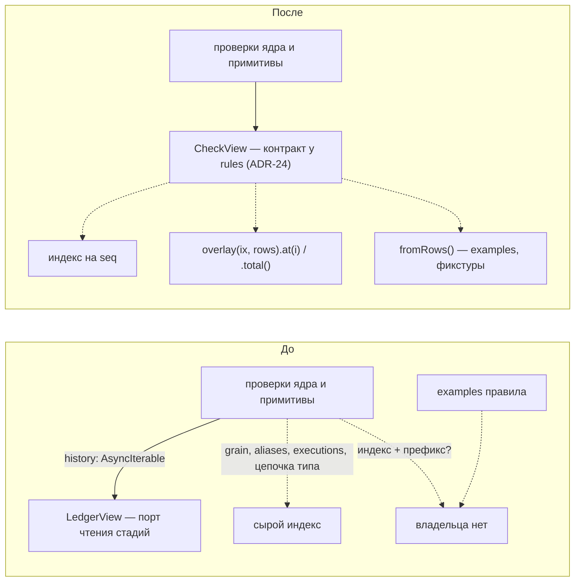
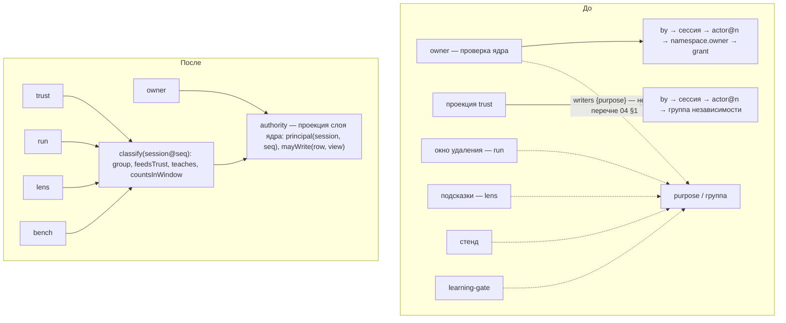
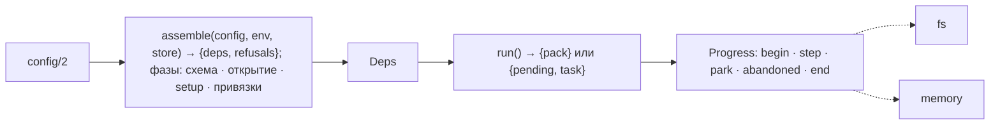
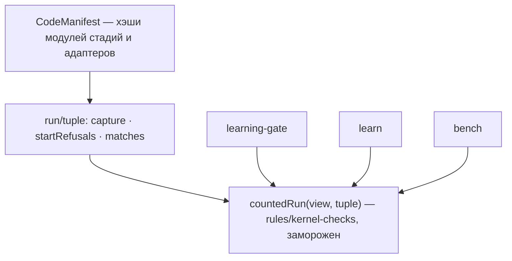
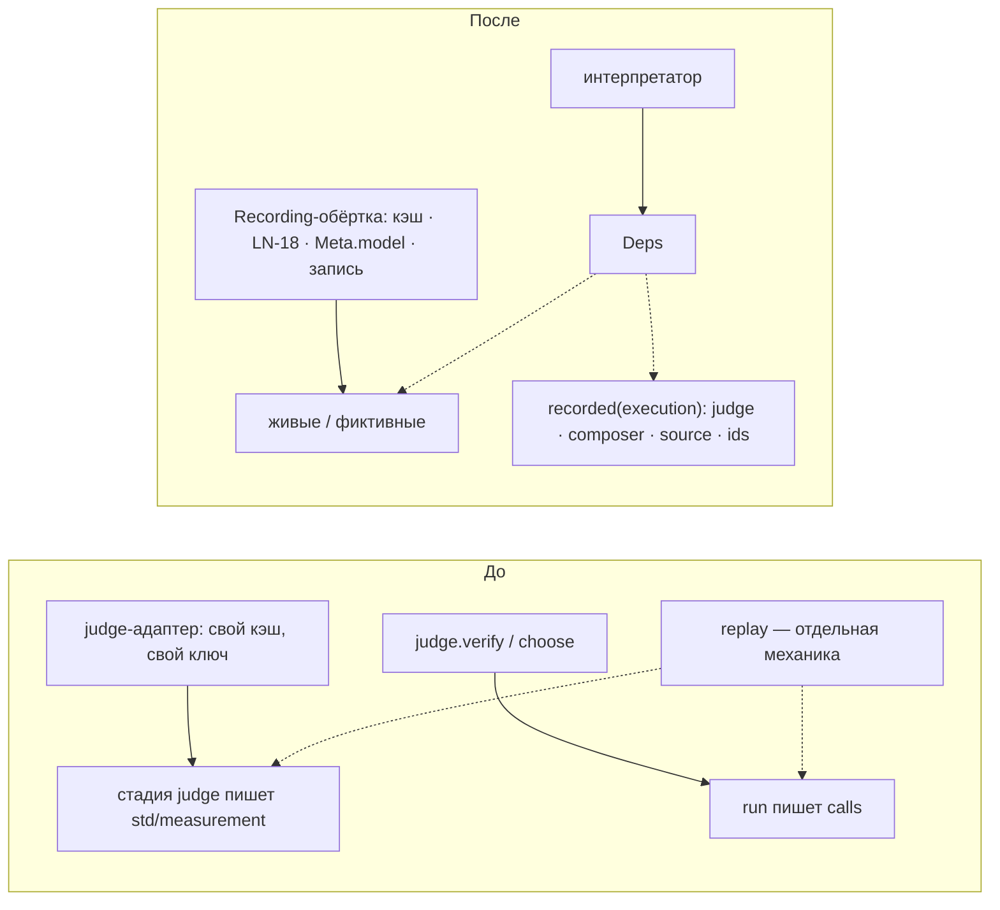
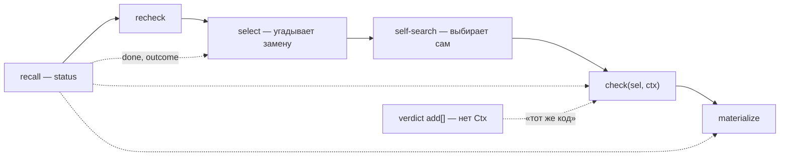
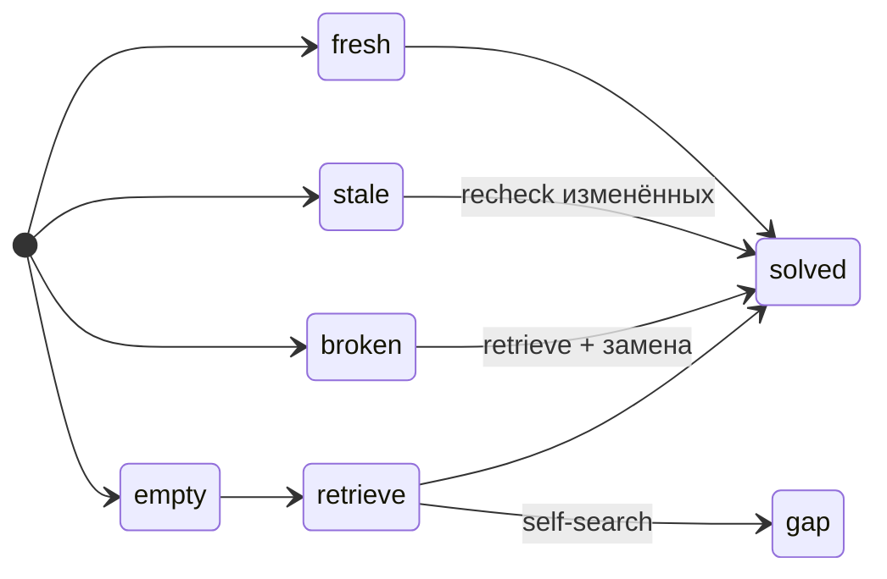

# Архитектурный разбор design/ — 2026-09-29

скилл: https://github.com/mattpocock/skills/blob/main/skills/engineering/improve-codebase-architecture/SKILL.md

**Что это.** Разбор проекта `design/` (v0.5 + VI-08) на мелкие модули и швы: где понимание одного понятия требует прыгать по многим разделам, где интерфейс почти равен реализации, где знание протекает через шов. Кода пока — только `src/kernel`; следующие срезы — S0 (скелет) и S1 (запись объекта), поэтому вес — на путь записи и корень сборки.

**Статус.** Отчёт, не норма. ~~Каталог `design/` заморожен: кандидат отсюда внедряется как Change под WARRANT (REQ/SCN, UNKNOWN или `I-N`), не правкой доменов.~~ 2026-09-29 maintainer разморозил `design/`: кандидаты внедряются в design v0.6 навыком arch-integrate (реестр — [ledger.md](ledger.md), разложение — [review-changes.md](review-changes.md)); код — по-прежнему Change под WARRANT. 37 ADR не пересматриваются; где кандидат задевает решение — строка «ADR».

**Словарь** (codebase-design): модуль (module) — всё, у чего есть интерфейс и реализация; интерфейс (interface) — всё, что вызывающий обязан знать: типы, инварианты, порядок, ошибки, настройка; глубина (depth) — поведение на единицу выученного интерфейса; глубокий / мелкий (deep / shallow); шов (seam) — место, где живёт интерфейс и где поведение меняется без правки на месте; адаптер (adapter) — то, что занимает шов; рычаг (leverage) — выигрыш вызывающих; локальность (locality) — выигрыш сопровождающих: изменения, ошибки и проверка сосредоточены в одном месте. Тест удаления: удалить модуль — сложность исчезает (был проходным) или всплывает у N вызывающих (окупался). Один адаптер — гипотетический шов, два — настоящий.

## Сводка

| # | Кандидат | Сила | Зависимость | Срез |
|---|---|---|---|---|
| 1 | [Коммит — один глубокий модуль](#1-коммит--один-глубокий-модуль) | Strong | in-process | S1 |
| 2 | [Вид проверки — шов с тремя адаптерами](#2-вид-проверки--шов-с-тремя-адаптерами) | Strong | local-substitutable | S1 |
| 3 | [Полномочия участника на seq](#3-полномочия-участника-на-seq) | Strong | in-process | S1 → S3 |
| 4 | [Корень сборки с фазами и порт хода](#4-корень-сборки-с-фазами-и-порт-хода) | Strong | ports & adapters | S0 |
| 5 | [Кортеж исполнения — один модуль](#5-кортеж-исполнения--один-модуль) | Strong | in-process | S0 (`code`) · S5–S9 |
| 6 | [Замороженное ядро — одна точка входа](#6-замороженное-ядро--одна-точка-входа) | Worth exploring | in-process | S1 |
| 7 | [Replay — записанные адаптеры портов](#7-replay--записанные-адаптеры-портов) | Worth exploring | ports & adapters | S5 · S9 |
| 8 | [LENS целиком — один модуль, шов оценщика](#8-lens-целиком--один-модуль-шов-оценщика) | Worth exploring | in-process | S5 |
| 9 | [Потребность → решение: явный автомат и замкнутый мир](#9-потребность--решение-явный-автомат-и-замкнутый-мир) | Worth exploring | in-process | S6 · S7 · S8 |
| 10 | [Происхождение голоса и «в силе ли факт»](#10-происхождение-голоса-и-в-силе-ли-факт) | Worth exploring | in-process | S3 · S8 |
| 11 | [Мелочи и гипотетические швы](#11-мелочи-и-гипотетические-швы) | Speculative | — | — |

## 1. Коммит — один глубокий модуль

**Сила:** Strong · in-process · S1

**Файлы:** 12-ledger §2 (шаги 0–6, LG-03, LG-17, LG-20), §5 `Draft` · 13-rules §2 + «Префикс или итог» (RL-16, RL-17) · 10-kernel §1 «Когда запись — no-op», KR-03, KR-16 · 11 GR-11, GR-16 · 15 CT-10 · ADR-31, 33, 34.

**До — правила коммита в девяти местах:**

- 10 §1 — когда запись no-op;
- 12 §2 — шаги 0–6, строка «относительные проверки»;
- 13 §2 — таблица проверок, «префикс или итог»; `validate(rows, state)` — `state` и режим не заданы;
- 11 — `ensure` / `merge` / `split`, которым нужны CAS, rules и проекции `grain`/`aliases` — всё выше identity по матрице;
- 15 CT-10 — копия `std` сохраняет заголовок поставщика, а `Draft = {type, id?, body, expect?}` заголовка не несёт, `by` — одно на коммит;
- 10 KR-16 / ADR-34 — генезис и `core/genesis-vN` — тоже мимо интерфейса;
- исключения RL-16, инвариант 12 ядра — по «источнику строки», которого в интерфейсе нет (вызывающему остаётся угадывать по `key`).

**После:**

```text
commit(batch) → {ok, ids, commit} | {violations} | {differs} | locked
  batch = author {drafts, by, intents} | copy {rows, signer} | genesis {delta}
  внутри: заголовки и ключ идемпотентности · no-op по (type@n, hash) ·
          реестр проверок {name, scope: row|commit, phase: write|publish-type|publish-rule, appliesTo} ·
          намерения ensure / merge / split · CAS хвоста (ADR-31) · маркер core/commit
identity — чистые функции: grainKey, замыкание алиасов, отчёт regrain
```

**Проблема.** Модуль `validate` мелкий (тест удаления: сложность не исчезает, а переезжает в `commit`, которому порядок и режимы принадлежат в любом случае), а интерфейс `commit(Draft[], by, key?)` не пропускает копию `std`, импорт и генезис.

**Решение.** `commit` принимает размеченный пакет; каждая проверка сама объявляет область, фазу и виды пакета; `ensure/merge/split` — намерения внутри `author`; списки 12 §2 и 13 §2 выводятся из реестра или удаляются.

**Выигрыш:**

- локальность: правила коммита в одном модуле;
- интерфейс называет источник строки — исключения перестают быть прозой;
- рычаг: один вход у CLI, импорта, `init`, обновления `std`;
- тесты S1/S2 — через `commit()` на `store-memory`: перестановка строк, направление `count` (RL-17), no-op / `core/holds`, `differs`, гонка `ensure`, merge с `count`, `split` возвращает ключ зерна, `type-latest` отклонён для `author` и пропущен для `copy`.

**ADR.** ADR-4, 31, 32, 34 не противоречит — даёт имя тому, что они уже подразумевают. Меняет форму LG-05 (вход коммита); «Операции» 11 перестают быть отдельно вызываемыми.

## 2. Вид проверки — шов с тремя адаптерами

**Сила:** Strong · local-substitutable · S1

**Файлы:** 12-ledger §5 `LedgerView`, §3 проекции · 04 §1 (что читают проверки ядра), AR-06 · LG-03 «индекс + префикс / индекс + все строки» · RL-10 (`examples`).



**Проблема.** Проверкам нужен синхронный умозрительный вид «индекс + незакоммиченные строки» на префиксе или на итоге. `LedgerView` — порт стадий, такого вида в нём нет; `history` асинхронна, чтений `grain`, `aliases`, `executions`, цепочки типа нет. Copy-on-write проекций `apply(row, ix)` для каждого префикса не принадлежит никому.

**Решение.** `CheckView` ровно с чтениями из перечня 04 §1 (ADR-35); ledger даёт `overlay`, rules — `fromRows()` для `examples` и тестов.

**Выигрыш:**

- шов настоящий: три адаптера с первого дня;
- каждая проверка и примитив — тест на `fromRows()` без Store;
- префикс против итога — один тест overlay внутри ledger;
- интерфейс = перечень ADR-35, не шире.

**ADR.** Внутренний шов кандидата 1. Уточняет исключение AR-06 (`rules/types → ledger/types`): контракт переходит к потребителю, ADR-24 соблюдён.

## 3. Полномочия участника на seq

**Сила:** Strong · in-process · S1 → S3

**Файлы:** 10-kernel §7 (`writers`, `target`, KR-13) · 13 §2 строка `owner` · 14 §1 (TR-11, TR-12, TR-13, TR-16) · 15 §1–2 (CT-03, CT-13, CT-14, CT-15) · 22 §6 окно удаления · 20 правило 6 · 23 §3 · 30 AD-15 · ADR-6, 25, 26, 33, 35.



**Проблема.** Вопросы «может ли сессия писать эту строку» и «чей это голос, какой он группы» идут по одной цепочке реестра участников и допусков на `seq`, а раздела индекса для неё нет — оба модуля построят её сами. Часть правил живёт только прозой вдали от проверки: CT-14 (`edit` не действует на `refs: follow`) в строке `owner` 13 §2 не упомянут; `declare` у не-человека отсекается при чтении trust, а не при записи. Владелец понятия — catalog (04 §8), исполнитель — замороженный код ядра (AR-12): шов catalog не содержит логики, которой он владеет. Закрытый перечень `purpose` принадлежит 30, значения резервируют 14, 22, 23, а читается он пятью отдельными списками разрешённых. Группа независимости определена в 14, но в интерфейсе trust (`assert`, `trust`, `explain`) её нет — run и bench повторят ADR-26 и TR-16 у себя.

**Решение.** Проекция полномочий в слое ядра — одно место модели прав (включая CT-14); поверх неё `classify` в интерфейсе trust — единственный читатель `purpose` вне ядра.

**Выигрыш:**

- локальность: модель прав в одном модуле;
- рычаг: пять читателей `purpose` — один ответ;
- табличный тест: строка на каждое значение `purpose` и участника вне реестра;
- журналы-фикстуры: `transfer` посреди журнала, отзыв `grant`, уточнение `model`, опечатка `--as` → `(agent, unknown)`, `declare` агенту, самоустановление `init`, копия `std` по замыканию.

**ADR.** Добавляет проекцию в перечень ADR-35 (замороженный слой по ADR-32); ADR-25 не противоречит. Заодно чинит расхождение с ADR-35: проверка `owner` читает `purpose` (`writers: {purpose: bench}` у `std/bench-copy`, 23 §1), а 04 §1 называет читателем `purpose` только гейт.

## 4. Корень сборки с фазами и порт хода

**Сила:** Strong · ports & adapters · S0

**Файлы:** 04 §6 («фиктивные адаптеры подключаются проводкой»), AR-09 · 30 §2, §4, §5 (AD-09) · 22 §3 (T155, RN-11, RN-12, RN-37, `env`) · ADR-19, 24, 28.

**До:**

- `wire.ts`: проводка → хранилище → `setup` → адаптеры; проверки проводки идут в два захода без имён (отказ «у адаптера из `setup.ports` нет привязки» возможен только после открытия хранилища);
- 04 §6: фиктивные адаптеры — проводкой; ADR-28 и AR-09: адаптеры — `setup.ports` в журнале; `lattice init` пишет `<пространство>/setup@1` без выбора фиктивных — S0 не доходит до них по описанным интерфейсам;
- run пишет и читает `.lattice/runs/<id>.log`, стареет его по `pending_ttl` хоста, берёт `env` процесса — ввод-вывод вне `adapters/` и `cli/`, порта нет;
- `Stage → Promise<Ctx>`, а `Composer.run` может вернуть `{pending}`; `run()` описан как `→ pack`.

**После:**



**Проблема.** Скелет S0 не собирается по описанным интерфейсам (04 §6 против ADR-28), а файл хода, `pending` и `env` — скрытые швы в run, где ввод-вывод запрещён тестом структуры.

**Решение.** `assemble` с названными фазами отказов; фиктивная `setup` для `init` (семя тестов или `init --setup <файл>`); порт `Progress` у run с адаптерами fs и memory; `run()` возвращает `pack | pending`; `env` передаёт корень сборки.

**Выигрыш:**

- таблица отказов проводки S0 — через `assemble`;
- `pending` → `lattice answer` → перезапуск — без файловой системы;
- RN-37 (брошенный `pending`) — на фиксированных часах;
- тест структуры остаётся зелёным без исключений.

**ADR.** ADR-28 не трогает — под него выравнивается 04 §6. Попутно: `answers/` ключуется по `(kind, хэш входа)`, не по кортежу — ревизия `setup` между `pending` и `answer` переиграет старый ответ под новым промптом. Фикстуры `composer-fixture` по хэшу входа ломаются при любой правке сборки промпта — ключ по виду и смыслу.

## 5. Кортеж исполнения — один модуль

**Сила:** Strong · in-process · S0 (`code`) · S5–S9

**Файлы:** 22 §1 (T131, RN-20, RN-24), §3 (RN-10, RN-32), §6 (RN-34), §7 `code-changed` · 13 RL-18 `learning-gate` · 23 §1 `invalid`, §5 (BN-13, BN-16) · 30 §2 · ADR-29, 35.

**До — определён в одном месте, сверяется в семи:** отказы на старте; `Meta.model` на каждый вызов; гейт пакета «проверен стендом»; `learn` выбирает `bench`; `learning-gate`; replay `code-changed`; стенд `invalid`. Запрос «засчитанный прогон кортежа» (T139: последний по `seq` прогон этого кортежа по плану `candidate`, чей `base` — действующий регрессионный, и он `pass`) записан четырежды: runtime, `learn`, `learning-gate`, bench. Кто вычисляет `code` — не сказано: `Ident` хэша кода не несёт, модули адаптеров видит только `wire.ts`; пример исполнения ключует `code` по пакету (`lattice-lens`), RN-34 — по хэшу модуля.

**После:**



**Проблема.** Разойдётся одна копия T139 — пакет помечен «проверен стендом», а гейт отклонит обучение. При зерне «пакет» любой релиз ломает совпадение гейта и replay; при зерне «модуль» неверен пример.

**Решение.** Одна чистая `countedRun` в замороженных проверках (гейт всё равно там, ADR-32/35); `run/tuple` для захвата и сверки; `code` — из манифеста хэшей модулей, генерируемого сборкой и фиксированного в тестах.

**Выигрыш:**

- свойство: `bench ≠ null` в пакете ⇔ гейт принимает строку обучения этого вердикта;
- одна табличная проверка всех отказов старта;
- релиз, не тронувший модуль, не ломает `pass` и replay;
- локальность: T139 — в одном месте.

**ADR.** ADR-29 не пересматривается — одна функция его реализует. Решение о зерне `code` нужно до S0: от него зависят `impl.pins` в `std`-JSON — иначе каждая правка кода меняет `std`.

## 6. Замороженное ядро — одна точка входа

**Сила:** Worth exploring · in-process · S1

**Файлы:** 04 §1, AR-12 («слой задаётся версией, не каталогом») · ADR-32, ADR-35 п. 1 · `test/architecture/structure.ts` · `src/kernel/*` · будущие `rules/kernel-checks/`, `ledger/projections.ts`.

**До.** Обещание «меняется только с версией `kernel`» охраняется в одном каталоге из трёх:

| Каталог | Что | Тест чистоты |
|---|---|---|
| `src/kernel` | девять функций, генезис | есть (REQ-AR-001) |
| `src/rules/kernel-checks` | проверки ядра, примитивы, гейт | нет |
| `src/ledger/projections.ts` | `revisions`, `latest`, `grain`, `aliases`, `facts`, `executions` | нет |

Правка `ledger/projections.ts` или `aliases` молча меняет смысл ядра v1. Проекции `grain` и `aliases` кодируют семантику identity (GR-02, GR-05), но лежат в ledger. Смена версии ядра трогает kernel, rules и ledger.

**После.** `kernel-v1 = {kernel, genesis, checks, primitives, projections}` — одна версионированная точка входа; каталоги ADR-32 на месте; тест структуры распространяет правила чистоты на всё достижимое из неё; маркер коммита берёт `kernel` отсюда.

**Выигрыш:**

- локальность: смена ядра — один модуль;
- тест структуры охраняет весь периметр;
- замороженные фикстуры по версии `kernel` гоняются против точки входа;
- REQ-AR-001 расширяется, не переписывается.

**ADR.** ADR-32 сохраняет раскладку каталогов; кандидат добавляет только вход. Требует Change к `openspec/specs/architecture`.

## 7. Replay — записанные адаптеры портов

**Сила:** Worth exploring · ports & adapters · S5 · S9

**Файлы:** 22 §3 (`Meta`, `Ident`, `calls`), §7 replay · 20 §5–§6 (LN-08, LN-18, кэш judge) · RN-32 · ADR-3, 19, 24.



**Проблема.** Один порт judge записывается двумя механизмами (`std/measurement` у lens, `calls` у run); ключ кэша `(adapter, model, prompt_hash, state_hash, norm, card)` задан в lens, а живёт в каждом адаптере — фиктивному он тоже нужен, иначе «повтор из кэша» S5 не проверить; replay — отдельная ветка.

**Решение.** Replay = интерпретатор с `Deps` из записанных адаптеров; сквозное поведение порта (кэш, проверка ключей LN-18, сверка `Meta.model`, запись) — в одной обёртке, адаптеры сжимаются до транспорта.

**Выигрыш:**

- один набор тестов `solve` — на живых-фиктивных и на записанных портах;
- replay побайтно без сети;
- кэш не пишется в каждом адаптере;
- записанный адаптер — ещё один настоящий адаптер у шва.

**ADR.** ADR-24 (`Meta` остаётся у run, переносится только поведение), ADR-3 (горизонт), ADR-19 — не пересматриваются.

## 8. LENS целиком — один модуль, шов оценщика

**Сила:** Worth exploring · in-process · S5

**Файлы:** 20 §4 (LN-03, стадии `normalize` … `cut`), §7 контракт LENS · 13 §3 способность · 22 §1–§2 (`Ctx`, «стадии нечего делать — пропускает») · 21 §3 `recall` · RN-10, RN-35 · ADR-13, 16.

**До.** 11 стадий, у каждой — способность (`reads`, `writes`, `uses`, `emits`, `impl.pins`, `determinism`), запись в конвейере с параметрами и поля `Ctx`:

`normalize → route → id-lookup → lexicon → pool → bm25 → judge → fuse → trust → threshold → cut`

- мелкие по тесту удаления: `normalize` (как стадия; функция нужна `check`, `recall` и ключу подсказки), `id-lookup`, `fuse`, `trust`, `threshold`, `cut`; глубокие — `pool`, `judge`;
- инвариант 4 «ID-попадание переживает порог» держится только порядком `id-lookup → fuse → threshold → cut`;
- кто превращает баллы пула в `candidates` — не сказано (неявно `fuse`);
- `calibrated_for`: три места (`threshold`, `recall`, `candidates` в политике), три поведения (отказ на старте / запись с пометкой / `null` — «не откалиброван»); интерпретатор знает имена стадий (`threshold` → промпт `score`, `recall` → промпт `verify`); у порогов `route` и повторного `verify` в self-search калибровки нет.

**После:**

```text
lens.retrieve(need, scope, deps) → LensOutput      — одна стадия конвейера
  params: pool_max, cues_max, fuse, k, no_match, calibrated_for
  внутренний шов Scorer: pool → Record<Id, number>  — адаптеры bm25, judge (embeddings — позже)
  CalibratedThreshold {value, for: {adapter, model, prompt_hash, bench}, call: score|verify|choose, onMismatch: refuse|mark}
    — способность объявляет калиброванные параметры, run сверяет их обобщённо
bm25.doc — отдельная стадия базовой линии
```

**Проблема.** Интерфейс каждой стадии почти равен её реализации; инварианты существуют только в упорядоченной цепочке; тест требует вручную собрать большой частичный `Ctx`.

**Решение.** `retrieve` — модуль, стадия конвейера — одна; настоящий внутренний шов — оценщик; калибровка — одно значение с объявленным поведением.

**Выигрыш:**

- тесты без ручной сборки `Ctx`: ID-попадание переживает `no-match`, без калибровки — без отказа, `overruled` исключён до judge, попадание в кэш всё равно пишет измерение, ошибка LN-18;
- один обобщённый тест калибровки вместо случаев по стадиям S5/S6;
- `rrf` / `linear` — параметр ревизии конвейера (ADR-16).

**ADR.** Не противоречит, но огрубляет LN-03 («стадия = единица способности»): самоописание конвейера данными теряет гранулярность внутри LENS — это и есть вопрос для гриллинга.

## 9. Потребность → решение: явный автомат и замкнутый мир

**Сила:** Worth exploring · in-process · S6 · S7 · S8

**Файлы:** 21 §3 (`recall`, шаги 1–4), §4 (`recheck`, `select`, `self-search`, `materialize`), §5 `check` (CP-06, CP-08, CP-24), CP-20 · 22 §1, §5 `verdict()` · ADR-18, 36.





**Проблема.** Переходы «повторной потребности» закодированы полями `done`, `outcome`, `selection.outcome`, `recall.status` в восьми стадиях; каждая следующая обязана верно реализовать протокол пропуска; `select` угадывает «замену сломанного члена» по `recall`; self-search выбирает сам, потому что конвейер не умеет вернуться. `check` глубокий, но шов не там: он типизирован на `Ctx`, а у `add[]` вердикта и CLI `materialize` `Ctx` нет. Три мира различаются: мир (`candidates ∪ found` в вызове / живые блоки области решения на `seq`), источник цитаты (карточка / карточка или полный текст через `source.text` + `text_hash`), гранулярность отказа (весь выбор / один элемент `add`).

**Решение.** `solveNeed(need, {retrieve, judge, composer, source, view, ids}) → {rows, solution, outcome, notes}` у compose держит переходы явно; конвейер — примерно `frame → solveNeed → deliver`. `ClosedWorld` (`fromCandidates`, `live(view, scope, seq)`, `verifyQuote`, `checkSelection`) — одна проверка для вызова, вердикта и `materialize`.

**Выигрыш:**

- тест на переход, а не на стадию: fresh — без `retrieve`; stale — recheck только изменённых; broken — retrieve + замена; пустое решение — retrieve (CP-20); ничего не подошло — self-search → `gap coverage` или `absent`;
- один набор `check` над тремя мирами: ссылка вне мира, цитата с запасным полным текстом и несовпадением хэша, цитата только из заголовка, `solution-size`;
- стадиям не нужен протокол пропуска;
- ADR-36: сверка цитаты в одном месте.

**ADR.** ADR-18 (линейная цепочка стадий) не нарушен — конвейер становится грубее. Реализация далеко (S6+) — по YAGNI решать при подходе к срезу.

## 10. Происхождение голоса и «в силе ли факт»

**Сила:** Worth exploring · in-process · S3 · S8

**Файлы:** 14 §3 (TR-07, TR-17, инварианты 3–4), §7 · 22 §6 (RN-14, `std/learned-assert`) · 10 §7 KR-13 `inForce` · 12 §3 `facts` · 20 LN-10 · ADR-5, 6, 35 п. 2.

**До.**

- Чтобы вычислить `basis`, trust идёт по `from` к `std/verdict` за его `by` и узнаёт `std/learned-assert` — тип 22 — чтобы исключить его из `declared` и из решающего «−». Trust ниже run по матрице, но кодирует правила происхождения run: новый тип строки обучения молча меняет смысл доверия.
- «В силе ли факт» (`inForce {basis}`) не отвечает ни один модуль: проекция `facts` его не учитывает, в операциях trust его нет, lens выводит «подсказка ≥ `observed`» сам (LN-10); порядок `basis` описан дважды — в 10 §7 и 14 §3.
- Отказ `trust()` на политике не `std/policy` (ADR-35) не имеет места: trust — проекция после принятого коммита — непонятно, ломает ли он коммит, пересборку или каждое чтение.
- Проекция trust зависит от того, что другие разделы уже обновлены той же строкой, — то есть от порядка списка в `wire.ts`; смена политики вынуждает полный пересчёт внутри инкрементального `apply`.

**После:**

```text
автор голоса       = via ?? by
решающий голос     = явный core/assert без via
интерфейс trust    += inForce(fact), standing(target)
проверка политики  — при open(), не при каждом чтении
голос хранит свои признаки на своём seq — смена политики перевзвешивает, а не прогоняет журнал
контракт на стороне run: у каждого типа с from есть via
```

**Выигрыш:**

- фикстуры trust без типов run;
- lens не выводит «≥ `observed`» сам;
- `rebuild --check` даёт то же при перестановке проекций;
- плохая ссылка на политику — отказ `open()`.

**ADR.** Расширяет ADR-5 (`via`) и ADR-6 (даёт `inForce` вычислителя), уточняет место отказа ADR-35 п. 2 — не противоречит ни одному.

## 11. Мелочи и гипотетические швы

**Сила:** Speculative

- **catalog мелкий.** `publish` — вызов `ledger.commit`; `grant`, `deprecate`, `retire` — сборка строк фактов; `referrers` — чтение раздела индекса. Тест удаления: ничего не всплывает. Глубина — только `update(package)`, `migrate`, `transfer`. `queue(namespace)` (CT-17) толкует вердикты, ждущие `pass`, `std/gap`, кандидатов в алиас и отчёт `lint` — знание run, compose, identity, которое catalog по матрице 04 §2 не зовёт: собирать в `cli/` из чистых `pending(ns, seq)` доменов.
- **`exec` — гипотетический шов:** ноль адаптеров, потребителя в v1 нет (RN-10); тип не нужен, хватит отказа `impl.adapter ≠ builtin` до срабатывания триггера.
- **`source` смешивает двух потребителей:** `load()` (хост, `lattice load`) и `text` / `locate` / `grep` / `find` (стадии); replay записывает только сторону чтения, а каждая фикстура обязана реализовать и `load`. По ADR-24 — два порта у своих потребителей: `Loader` и `Source`; тест `text_hash` (ADR-36) пересекает оба.

**Исправить до S1:**

- `Clock.now(): string` (12 §5) против `revision(input, at)`, где `at` — число (`src/kernel/revision.ts:74`).
- `ref-exists` определён дважды: относительная проверка в 12 §2 шаг 5 и параметризованный примитив в 13 §2 (он же инвариант 5 в 10) — нужен один владелец.

## Главная рекомендация

**[1. Коммит — один глубокий модуль](#1-коммит--один-глубокий-модуль) вместе с его швом [2. Вид проверки](#2-вид-проверки--шов-с-тремя-адаптерами).** Коммит строится следующим (S1), и через него пройдёт каждый срез после; сейчас его правила размазаны по девяти местам, а интерфейс не пропускает копию `std` и генезис. Решить форму до кода дешевле всего, и она же даёт `CheckView`, на котором все проверки ядра тестируются без хранилища.

Параллельно, до начала S0: противоречие 04 §6 ↔ ADR-28 из [кандидата 4](#4-корень-сборки-с-фазами-и-порт-хода) и зерно `code` из [кандидата 5](#5-кортеж-исполнения--один-модуль) — без них скелет не собирается по описанным интерфейсам.
